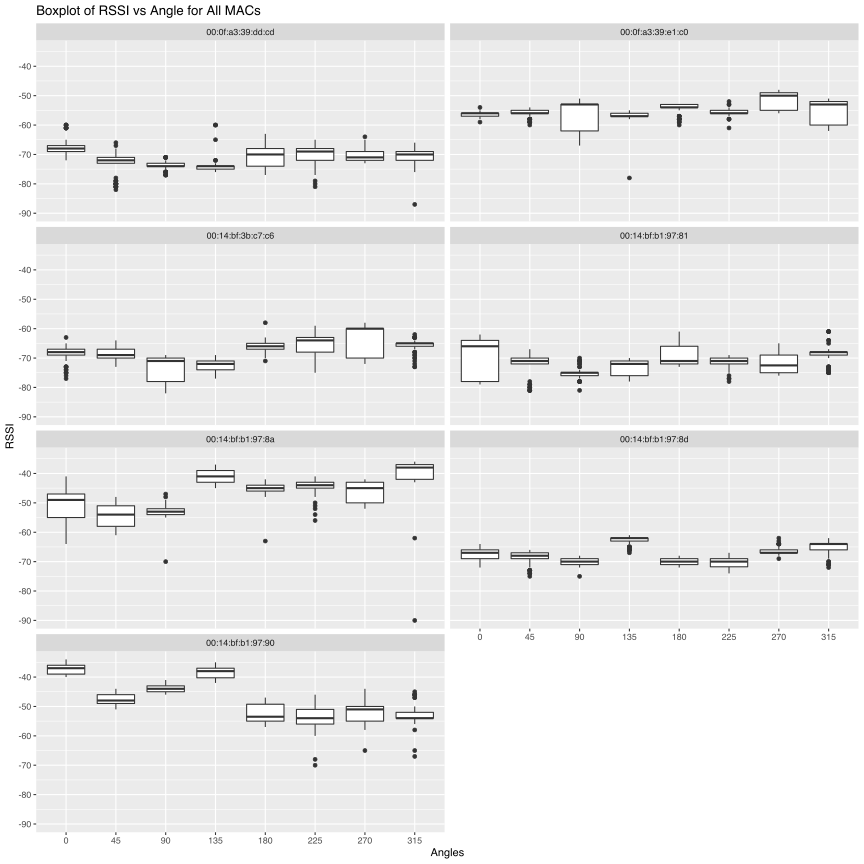

# Abstract 

Over the past 30 years, Real-Time Location Systems (RTLS) have become the standard for enterprises and consumers to connect to their loved ones, meet business goals, and find their way home. One place where RTLS is gaining further application is its use in helping keep students connected across college campuses. In this paper, we present how RTLS access points within a college campus building can locate handheld connected devices (such as laptops or cell phones). Underlying this methodology is the understanding of how the signal strength of a device behaves at various distances, angles and even through walls which we demonstrate in a practical application. Integral to this is testing of several machine learning clustering models that will be used to predict and identify the location of these devices using the Sum of Squared Errors as the evaluation criteria. Using Weighted and Unweighted K-Nearest Neighbors methods, we demonstrated that you can significantly increase the predictability of device location if you are able to use a combination of "co" and "cd" access points. These findings can have practical application in optimized management of resource usage and in providing elasticity to the bandwidth an enterprise uses based on the location of devices loading an access point, which can offer cost benefits. 

# Introduction

With the advent of Wi-Fi and local area networks, devices like Real-Time Location Systems (RTLS) can be leveraged for location positioning of an object in a specified area in real time. This is made possible by way of a continuous communication and feedback between a tag attached to the object being tracked and reader or array of readers. Examples of RTLS include Infrared, Bluetooth, Cellular, and Radio Frequency Identification (RFID). To operate RTLS, a scanning device is required to locate an object (such as a cell phone or laptop) based on the angle and coordinates of the object being tracked. You can use multiple scanning devices to triangulate the exact location of the object using the combination of angles in which the signal is triggering the respective receivers. Utilizing a series of wireless network signals in an office building, we will be able to detect the exact location of various objects in real time using different combinations of network devices. Here, we can perform an unweighted and weighted k-nearest neighbors (k-NN) analysis to predict the location of the unknown Online data using the Offline training data. To go further, we will be seeing if we can better predict the location of the online data using different combinations of the network device mac addresses available. 

# Literature Review

The code and methodology used for this evaluation comes primarily from *Data Science in R: A Case Studies Approach to Computational Reasoning and Problem Solving* by Deborah Nolan of the University of California, Berkeley and Duncan Temple Lang of the University of California, Davis. The application of the code and methodoogy were further examined and proved to be sound by Southern Methodist University, as incorporated into the lectures given by Adjunct Lecturer Bradley Blanchard as part of the university's Quantifying The World course.  

# Method

The $k$-nearest neighbors method is a non-parametric classification method. Unlike parametric methods, like logistic regression, which *learn* the parameters through training, $k$-nearest neighbors uses a user defined tuning parameter $k$ to determine how the model will be trained. The $k$-nearest neighbors model uses $k$ neighbors to estimate the probability of each class $g$ as the proportion of the $k$ neighbors of $x$ with that class, $g$.

$$
\hat{p}_{kg}(x) = \hat{P}_k(Y = g \mid X = x) = \frac{1}{k} \sum_{i \in \mathcal{N}_k(x, \mathcal{D})} I(y_i = g)
$$ 
The unknown $x$ is then assigned the class with the highest estimated probability. The $k$ nearest neighbors are determined by a measure of distance like Euclidean distance or Manhattan distance. In unweighted models classification of $x$ is determined the simple plurality of neighbors, but in weighted models the distances of the $k$ neighbors will have a bearing on the classification of $x$.

Using the $k$ tuning parameter, we will estimate the online device locations by assigning them with the location of $k$ devices with the closest signal strength. We will measure the closeness in terms of signal strength of our training observations and test prediction using a Euclidean distance metric. Once we have all these measurements, we will measure the overall performance of our model by an aggregate sum of squared errors metric.

We will test are two types of k-NN algorithms: weighted and unweighted. In the case of the unweighted, the k nearest neighbors are assigned equal weight in estimating the location of the device in question. The location of the test device is simply an arithmetic average of the (x,y coordinates) of the closest nearest neighbor device. For the weighted average algorithm, the $k$ nearest neighbors are each assigned weights that are equal to the reciprocal of their distance to the test device in terms of signal strength. Therefore, training observations with closer signal strength distances are given greater weight in estimating the location of the test observation. 

As a baseline, we will first do a search for an optimal model excluding `00:0f:a3:39:dd:cd`. This will align with the original research methods of the reference case study and provide an initial set of results to compare subsequent models against.

To complete this analysis, We employed the following steps. 
  
  1. Data Cleansing
  2. Exploratory Data Analysis
  3. Signal Strength Analysis
  4. kNN modeling 
      a. Unweighted kNN
      b. Weighted kNN
  5. Comparing kNN approaches


# Data

For this project, we will be leveraging two separate datasets for our analysis. One of which is a reference set named offline which contains signal strength measurements from a hand-held device on a gridwork of 166 different points, all of which were spaced 1 meter apart. This gridwork is located in the hallways of a one floor building at the University of Mannheim. The other dataset is titled online which we will be using for testing our k-NN model to predict the location of an unknown device. The online dataset includes 60 different locations chosen at random with 110 signals measured from each point by six 6 wireless access points. In the below, you can see a map of the online test locations (black dots) overlaid with the offline training locations (grey dots). Both datasets contain the same features and will require the same procedures for cleaning.  


```r

```

<div class="figure" style="text-align: center">

<p class="caption">**Office layout:** *Floor plan of the first floor of the test building in the University of Mannheim. Depicts the offline points (grey dots) placed about a meter apart from one another and the placement of the online points (black dots) scattered randomly throughout for testing. Wifi access points are denoted by blue squares.*</p>
</div>

## Data Description


```r
pander::pander(
 list(
      t = "Time stamp (Milliseconds) since 12:00am, January 1, 1970",
      Id = "router MAC address",
      Pos = "Router location",
      Degree = "Orientation of scanning device carried by the researcher, measured in Degrees",
      MAC = "MAC address of either the router, or scanning device, combined with corresponding values for signal strength (dBm), the mode in which it was operating(adhoc scanner = 1, access router = 3), and its corresponding channel frequency.",Signal = "Received Signal Strength in DbM")
 )
```


  * **t**: Time stamp (Milliseconds) since 12:00am, January 1, 1970
  * **Id**: router MAC address
  * **Pos**: Router location
  * **Degree**: Orientation of scanning device carried by the researcher, measured in Degrees
  * **MAC**: MAC address of either the router, or scanning device, combined with corresponding values for signal strength (dBm), the mode in which it was operating(adhoc scanner = 1, access router = 3), and its corresponding channel frequency.
  * **Signal**: Received Signal Strength in DbM

<!-- end of list -->
## Data Formatting

The first cleaning method we will employ will be to break up the position variable into separate variables which we can use to triangulate the location. In our raw dataset, we have position values for latitude, longitude and elevation separated by commas, which we will convert into PosX, PosY and PosZ. Upon further cleaning, we were able to determine that there was only one unique value for PosZ at 0 (which made sense considering the experiment took place in a one story building), we had the liberty to drop the variable. Additionally, running a procedure to check on the number of unique variables in the ScanMac column yielded only a single unique value, so we can drop that one as well. 

In our documentation, we found that our type of device was mixed between the values 1 and 3, which we may want to clarify more. Reviewing our documentation, we will only want to focus on fixed access points (value=3) as that is more relevant to our study of predicting device locations using a fixed set of receivers. So, moving further, we will remove the adhoc instances in our dataset. 

The Time measurement is something that we will want to make an adjustment to so that we can more easily analyze in the future. As mentioned prior, the time data is based on the number of milliseconds from a specific date (which could possibly be arbitrary), so we can change to a Year-Month-Day-Time format. But first, we can divide the number of milliseconds to seconds. This leaves us with the following features that we will use across our offline and online data.  Additionally, we will remove the channel feature since it is strictly a character code that contains redundant identifiers of Mac Address, signal strength, frequency and mode that may play an unfair role in our predictive modeling. 


```r
#processLine performs splitting and cleansing of delimiters in the lines
processLine = function(x) {
    tokens = strsplit(x, "[;=,]")[[1]]
    if (length(tokens) == 10) {
        return(NULL)
    }
    tmp = matrix(tokens[-(1:10)], , 4, byrow = TRUE)
    cbind(matrix(tokens[c(2, 4, 6:8, 10)], nrow(tmp), 6, byrow = TRUE), tmp)
}

#roundReaderOrientation adjusts angles to increments of 45 degrees
#this is done to simplify calculations overall since the resolution
#of these angles is less important than that which is provided
roundReaderOrientation = function(orientation) {
    refs = seq(0, by = 45, length = 9)
    angle = sapply(orientation, function(o) which.min(abs(o - refs)))
    c(refs[1:8], 0)[angle]
}

# read in the data for the appropriate mac addresses
processTraceFile <- function(filename, subMacs = c("00:0f:a3:39:e1:c0", "00:0f:a3:39:dd:cd",
                                           "00:14:bf:b1:97:8a", "00:14:bf:3b:c7:c6",
                                           "00:14:bf:b1:97:90", "00:14:bf:b1:97:8d",
                                           "00:14:bf:b1:97:81")) {
    txt = readLines(filename)
    lines = txt[substr(txt, 1, 1) != "#"]
    tmp = lapply(lines, processLine)
    
    # create dataframe and name columns
    data = as.data.frame(do.call(rbind, tmp), stringsAsFactors = FALSE)
    names(data) = c("time", "scanMac", "posX", "posY", "posZ", 
                    "orientation", "mac", "signal", "channel", 
                    "type")
    
    # keep only signals from access points (=3)
    data = data[data$type == "3", ]
    
    # drop scanMac, posZ, channel, and type - no info in them
    dropVars = c("scanMac", "posZ", "channel", "type")
    data = data[, !(names(data) %in% dropVars)]
    
    # drop more unwanted access points
    data = data[data$mac %in% subMacs, ]
    
    # convert numeric values
    numVars = c("time", "posX", "posY", "orientation", "signal")
    data[numVars] = lapply(data[numVars], as.numeric)
    
    # convert time to POSIX
    data$rawTime = data$time
    data$time = data$time/1000
    class(data$time) = c("POSIXt", "POSIXct")
    
    # round orientations to nearest 45 degree angle
    data$angle = roundReaderOrientation(data$orientation)
    
    return(data)
    }
```


```r
offline <- processTraceFile("offline.final.trace.txt")
online <- processTraceFile("online.final.trace.txt")

#offline = readLines("http://rdatasciencecases.org/Data/offline.final.trace.txt")
#online = readLines("http://rdatasciencecases.org/Data/online.final.trace.txt")
```

Reviewing our cleansed data set, we can see the following:

```r
head(offline)
```

<div data-pagedtable="false">
  <script data-pagedtable-source type="application/json">
{"columns":[{"label":[""],"name":["_rn_"],"type":[""],"align":["left"]},{"label":["time"],"name":[1],"type":["dttm"],"align":["right"]},{"label":["posX"],"name":[2],"type":["dbl"],"align":["right"]},{"label":["posY"],"name":[3],"type":["dbl"],"align":["right"]},{"label":["orientation"],"name":[4],"type":["dbl"],"align":["right"]},{"label":["mac"],"name":[5],"type":["chr"],"align":["left"]},{"label":["signal"],"name":[6],"type":["dbl"],"align":["right"]},{"label":["rawTime"],"name":[7],"type":["dbl"],"align":["right"]},{"label":["angle"],"name":[8],"type":["dbl"],"align":["right"]}],"data":[{"1":"2006-02-11 01:31:58","2":"0","3":"0","4":"0","5":"00:14:bf:b1:97:8a","6":"-38","7":"1.1e+12","8":"0","_rn_":"1"},{"1":"2006-02-11 01:31:58","2":"0","3":"0","4":"0","5":"00:14:bf:b1:97:90","6":"-56","7":"1.1e+12","8":"0","_rn_":"2"},{"1":"2006-02-11 01:31:58","2":"0","3":"0","4":"0","5":"00:0f:a3:39:e1:c0","6":"-53","7":"1.1e+12","8":"0","_rn_":"3"},{"1":"2006-02-11 01:31:58","2":"0","3":"0","4":"0","5":"00:14:bf:b1:97:8d","6":"-65","7":"1.1e+12","8":"0","_rn_":"4"},{"1":"2006-02-11 01:31:58","2":"0","3":"0","4":"0","5":"00:14:bf:b1:97:81","6":"-65","7":"1.1e+12","8":"0","_rn_":"5"},{"1":"2006-02-11 01:31:58","2":"0","3":"0","4":"0","5":"00:14:bf:3b:c7:c6","6":"-66","7":"1.1e+12","8":"0","_rn_":"6"}],"options":{"columns":{"min":{},"max":[10]},"rows":{"min":[10],"max":[10]},"pages":{}}}
  </script>
</div>

Above is a view of our cleaned dataset. We are working with a time stamp value, an X and Y location value of our access point, the Mac address we are working with, a signal strength and the angle in which the signal was recieved. 

It should be noted that the original researchers chose to exclude data from one access point. Of the 7 access points, 2 were Alpha routers. Mac `00:0f:a3:39:e1:c0` was kept for the analysis, and mac `00:0f:a3:39:dd:cd` was removed. In this analysis we will endeavor to determine whether this action was warranted. 

According to our documentation, we should have only 8 values for orientation. We also simplify our measurement of the reader orientation and round these measurements to the nearest 45 degree angle. The resolution of the existing data is less important, thus we can safely assume that 45 degree increments is sufficient, and this will provide some relief in terms of computational effort. 

We will look at the orientation column of our dataset, we can see that we have a wide variety of angles available in clusters around the expected angles (such as 179 or 181) as shown below. Since we are going to focus on measure signal strength at 8 orientations in 45-degree increments, we will round each of our orientations to the nearest 45 degree increment. Additionally, we will try to map values close to 360 so that they line up back to zero. 

```r
length(unique(offline$orientation))
```

```
#> [1] 203
```

```r
plot(ecdf(offline$orientation), main = 'Orientation for the Hand-Held Device', xlab = 'CDF', ylab = 'Orientation')
```

<div class="figure" style="text-align: center">

<p class="caption">**Orientation for the Hand-Held Device:** *The location of the orientation values as it relates to the empirical cdf. We can see that at each major orientation (45, 90, 135, 180, ect) are scattered around these values. So our cleaning procedure is going to round these to the nearest 45 degree angle. After making the adjustment, we can see that the new values look like they are more exact to the 8 angles we are using. *</p>
</div>

```r
with(offline, boxplot(orientation ~ angle, 
                      xlab = 'Rounded 45 Degree Angle', 
                      ylab = 'Orientation'))
```

<div class="figure" style="text-align: center">

<p class="caption">**Orientation for the Hand-Held Device:** *The location of the orientation values as it relates to the empirical cdf. We can see that at each major orientation (45, 90, 135, 180, ect) are scattered around these values. So our cleaning procedure is going to round these to the nearest 45 degree angle. After making the adjustment, we can see that the new values look like they are more exact to the 8 angles we are using. *</p>
</div>


The last cleaning procedure we will follow is to review the frequency of the mac addresses in place for our models. Since the documentation mentioned that the mac addresses ending in c5, a9, fc, 10, and 4b were either not on the correct floor, or were not turned on the whole time, we have dropped these addresses so that we are only working with the remaining 7 addresses that have a frequency of over 120,000 observations.


```r
#### Exploring MAC Addresses ###


## Below we can check the counts of observations for various MAC addresses with table()
par(mar=c(10,5,1,1))   # extra large bottom margin
plotdata <- offline %>%
  group_by(mac) %>%
  summarise(counts = n())

ggplot(plotdata, aes(x = reorder(mac, -counts), y = counts)) +
  geom_bar(fill = "#0073C2FF", stat = "identity") +
  geom_text(aes(label = counts), vjust = -0.3) + 
  theme(axis.text.x = element_text(angle = 90)) +
  labs(x = "Mac", caption = "Figure: Frequency count of Mac addresses in our study. We will be dropping the addresses that have a frequency count below 120,000. ")
```


# RTLS Analysis
Approaching this problem strategically, we chose to analyze the received signal strength utilizing a K Nearest Neighbors approach. We first analyze the data excluding mac `00:0f:a3:39:dd:cd` as definde by the original researchers. Then analyze the same data set including mac `00:0f:a3:39:dd:cd` and excluding mac `00:0f:a3:39:e1:c0`. Then, finally, we analyze the full data set including all access points. 


```r
ap_a <- "00:0f:a3:39:e1:c0"
ap_b <- "00:0f:a3:39:dd:cd"
```

## Exploratory Data Analysis
**Signal Strength by Angle**
Given that the orientation of the signal receiving device is an important characterstic these data, we quickly review signal versus orientation angle. From these plots it becomes clear that the signal from `00:0f:a3:39:dd:cd` is weak as compared to `00:0f:a3:39:e1:c0`, and contains numerous outliers in the data. 

```r
offline %>% mutate(angle = factor(angle)) %>% 
  filter(posX == 2 & posY == 12) %>% 
  ggplot + geom_boxplot(aes(y = signal, x = angle)) + 
  facet_wrap(. ~ mac, ncol = 2) + 
  ggtitle("Boxplot of RSSI vs Angle for All MACs") +
  labs(x="Angles", y="RSSI")
```



This is further confirmed when reviewing a comparison of mean and standard deviation between the routers. This confirms our suspicion  for low signal strength values for `00:0f:a3:39:dd:cd`. In fact, access point `00:0f:a3:39:e1:c0` is the strongest signal compared to all access points, which we can see in the charts above and below. 


```r
dt <- offline %>% 
  mutate(angle = factor(angle)) %>% 
  group_by(mac) %>% 
  summarise(signal_avg = mean(signal), signal_std = sd(signal))

datatable(offline %>% 
  mutate(angle = factor(angle)) %>% 
  group_by(mac) %>% 
  summarise(signal_avg = mean(signal), signal_std = sd(signal)))
```

<!--html_preserve--><div id="htmlwidget-3dfe42943b4245f07961" style="width:100%;height:auto;" class="datatables html-widget"></div>
<script type="application/json" data-for="htmlwidget-3dfe42943b4245f07961">{"x":{"filter":"none","data":[["1","2","3","4","5","6","7"],["00:0f:a3:39:dd:cd","00:0f:a3:39:e1:c0","00:14:bf:3b:c7:c6","00:14:bf:b1:97:81","00:14:bf:b1:97:8a","00:14:bf:b1:97:8d","00:14:bf:b1:97:90"],[-70.4622473715655,-53.7018208992061,-60.7586086984012,-56.3981834650446,-56.6500127856079,-53.7401442406759,-67.0349670931611],[8.12912858578863,5.79553622617984,7.08584087775903,8.06986048402936,9.54495713293062,8.30344726920118,10.6371936321165]],"container":"<table class=\"display\">\n  <thead>\n    <tr>\n      <th> <\/th>\n      <th>mac<\/th>\n      <th>signal_avg<\/th>\n      <th>signal_std<\/th>\n    <\/tr>\n  <\/thead>\n<\/table>","options":{"columnDefs":[{"className":"dt-right","targets":[2,3]},{"orderable":false,"targets":0}],"order":[],"autoWidth":false,"orderClasses":false}},"evals":[],"jsHooks":[]}</script><!--/html_preserve-->

```r
ggplot(dt, aes(x = reorder(mac, -signal_avg), y = signal_avg)) +
  geom_bar(fill = "#0073C2FF", stat = "identity") +
  theme(axis.text.x = element_text(angle = 90)) +
  labs(x = "Mac", caption = "Figure: Average Signal")
```


## Modeling: K Nearest Neighbors 

In our analysis, we will use a non-parametric machine learning technique called K-Nearest_Neighbors (k-NN) to predict the position of our devices in our online dataset. For our number of neighbors we ultimately choose, we will estimate these device locations by assigning them with the location of k devices with the closest signal strenth. We will measure the closeness in terms of signal strength of our training observation and test prediction using a Euclidean metric. Once we have all these measurements, we will measure the overall performance of our model by an aggregate sum of square errors metric.

There are two types of k-NN algorithms: weighted and unweighted. In the case of the unweighted, the k nearest neighbors are assigned equal weight in estimating the location of the device in quesiton. The location of the test device is simply an arithmetic average of the (x,y coordinates) of the closest nearest neighbor device. In regards to the Weighted average, the k nearest neighbors are assigned weights that are equal to the reciprocal of its distance to the test device in terms of the signal strength. Therefore, training observations with closer signal strength distances are given greater weight in estimating the location of the test observation. 

(excluding `00:0f:a3:39:dd:cd`)
We will first do a search for an optimal model excluding `00:0f:a3:39:dd:cd`. This can serve as a baseline model to measure against since it will align with the original research methods. 


```r
ap_a <- "00:0f:a3:39:e1:c0"
ap_b <- "00:0f:a3:39:dd:cd"

offline <- processTraceFile("offline.final.trace.txt")
offline$posXY <-  paste(offline$posX, offline$posY, sep = "-")
ByLocationAngle = with(offline, by(offline, list(posXY, angle, mac), function(x) x))

rssiSummary = 
  lapply(ByLocationAngle,            
         function(oneLoc) {
           ans = oneLoc[1, ]
           ans$medSignal = median(oneLoc$signal)
           ans$avgSignal = mean(oneLoc$signal)
           ans$num = length(oneLoc$signal)
           ans$sdSignal = sd(oneLoc$signal)
           ans$iqrSignal = IQR(oneLoc$signal)
           ans
           })

offlineSummary_original = do.call("rbind", rssiSummary)    

offlineSummary <- offlineSummary_original %>% 
  filter(mac != ap_b)

online <-  processTraceFile("online.final.trace.txt", subMacs = unique(offlineSummary$mac))

online$posXY <-  paste(online$posX, online$posY, sep = "-")

keepColumns = c("posXY", "posX","posY", "orientation", "angle")

byLocation = with(online, 
             by(online, list(posXY), 
                function(x) {
                  ans = x[1, keepColumns]
                  avgSS = tapply(x$signal, x$mac, mean)
                  y = matrix(avgSS, nrow = 1, ncol = 6,
                        dimnames = list(ans$posXY, names(avgSS)))
                  cbind(ans, y)
                }))

onlineSummary = do.call("rbind", byLocation)
calcError <- function(estXY, actualXY) sum( rowSums( (estXY - actualXY)^2) )
reshapeSS1 <-  function(data, varSignal = "signal", keepColumns = c("posXY", "posX","posY")) {
  byLocation <- with(data, by(data, list(posXY), 
                              function(x) {
                                ans <-  x[1, keepColumns]
                                avgSS <-  tapply(x[ , varSignal ], x$mac, mean)
                                y <-  matrix(avgSS, nrow = 1, ncol = 6,
                                             dimnames = list(ans$posXY,
                                                             names(avgSS)))
                                cbind(ans, y)
                              }))
  
  newDataSS <- do.call("rbind", byLocation)
  return(newDataSS)
}

selectTrain1 <-  function(angleNewObs, signals = NULL, m = 1){
  refs <-  seq(0, by = 45, length  = 8)
  nearestAngle <-  roundReaderOrientation(angleNewObs)
  if (m %% 2 == 1) 
    angles <-  seq(-45 * (m - 1) /2, 45 * (m - 1) /2, length = m)
  else {
    m = m + 1
    angles <-  seq(-45 * (m - 1) /2, 45 * (m - 1) /2, length = m)
    if (sign(angleNewObs - nearestAngle) > -1) 
      angles <-  angles[ -1 ]
    else 
      angles <-  angles[ -m ]
  }
  
  # round angles
  angles <-  angles + nearestAngle
  angles[angles < 0] <-  angles[ angles < 0 ] + 360
  angles[angles > 360] <-  angles[ angles > 360 ] - 360
  angles <-  sort(angles) 
  offlineSubset <-  signals[ signals$angle %in% angles, ]
  reshapeSS1(offlineSubset, varSignal = "avgSignal")
}

NN1 <-  function(newSignal, trainSubset) {
  diffs <-  apply(trainSubset[ , 4:9], 1, 
                  function(x) x - newSignal)
  dists <-  apply(diffs, 2, function(x) sqrt(sum(x^2)) )
  closest <-  order(dists)
  weightDF <-  trainSubset[closest, 1:3 ]
  weightDF$weight <-  1/closest
  return(weightDF)
}

predXY1 <-  function(newSignals, newAngles, trainData, 
                    numAngles = 1, k = 3){
  closeXY <-  list(length = nrow(newSignals))
  for (i in 1:nrow(newSignals)) {
    trainSS <-  selectTrain1(newAngles[i], trainData, m = numAngles)
    closeXY[[i]] <- NN1(newSignal = as.numeric(newSignals[i, ]), trainSS)
  }
  estXY <- lapply(closeXY, 
                 function(x) sapply(x[ , 2:3], 
                                    function(x) mean(x[1:k])))
  estXY <- do.call("rbind", estXY)
  return(estXY)
}

v = 11 
permuteLocations = sample(unique(offlineSummary$posXY))
permuteLocations = matrix(permuteLocations, ncol = v, 
                     nrow = floor(length(permuteLocations)/v))

onlinecvFold = subset(offlineSummary, posXY %in% permuteLocations[ , 1])

reshapeSS1 = function(data, varSignal = "signal", 
                     keepColumns = c("posXY", "posX","posY"),
                     sampleAngle = FALSE, 
                     refs = seq(0, 315, by = 45)) {
  byLocation =
    with(data, by(data, list(posXY), 
                  function(x) {
                    if (sampleAngle) {
                      x = x[x$angle == sample(refs, size = 1), ]}
                    ans = x[1, keepColumns]
                    avgSS = tapply(x[ , varSignal ], x$mac, mean)
                    y = matrix(avgSS, nrow = 1, ncol = 6,
                               dimnames = list(ans$posXY,
                                               names(avgSS)))
                    cbind(ans, y)
                  }))
  
  newDataSS = do.call("rbind", byLocation)
  return(newDataSS)
}

#exclude the right mac address
offline = offline[ offline$mac != ap_b, ]
keepColumns = c("posXY", "posX","posY", "orientation", "angle")

onlineCVSummary = reshapeSS1(offline, keepColumns = keepColumns, 
                            sampleAngle = TRUE)

onlinecvFold = subset(onlineCVSummary, 
                    posXY %in% permuteLocations[ , 1])

offlineFold = subset(offlineSummary,
                     posXY %in% permuteLocations[ , -1])

estFold = predXY1(newSignals = onlinecvFold[ , 6:11], 
                 newAngles = onlinecvFold[ , 4], 
                 offlineFold, numAngles = 1, k = 3)

actualFold = onlinecvFold[ , c("posX", "posY")]

NNeighbors = 20
K = NNeighbors 
err = numeric(K)
for (j in 1:v) {
  onlinecvFold = subset(onlineCVSummary, 
                      posXY %in% permuteLocations[ , j])
  offlineFold = subset(offlineSummary,
                       posXY %in% permuteLocations[ , -j])
  actualFold = onlinecvFold[ , c("posX", "posY")]
  
  for (k in 1:K) {
    estFold = predXY1(newSignals = onlinecvFold[ , 6:11],
                     newAngles = onlinecvFold[ , 4], 
                     offlineFold, numAngles = 1, k = k)
    err[k] = err[k] + calcError(estFold, actualFold)
  }
}

error_df <- data.frame(ap_a = err)
plot(y = err, x = (1:K),  type = "l", lwd= 2,
     ylim = c(800, 2100),
     xlab = "Number of Neighbors",
     ylab = "Sum of Square Errors",
      main = "Error vs K, with AP A Data")
rmseMin = min(err)
kMin = which(err == rmseMin)[1]
segments(x0 = 0, x1 = kMin, y0 = rmseMin, col = gray(0.4), 
         lty = 2, lwd = 2)
segments(x0 = kMin, x1 = kMin, y0 = 1100,  y1 = rmseMin, 
         col = grey(0.4), lty = 2, lwd = 2)


text(x = kMin - 2, y = rmseMin + 40, 
     label = as.character(round(rmseMin)), col = grey(0.4))
```


```r
estXYkmin1 = predXY1(newSignals = onlineSummary[ , 6:11], 
                 newAngles = onlineSummary[ , 4], 
                 offlineSummary, numAngles = 1, k = kMin)
actualXY = onlineSummary[ , c("posX", "posY")]

err_cv1 <- calcError(estXYkmin1, actualXY)
trainData = offlineSummary[ offlineSummary$angle == 0 & 
                              offlineSummary$mac == "00:0f:a3:39:e1:c0" ,
                        c("posX", "posY")]

ErrorMap = function(estXY, actualXY, trainData = NULL, AP = NULL){
  
    plot(0, 0, xlim = c(0, 35), ylim = c(-3, 15), type = "n",
         xlab = "", ylab = "", axes = FALSE,
         main = "Floor Map of Predictions",
         sub = "■ = Access Point, ● = Actual, ✷ = Predicted")
    box()
    if ( !is.null(AP) ) points(AP, pch = 15)
    if ( !is.null(trainData) )
      points(trainData, pch = 19, col="grey", cex = 0.6)
    
    points(x = actualXY[, 1], y = actualXY[, 2], 
           pch = 19, cex = 0.8 )
    points(x = estXY[, 1], y = estXY[, 2], 
           pch = 8, cex = 0.8 )
    segments(x0 = estXY[, 1], y0 = estXY[, 2],
             x1 = actualXY[, 1], y1 = actualXY[ , 2],
             lwd = 2, col = "red")
}
actualXY = onlineSummary[ , c("posX", "posY")]
```
With Running our K-NN with Access Point A, we are yielding an optimal number of neighbors at 8 which generates us just over 1,400 in our Sum of Square Errors. We will use this as a baseline for our other evaluations. 


```r
ErrorMap(estXY  = estXYkmin1 , actualXY = actualXY, trainData = trainData)
```


Through the grid search we can see that the best value for K is `8`, with an error of 1,400.  

## Modeling: K Nearest Neighbors (excluding `00:0f:a3:39:e1:c0`)
Now we will conduct the same exercise excluding the other access point. 

```r
ap_a <- "00:0f:a3:39:e1:c0"
ap_b <- "00:0f:a3:39:dd:cd"

offline <- processTraceFile("offline.final.trace.txt")
offline$posXY <-  paste(offline$posX, offline$posY, sep = "-")
ByLocationAngle = with(offline, by(offline, list(posXY, angle, mac), function(x) x))

rssiSummary = 
  lapply(ByLocationAngle,            
         function(oneLoc) {
           ans = oneLoc[1, ]
           ans$medSignal = median(oneLoc$signal)
           ans$avgSignal = mean(oneLoc$signal)
           ans$num = length(oneLoc$signal)
           ans$sdSignal = sd(oneLoc$signal)
           ans$iqrSignal = IQR(oneLoc$signal)
           ans
           })

offlineSummary_original = do.call("rbind", rssiSummary)    

offlineSummary <- offlineSummary_original %>% 
  filter(mac != ap_a)

online <-  processTraceFile("online.final.trace.txt", subMacs = unique(offlineSummary$mac))

online$posXY <-  paste(online$posX, online$posY, sep = "-")

keepColumns = c("posXY", "posX","posY", "orientation", "angle")

byLocation = with(online, 
             by(online, list(posXY), 
                function(x) {
                  ans = x[1, keepColumns]
                  avgSS = tapply(x$signal, x$mac, mean)
                  y = matrix(avgSS, nrow = 1, ncol = 6,
                        dimnames = list(ans$posXY, names(avgSS)))
                  cbind(ans, y)
                }))

onlineSummary = do.call("rbind", byLocation)
calcError <- function(estXY, actualXY) sum( rowSums( (estXY - actualXY)^2) )
reshapeSS2 <-  function(data, varSignal = "signal", keepColumns = c("posXY", "posX","posY")) {
  byLocation <- with(data, by(data, list(posXY), 
                              function(x) {
                                ans <-  x[1, keepColumns]
                                avgSS <-  tapply(x[ , varSignal ], x$mac, mean)
                                y <-  matrix(avgSS, nrow = 1, ncol = 6,
                                             dimnames = list(ans$posXY,
                                                             names(avgSS)))
                                cbind(ans, y)
                              }))
  
  newDataSS <- do.call("rbind", byLocation)
  return(newDataSS)
}

selectTrain2 <-  function(angleNewObs, signals = NULL, m = 1){
  refs <-  seq(0, by = 45, length  = 8)
  nearestAngle <-  roundReaderOrientation(angleNewObs)
  if (m %% 2 == 1) 
    angles <-  seq(-45 * (m - 1) /2, 45 * (m - 1) /2, length = m)
  else {
    m = m + 1
    angles <-  seq(-45 * (m - 1) /2, 45 * (m - 1) /2, length = m)
    if (sign(angleNewObs - nearestAngle) > -1) 
      angles <-  angles[ -1 ]
    else 
      angles <-  angles[ -m ]
  }
  
  # round angles
  angles <-  angles + nearestAngle
  angles[angles < 0] <-  angles[ angles < 0 ] + 360
  angles[angles > 360] <-  angles[ angles > 360 ] - 360
  angles <-  sort(angles) 
  offlineSubset <-  signals[ signals$angle %in% angles, ]
  reshapeSS2(offlineSubset, varSignal = "avgSignal")
}

NN2 <-  function(newSignal, trainSubset) {
  diffs <-  apply(trainSubset[ , 4:9], 1, 
                  function(x) x - newSignal)
  dists <-  apply(diffs, 2, function(x) sqrt(sum(x^2)) )
  closest <-  order(dists)
  weightDF <-  trainSubset[closest, 1:3 ]
  weightDF$weight <-  1/closest
  return(weightDF)
}

predXY2 <-  function(newSignals, newAngles, trainData, 
                    numAngles = 1, k = 3){
  closeXY <-  list(length = nrow(newSignals))
  for (i in 1:nrow(newSignals)) {
    trainSS <-  selectTrain1(newAngles[i], trainData, m = numAngles)
    closeXY[[i]] <- NN1(newSignal = as.numeric(newSignals[i, ]), trainSS)
  }
  estXY <- lapply(closeXY, 
                 function(x) sapply(x[ , 2:3], 
                                    function(x) mean(x[1:k])))
  estXY <- do.call("rbind", estXY)
  return(estXY)
}

v = 11 
permuteLocations = sample(unique(offlineSummary$posXY))
permuteLocations = matrix(permuteLocations, ncol = v, 
                     nrow = floor(length(permuteLocations)/v))

onlinecvFold = subset(offlineSummary, posXY %in% permuteLocations[ , 1])

reshapeSS2 = function(data, varSignal = "signal", 
                     keepColumns = c("posXY", "posX","posY"),
                     sampleAngle = FALSE, 
                     refs = seq(0, 315, by = 45)) {
  byLocation =
    with(data, by(data, list(posXY), 
                  function(x) {
                    if (sampleAngle) {
                      x = x[x$angle == sample(refs, size = 1), ]}
                    ans = x[1, keepColumns]
                    avgSS = tapply(x[ , varSignal ], x$mac, mean)
                    y = matrix(avgSS, nrow = 1, ncol = 6,
                               dimnames = list(ans$posXY,
                                               names(avgSS)))
                    cbind(ans, y)
                  }))
  
  newDataSS = do.call("rbind", byLocation)
  return(newDataSS)
}

#exclude the right mac address
offline = offline[ offline$mac != ap_a, ]
keepColumns = c("posXY", "posX","posY", "orientation", "angle")

onlineCVSummary = reshapeSS2(offline, keepColumns = keepColumns, 
                            sampleAngle = TRUE)

onlinecvFold = subset(onlineCVSummary, 
                    posXY %in% permuteLocations[ , 1])

offlineFold = subset(offlineSummary,
                     posXY %in% permuteLocations[ , -1])

estFold = predXY1(newSignals = onlinecvFold[ , 6:11], 
                 newAngles = onlinecvFold[ , 4], 
                 offlineFold, numAngles = 1, k = 3)

actualFold = onlinecvFold[ , c("posX", "posY")]

NNeighbors = 20
K = NNeighbors 
err = numeric(K)
for (j in 1:v) {
  onlinecvFold = subset(onlineCVSummary, posXY %in% permuteLocations[ , j])
  offlineFold = subset(offlineSummary,posXY %in% permuteLocations[ , -j])
  actualFold = onlinecvFold[ , c("posX", "posY")]
  
  for (k in 1:K) {
    estFold = predXY2(newSignals = onlinecvFold[ , 6:11],
                     newAngles = onlinecvFold[ , 4], 
                     offlineFold, numAngles = 1, k = k)
    
    err[k] = err[k] + calcError(estFold, actualFold)
  }
}

error_df$ap_b <- err
plot(y = err, x = (1:K),  type = "l", lwd= 2,
     ylim = c(800, 2100),
     xlab = "Number of Neighbors",
     ylab = "Sum of Square Errors",
      main = "Error vs K, with AP B Data")
rmseMin = min(err)
kMin = which(err == rmseMin)[1]
segments(x0 = 0, x1 = kMin, y0 = rmseMin, col = gray(0.4), 
         lty = 2, lwd = 2)
segments(x0 = kMin, x1 = kMin, y0 = 1100,  y1 = rmseMin, 
         col = grey(0.4), lty = 2, lwd = 2)


text(x = kMin - 2, y = rmseMin + 40, 
     label = as.character(round(rmseMin)), col = grey(0.4))
```


```r
estXYkmin2 = predXY2(newSignals = onlineSummary[ , 6:11], 
                 newAngles = onlineSummary[ , 4], 
                 offlineSummary, numAngles = 1, k = kMin)
actualXY = onlineSummary[ , c("posX", "posY")]

err_cv2 <- calcError(estXYkmin2, actualXY)
trainData = offlineSummary[ offlineSummary$angle == 0 & 
                              offlineSummary$mac == "00:0f:a3:39:dd:cd" ,
                        c("posX", "posY")]

ErrorMap = function(estXY, actualXY, trainData = NULL, AP = NULL){
  
    plot(0, 0, xlim = c(0, 35), ylim = c(-3, 15), type = "n",
         xlab = "", ylab = "", axes = FALSE,
         main = "Floor Map of Predictions",
         sub = "■ = Access Point, ● = Actual, ✷ = Predicted")
    box()
    if ( !is.null(AP) ) points(AP, pch = 15)
    if ( !is.null(trainData) )
      points(trainData, pch = 19, col="grey", cex = 0.6)
    
    points(x = actualXY[, 1], y = actualXY[, 2], 
           pch = 19, cex = 0.8 )
    points(x = estXY[, 1], y = estXY[, 2], 
           pch = 8, cex = 0.8 )
    segments(x0 = estXY[, 1], y0 = estXY[, 2],
             x1 = actualXY[, 1], y1 = actualXY[ , 2],
             lwd = 2, col = "red")
}
actualXY = onlineSummary[ , c("posX", "posY")]
```

Running our KNN model on access point b, we find that the optimal number of neighbors garners 5 as the optimal number of neighbors. This yields us a sum of square error of just over 1,000, which is better than our KNN model on access point A. 


```r
ErrorMap(estXY  = estXYkmin2 , actualXY = actualXY, trainData = trainData)
```


Above is a visual of the actual location of the devices with red lines to the predicted location of the devices. Prediction for the online data has an SSE Lets compare the results to those of router B:


```r
error_df$k <- 1:nrow(error_df)
error_df %>% 
  gather_("Router","RMSE", names(error_df)[-length(error_df)]) %>%
  ggplot() + geom_line(aes(x = k, y = RMSE, color = Router)) +
  ggtitle("RMSE Over K by Router")
```

<div class="figure" style="text-align: center">

<p class="caption">*Model Data with AP B overall performed better than AP A*</p>
</div>

The model that includes AP B has a significantly lower RMSE than the model with just AP A. This would imply that removing AP B from the model originally was not the optimal choice. 

## Modeling: K Nearest Neighbors (all Macs)

We will now perform a model with all the data, and compare results. 


```r
offline <- processTraceFile("offline.final.trace.txt")

offline$posXY <-  paste(offline$posX, offline$posY, sep = "-")
ByLocationAngle = with(offline, 
                    by(offline, list(posXY, angle, mac), 
                       function(x) x))
rssiSummary = 
  lapply(ByLocationAngle,            
         function(oneLoc) {
           ans = oneLoc[1, ]
           ans$medSignal = median(oneLoc$signal)
           ans$avgSignal = mean(oneLoc$signal)
           ans$num = length(oneLoc$signal)
           ans$sdSignal = sd(oneLoc$signal)
           ans$iqrSignal = IQR(oneLoc$signal)
           ans
           })
offlineSummary = do.call("rbind", rssiSummary)     
online <-  processTraceFile("online.final.trace.txt", subMacs = unique(offlineSummary$mac))
online$posXY <-  paste(online$posX, online$posY, sep = "-")
keepColumns = c("posXY", "posX","posY", "orientation", "angle")
byLocation = with(online, 
             by(online, list(posXY), 
                function(x) {
                  ans = x[1, keepColumns]
                  avgSS = tapply(x$signal, x$mac, mean)
                  y = matrix(avgSS, nrow = 1, ncol = 7,
                        dimnames = list(ans$posXY, names(avgSS)))
                  cbind(ans, y)
                }))
onlineSummary = do.call("rbind", byLocation)
calcError <- function(estXY, actualXY) sum( rowSums( (estXY - actualXY)^2) )
reshapeSS2 <-  function(data, varSignal = "signal", 
                        keepColumns = c("posXY", "posX","posY")) {
  byLocation <- with(data, by(data, list(posXY), 
                              function(x) {
                                ans <-  x[1, keepColumns]
                                avgSS <-  tapply(x[ , varSignal ], x$mac, mean)
                                y <-  matrix(avgSS, nrow = 1, ncol = 7,
                                             dimnames = list(ans$posXY,
                                                             names(avgSS)))
                                cbind(ans, y)
                              }))
  newDataSS <- do.call("rbind", byLocation)
  return(newDataSS)
}
selectTrain2 <-  function(angleNewObs, signals = NULL, m = 1){
  # m is the number of angles to keep between 1 and 5
  refs <-  seq(0, by = 45, length  = 8)
  nearestAngle <-  roundReaderOrientation(angleNewObs)
  if (m %% 2 == 1) 
    angles <-  seq(-45  * (m - 1) /2, 45 * (m - 1) /2, length = m)
  else {
    m = m + 1
    angles <-  seq(-45 * (m - 1) /2, 45 * (m - 1) /2, length = m)
    if (sign(angleNewObs - nearestAngle) > -1) 
      angles <-  angles[ -1 ]
    else 
      angles <-  angles[ -m ]
  }
  # round angles
  angles <-  angles + nearestAngle
  angles[angles < 0] <-  angles[ angles < 0 ] + 360
  angles[angles > 360] <-  angles[ angles > 360 ] - 360
  angles <-  sort(angles) 
  offlineSubset <-  signals[ signals$angle %in% angles, ]
  reshapeSS2(offlineSubset, varSignal = "avgSignal")
}
NN2 <-  function(newSignal, trainSubset) {
  diffs <-  apply(trainSubset[ , 4:9], 1, 
                  function(x) x - newSignal)
  dists <-  apply(diffs, 2, function(x) sqrt(sum(x^2)) )
  closest <-  order(dists)
  weightDF <-  trainSubset[closest, 1:3 ]
  weightDF$weight <-  1/closest
  return(weightDF)
}
predXY2 <-  function(newSignals, newAngles, trainData, 
                    numAngles = 1, k = 3){
  closeXY <-  list(length = nrow(newSignals))
  for (i in 1:nrow(newSignals)) {
    trainSS <-  selectTrain2(newAngles[i], trainData, m = numAngles)
    closeXY[[i]] <- NN2(newSignal = as.numeric(newSignals[i, ]), trainSS)
  }
  estXY <- lapply(closeXY, 
                 function(x) sapply(x[ , 2:3], 
                                    function(x) mean(x[1:k])))
  estXY <- do.call("rbind", estXY)
  return(estXY)
}
v = 11 
permuteLocations = sample(unique(offlineSummary$posXY))
permuteLocations = matrix(permuteLocations, ncol = v, 
                     nrow = floor(length(permuteLocations)/v))
onlinecvFold = subset(offlineSummary, posXY %in% permuteLocations[ , 1])
reshapeSS2 = function(data, varSignal = "signal", 
                     keepColumns = c("posXY", "posX","posY"),
                     sampleAngle = FALSE, 
                     refs = seq(0, 315, by = 45)) {
  byLocation =
    with(data, by(data, list(posXY), 
                  function(x) {
                    if (sampleAngle) {
                      x = x[x$angle == sample(refs, size = 1), ]}
                    ans = x[1, keepColumns]
                    avgSS = tapply(x[ , varSignal ], x$mac, mean)
                    y = matrix(avgSS, nrow = 1, ncol = 7,
                               dimnames = list(ans$posXY,
                                               names(avgSS)))
                    cbind(ans, y)
                  }))
  newDataSS = do.call("rbind", byLocation)
  return(newDataSS)
}
keepColumns = c("posXY", "posX","posY", "orientation", "angle")
onlineCVSummary = reshapeSS2(offline, keepColumns = keepColumns, 
                            sampleAngle = TRUE)
onlinecvFold = subset(onlineCVSummary, 
                    posXY %in% permuteLocations[ , 1])
offlineFold = subset(offlineSummary,
                     posXY %in% permuteLocations[ , -1])
estFold = predXY2(newSignals = onlinecvFold[ , 6:12], 
                 newAngles = onlinecvFold[ , 5], 
                 offlineFold, numAngles = 1, k = 3)
actualFold = onlinecvFold[ , c("posX", "posY")]
NNeighbors = 20
K = NNeighbors 
err = numeric(K)
for (j in 1:v) {
  onlinecvFold = subset(onlineCVSummary, 
                      posXY %in% permuteLocations[ , j])
  offlineFold = subset(offlineSummary,
                       posXY %in% permuteLocations[ , -j])
  actualFold = onlinecvFold[ , c("posX", "posY")]
  
  for (k in 1:K) {
    estFold = predXY2(newSignals = onlinecvFold[ , 6:11],
                     newAngles = onlinecvFold[ , 4], 
                     offlineFold, numAngles = 1, k = k)
    err[k] = err[k] + calcError(estFold, actualFold)
  }
}
error_df$both <- err
plot(y = err, x = (1:K),  type = "l", lwd= 2,
     ylim = c(800, 2100),
     xlab = "Number of Neighbors",
     ylab = "Sum of Square Errors",
      main = "Error vs K, with all Data")
rmseMin = min(err)
kMin = which(err == rmseMin)[1]
segments(x0 = 0, x1 = kMin, y0 = rmseMin, col = gray(0.4), 
         lty = 2, lwd = 2)
segments(x0 = kMin, x1 = kMin, y0 = 1100,  y1 = rmseMin, 
         col = grey(0.4), lty = 2, lwd = 2)

text(x = kMin - 2, y = rmseMin + 40, 
     label = as.character(round(rmseMin)), col = grey(0.4))
```


```r
estXYkmin3 = predXY2(newSignals = onlineSummary[ , 6:12], 
                 newAngles = onlineSummary[ , 5], 
                 offlineSummary, numAngles = 1, k = kMin)
actualXY = onlineSummary[ , c("posX", "posY")]
err_cv3 <- calcError(estXYkmin3, actualXY)
trainData = offlineSummary[ offlineSummary$angle == 0 & 
                              offlineSummary$mac == "00:0f:a3:39:e1:c0" ,
                        c("posX", "posY")]

ErrorMap = function(estXY, actualXY, trainData = NULL, AP = NULL){
  
    plot(0, 0, xlim = c(0, 35), ylim = c(-3, 15), type = "n",
         xlab = "", ylab = "", axes = FALSE,
         main = "Floor Map of Predictions",
         sub = "■ = Access Point, ● = Actual, ✷ = Predicted")
    box()
    if ( !is.null(AP) ) points(AP, pch = 15)
    if ( !is.null(trainData) )
      points(trainData, pch = 19, col="grey", cex = 0.6)
    
    points(x = actualXY[, 1], y = actualXY[, 2], 
           pch = 19, cex = 0.8 )
    points(x = estXY[, 1], y = estXY[, 2], 
           pch = 8, cex = 0.8 )
    segments(x0 = estXY[, 1], y0 = estXY[, 2],
             x1 = actualXY[, 1], y1 = actualXY[ , 2],
             lwd = 2, col = "red")
}
actualXY = onlineSummary[ , c("posX", "posY")]
```

Running our model using both Access Points A and B gives us an optimal number of neighbors at 8. Which generates us a sum of square errors at just over 1,200. This is a bit lower than our strongest performing unweighted model which was including only access pont B. 


```r
ErrorMap(estXY  = estXYkmin3 , actualXY = actualXY, trainData = trainData)
```


Above is a visualization of our error of our predicted access points with red lines showing the difference of their locations with their respective actual points. 


```r
datatable(data.frame(router = c("With Access Point A","With Access Point B", "All Access Points"), 
                     "Sum of Squares - Online Dataset" = c(err_cv1, err_cv2, err_cv3)))
```

<!--html_preserve--><div id="htmlwidget-e1004db1acd0173b9a2d" style="width:100%;height:auto;" class="datatables html-widget"></div>
<script type="application/json" data-for="htmlwidget-e1004db1acd0173b9a2d">{"x":{"filter":"none","data":[["1","2","3"],["With Access Point A","With Access Point B","All Access Points"],[373.057851020408,299.453911111111,358.15155]],"container":"<table class=\"display\">\n  <thead>\n    <tr>\n      <th> <\/th>\n      <th>router<\/th>\n      <th>Sum.of.Squares...Online.Dataset<\/th>\n    <\/tr>\n  <\/thead>\n<\/table>","options":{"columnDefs":[{"className":"dt-right","targets":2},{"orderable":false,"targets":0}],"order":[],"autoWidth":false,"orderClasses":false}},"evals":[],"jsHooks":[]}</script><!--/html_preserve-->

As shown in the above table the best results were yielded from including Access Point B, not Access Point A. And in fact, results diminished by including both. 

## Weighted KNN Analysis
Here we will attempt to improve our results by including Access Point B, excluding Access Point A, and performing a weighted KNN analysis. 


```r
offline <- processTraceFile("offline.final.trace.txt")

offline$posXY <-  paste(offline$posX, offline$posY, sep = "-")
ByLocationAngle = with(offline, 
                    by(offline, list(posXY, angle, mac), 
                       function(x) x))
rssiSummary = 
  lapply(ByLocationAngle,            
         function(oneLoc) {
           ans = oneLoc[1, ]
           ans$medSignal = median(oneLoc$signal)
           ans$avgSignal = mean(oneLoc$signal)
           ans$num = length(oneLoc$signal)
           ans$sdSignal = sd(oneLoc$signal)
           ans$iqrSignal = IQR(oneLoc$signal)
           ans
           })

offlineSummary_original = do.call("rbind", rssiSummary)     
offlineSummary <- offlineSummary_original %>% filter(mac != ap_a)
online <-  processTraceFile("online.final.trace.txt", subMacs = unique(offlineSummary$mac))
online$posXY <-  paste(online$posX, online$posY, sep = "-")
keepColumns = c("posXY", "posX","posY", "orientation", "angle")
byLocation = with(online, 
             by(online, list(posXY), 
                function(x) {
                  ans = x[1, keepColumns]
                  avgSS = tapply(x$signal, x$mac, mean)
                  y = matrix(avgSS, nrow = 1, ncol = 6,
                        dimnames = list(ans$posXY, names(avgSS)))
                  cbind(ans, y)
                }))
onlineSummary = do.call("rbind", byLocation)
calcError <- function(estXY, actualXY) sum( rowSums( (estXY - actualXY)^2) )
reshapeSS1 <-  function(data, varSignal = "signal", 
                        keepColumns = c("posXY", "posX","posY")) {
  byLocation <- with(data, by(data, list(posXY), 
                              function(x) {
                                ans <-  x[1, keepColumns]
                                avgSS <-  tapply(x[ , varSignal ], x$mac, mean)
                                y <-  matrix(avgSS, nrow = 1, ncol = 6,
                                             dimnames = list(ans$posXY,
                                                             names(avgSS)))
                                cbind(ans, y)
                              }))
  newDataSS <- do.call("rbind", byLocation)
  return(newDataSS)
}
selectTrain1 <-  function(angleNewObs, signals = NULL, m = 1){
  # m is the number of angles to keep between 1 and 5
  refs <-  seq(0, by = 45, length  = 8)
  nearestAngle <-  roundReaderOrientation(angleNewObs)
  if (m %% 2 == 1) 
    angles <-  seq(-45 * (m - 1) /2, 45 * (m - 1) /2, length = m)
  else {
    m = m + 1
    angles <-  seq(-45 * (m - 1) /2, 45 * (m - 1) /2, length = m)
    if (sign(angleNewObs - nearestAngle) > -1) 
      angles <-  angles[ -1 ]
    else 
      angles <-  angles[ -m ]
  }
  # round angles
  angles <-  angles + nearestAngle
  angles[angles < 0] <-  angles[ angles < 0 ] + 360
  angles[angles > 360] <-  angles[ angles > 360 ] - 360
  angles <-  sort(angles) 
  offlineSubset <-  signals[ signals$angle %in% angles, ]
  reshapeSS1(offlineSubset, varSignal = "avgSignal")
}
NN_weighted = function(newSignal, trainSubset) {
  diffs = apply(trainSubset[ , 4:9], 1,
                function(x) x - newSignal)
  dists <- sqrt(colSums(diffs^2)) # why is the book using apply when R is vectorized?
  weighted_dists <- (1/dists)/(sum(1/dists))
  closest = order(dists)
  return(list(trainSubset[closest, 1:3 ], (1/dists)[order(weighted_dists, decreasing = TRUE)]))
}


cl <- makeCluster(parallel::detectCores() - 1)
registerDoParallel(cl)
predXY_weighted = function(newSignals, newAngles, trainData,
  numAngles = 1, k = 3){
  l <- nrow(newSignals)
  res <- foreach(i = 1:nrow(newSignals)) %do% {
   trainSS <- selectTrain1(newAngles[i], trainData, m = numAngles)
   nn <-  NN_weighted(newSignal = as.numeric(newSignals[i,]), trainSS)[[1]]
   wdist <- NN_weighted(newSignal = as.numeric(newSignals[i,]), trainSS)[[2]]
   weighted_dist <- wdist[1:k]/sum(wdist[1:k])
   lab <- as.matrix(nn[1:k,2:3] * weighted_dist)
   return(lab)
  }
  estXY = lapply(res, colSums)
  estXY = do.call("rbind", estXY)
  return(estXY)
}
v = 11 
permuteLocations = sample(unique(offlineSummary$posXY))
permuteLocations = matrix(permuteLocations, ncol = v, 
                     nrow = floor(length(permuteLocations)/v))
onlinecvFold = subset(offlineSummary, posXY %in% permuteLocations[ , 1])
reshapeSS1 = function(data, varSignal = "signal", 
                     keepColumns = c("posXY", "posX","posY"),
                     sampleAngle = FALSE, 
                     refs = seq(0, 315, by = 45)) {
  byLocation =
    with(data, by(data, list(posXY), 
                  function(x) {
                    if (sampleAngle) {
                      x = x[x$angle == sample(refs, size = 1), ]}
                    ans = x[1, keepColumns]
                    avgSS = tapply(x[ , varSignal ], x$mac, mean)
                    y = matrix(avgSS, nrow = 1, ncol = 6,
                               dimnames = list(ans$posXY,
                                               names(avgSS)))
                    cbind(ans, y)
                  }))
  newDataSS = do.call("rbind", byLocation)
  return(newDataSS)
}
offline = offline[ offline$mac != "00:0f:a3:39:dd:cd", ]
keepColumns = c("posXY", "posX","posY", "orientation", "angle")
onlineCVSummary = reshapeSS1(offline, keepColumns = keepColumns, 
                            sampleAngle = TRUE)
onlinecvFold = subset(onlineCVSummary, 
                    posXY %in% permuteLocations[ , 1])
offlineFold = subset(offlineSummary,
                     posXY %in% permuteLocations[ , -1])
estFold = predXY_weighted(newSignals = onlinecvFold[ , 6:11], 
                 newAngles = onlinecvFold[ , 4], 
                 offlineFold, numAngles = 1, k = 3)
actualFold = onlinecvFold[ , c("posX", "posY")]
NNeighbors = 20
K = NNeighbors 
err = numeric(K)
for (j in 1:v) {
  onlinecvFold = subset(onlineCVSummary, 
                      posXY %in% permuteLocations[ , j])
  offlineFold = subset(offlineSummary,
                       posXY %in% permuteLocations[ , -j])
  actualFold = onlinecvFold[ , c("posX", "posY")]
  
  for (k in 1:K) {
    estFold = predXY_weighted(newSignals = onlinecvFold[ , 6:11],
                     newAngles = onlinecvFold[ , 4], 
                     offlineFold, numAngles = 1, k = k)
    err[k] = err[k] + calcError(estFold, actualFold)
  }
}
error_df$ap_a_weighed <- err
plot(y = err, x = (1:K),  type = "l", lwd= 2,
     ylim = c(800, 8000),
     xlab = "Number of Neighbors",
     ylab = "Sum of Square Errors",
      main = "Error vs K, with weighted Data")
rmseMin = min(err)
kMin = which(err == rmseMin)[1]
segments(x0 = 0, x1 = kMin, y0 = rmseMin, col = gray(0.4), 
         lty = 2, lwd = 2)
segments(x0 = kMin, x1 = kMin, y0 = 1100,  y1 = rmseMin, 
         col = grey(0.4), lty = 2, lwd = 2)

text(x = kMin - 2, y = rmseMin + 40, 
     label = as.character(round(rmseMin)), col = grey(0.4))
```


```r
estXYkmin4 = predXY_weighted(newSignals = onlineSummary[ , 6:11], 
                 newAngles = onlineSummary[ , 4], 
                 offlineSummary, numAngles = 1, k = kMin)
actualXY = onlineSummary[ , c("posX", "posY")]
err_cv4 <- calcError(estXYkmin4, actualXY)
trainData = offlineSummary[ offlineSummary$angle == 0 & 
                              offlineSummary$mac == "00:0f:a3:39:e1:c0" ,
                        c("posX", "posY")]

ErrorMap = function(estXY, actualXY, trainData = NULL, AP = NULL){
  
    plot(0, 0, xlim = c(0, 35), ylim = c(-3, 15), type = "n",
         xlab = "", ylab = "", axes = FALSE,
         main = "Floor Map of Predictions",
         sub = "■ = Access Point, ● = Actual, ✷ = Predicted")
    box()
    if ( !is.null(AP) ) points(AP, pch = 15)
    if ( !is.null(trainData) )
      points(trainData, pch = 19, col="grey", cex = 0.6)
    
    points(x = actualXY[, 1], y = actualXY[, 2], pch = 19, cex = 0.8 )
    points(x = estXY[, 1], y = estXY[, 2], pch = 8, cex = 0.8 )
    segments(x0 = estXY[, 1], y0 = estXY[, 2], x1 = actualXY[, 1], y1 = actualXY[ , 2],
             lwd = 2, col = "red")
}
actualXY = onlineSummary[ , c("posX", "posY")]
```

The result of running our Access point A of our weighted model generates an optimal model of 20 neighbors. This gives us a very inefficient Sum of Square errors of just below 6,000. 


```r
ErrorMap(estXY  = estXYkmin4 , actualXY = actualXY, trainData = trainData)
```


Above, we show a visual demonstrating the error of each actual vs predicted observation. Next, we will try the weighed Knn with the access points B removed and replaced with that of Access points A


```r
offline <- processTraceFile("offline.final.trace.txt")

offline$posXY <-  paste(offline$posX, offline$posY, sep = "-")
ByLocationAngle = with(offline, 
                    by(offline, list(posXY, angle, mac), 
                       function(x) x))
rssiSummary = 
  lapply(ByLocationAngle,            
         function(oneLoc) {
           ans = oneLoc[1, ]
           ans$medSignal = median(oneLoc$signal)
           ans$avgSignal = mean(oneLoc$signal)
           ans$num = length(oneLoc$signal)
           ans$sdSignal = sd(oneLoc$signal)
           ans$iqrSignal = IQR(oneLoc$signal)
           ans
           })

offlineSummary_original = do.call("rbind", rssiSummary)     
offlineSummary <- offlineSummary_original %>% filter(mac != ap_b)
online <-  processTraceFile("online.final.trace.txt", subMacs = unique(offlineSummary$mac))
online$posXY <-  paste(online$posX, online$posY, sep = "-")
keepColumns = c("posXY", "posX","posY", "orientation", "angle")
byLocation = with(online, 
             by(online, list(posXY), 
                function(x) {
                  ans = x[1, keepColumns]
                  avgSS = tapply(x$signal, x$mac, mean)
                  y = matrix(avgSS, nrow = 1, ncol = 6,
                        dimnames = list(ans$posXY, names(avgSS)))
                  cbind(ans, y)
                }))
onlineSummary = do.call("rbind", byLocation)
calcError <- function(estXY, actualXY) sum( rowSums( (estXY - actualXY)^2) )
reshapeSS1 <-  function(data, varSignal = "signal", 
                        keepColumns = c("posXY", "posX","posY")) {
  byLocation <- with(data, by(data, list(posXY), 
                              function(x) {
                                ans <-  x[1, keepColumns]
                                avgSS <-  tapply(x[ , varSignal ], x$mac, mean)
                                y <-  matrix(avgSS, nrow = 1, ncol = 6,
                                             dimnames = list(ans$posXY,
                                                             names(avgSS)))
                                cbind(ans, y)
                              }))
  newDataSS <- do.call("rbind", byLocation)
  return(newDataSS)
}
selectTrain1 <-  function(angleNewObs, signals = NULL, m = 1){
  # m is the number of angles to keep between 1 and 5
  refs <-  seq(0, by = 45, length  = 8)
  nearestAngle <-  roundReaderOrientation(angleNewObs)
  if (m %% 2 == 1) 
    angles <-  seq(-45 * (m - 1) /2, 45 * (m - 1) /2, length = m)
  else {
    m = m + 1
    angles <-  seq(-45 * (m - 1) /2, 45 * (m - 1) /2, length = m)
    if (sign(angleNewObs - nearestAngle) > -1) 
      angles <-  angles[ -1 ]
    else 
      angles <-  angles[ -m ]
  }
  # round angles
  angles <-  angles + nearestAngle
  angles[angles < 0] <-  angles[ angles < 0 ] + 360
  angles[angles > 360] <-  angles[ angles > 360 ] - 360
  angles <-  sort(angles) 
  offlineSubset <-  signals[ signals$angle %in% angles, ]
  reshapeSS1(offlineSubset, varSignal = "avgSignal")
}
NN_weighted = function(newSignal, trainSubset) {
  diffs = apply(trainSubset[ , 4:9], 1,
                function(x) x - newSignal)
  dists <- sqrt(colSums(diffs^2)) # why is the book using apply when R is vectorized?
  weighted_dists <- (1/dists)/(sum(1/dists))
  closest = order(dists)
  return(list(trainSubset[closest, 1:3 ], (1/dists)[order(weighted_dists, decreasing = TRUE)]))
}


cl <- makeCluster(parallel::detectCores() - 1)
registerDoParallel(cl)
predXY_weighted = function(newSignals, newAngles, trainData,
  numAngles = 1, k = 3){
  l <- nrow(newSignals)
  res <- foreach(i = 1:nrow(newSignals)) %do% {
   trainSS <- selectTrain1(newAngles[i], trainData, m = numAngles)
   nn <-  NN_weighted(newSignal = as.numeric(newSignals[i,]), trainSS)[[1]]
   wdist <- NN_weighted(newSignal = as.numeric(newSignals[i,]), trainSS)[[2]]
   weighted_dist <- wdist[1:k]/sum(wdist[1:k])
   lab <- as.matrix(nn[1:k,2:3] * weighted_dist)
   return(lab)
  }
  estXY = lapply(res, colSums)
  estXY = do.call("rbind", estXY)
  return(estXY)
}
v = 11 
permuteLocations = sample(unique(offlineSummary$posXY))
permuteLocations = matrix(permuteLocations, ncol = v, 
                     nrow = floor(length(permuteLocations)/v))
onlinecvFold = subset(offlineSummary, posXY %in% permuteLocations[ , 1])
reshapeSS1 = function(data, varSignal = "signal", 
                     keepColumns = c("posXY", "posX","posY"),
                     sampleAngle = FALSE, 
                     refs = seq(0, 315, by = 45)) {
  byLocation =
    with(data, by(data, list(posXY), 
                  function(x) {
                    if (sampleAngle) {
                      x = x[x$angle == sample(refs, size = 1), ]}
                    ans = x[1, keepColumns]
                    avgSS = tapply(x[ , varSignal ], x$mac, mean)
                    y = matrix(avgSS, nrow = 1, ncol = 6,
                               dimnames = list(ans$posXY,
                                               names(avgSS)))
                    cbind(ans, y)
                  }))
  newDataSS = do.call("rbind", byLocation)
  return(newDataSS)
}
offline = offline[ offline$mac != "00:0f:a3:39:dd:cd", ]
keepColumns = c("posXY", "posX","posY", "orientation", "angle")
onlineCVSummary = reshapeSS1(offline, keepColumns = keepColumns, 
                            sampleAngle = TRUE)
onlinecvFold = subset(onlineCVSummary, 
                    posXY %in% permuteLocations[ , 1])
offlineFold = subset(offlineSummary,
                     posXY %in% permuteLocations[ , -1])
estFold = predXY_weighted(newSignals = onlinecvFold[ , 6:11], 
                 newAngles = onlinecvFold[ , 4], 
                 offlineFold, numAngles = 1, k = 3)
actualFold = onlinecvFold[ , c("posX", "posY")]
NNeighbors = 20
K = NNeighbors 
err = numeric(K)
for (j in 1:v) {
  onlinecvFold = subset(onlineCVSummary, 
                      posXY %in% permuteLocations[ , j])
  offlineFold = subset(offlineSummary,
                       posXY %in% permuteLocations[ , -j])
  actualFold = onlinecvFold[ , c("posX", "posY")]
  
  for (k in 1:K) {
    estFold = predXY_weighted(newSignals = onlinecvFold[ , 6:11],
                     newAngles = onlinecvFold[ , 4], 
                     offlineFold, numAngles = 1, k = k)
    err[k] = err[k] + calcError(estFold, actualFold)
  }
}
error_df$ap_b_weighted <- err
plot(y = err, x = (1:K),  type = "l", lwd= 2,
     ylim = c(800, 8000),
     xlab = "Number of Neighbors",
     ylab = "Sum of Square Errors",
      main = "Error vs K, with weighted Data")
rmseMin = min(err)
kMin = which(err == rmseMin)[1]
segments(x0 = 0, x1 = kMin, y0 = rmseMin, col = gray(0.4), 
         lty = 2, lwd = 2)
segments(x0 = kMin, x1 = kMin, y0 = 1100,  y1 = rmseMin, 
         col = grey(0.4), lty = 2, lwd = 2)

text(x = kMin - 2, y = rmseMin + 40, 
     label = as.character(round(rmseMin)), col = grey(0.4))
```


```r
estXYkmin5 = predXY_weighted(newSignals = onlineSummary[ , 6:11], 
                 newAngles = onlineSummary[ , 4], 
                 offlineSummary, numAngles = 1, k = kMin)
actualXY = onlineSummary[ , c("posX", "posY")]
err_cv5 <- calcError(estXYkmin5, actualXY)
trainData = offlineSummary[ offlineSummary$angle == 0 & 
                              offlineSummary$mac == "00:0f:a3:39:e1:c0" ,
                        c("posX", "posY")]

ErrorMap = function(estXY, actualXY, trainData = NULL, AP = NULL){
  
    plot(0, 0, xlim = c(0, 35), ylim = c(-3, 15), type = "n",
         xlab = "", ylab = "", axes = FALSE,
         main = "Floor Map of Predictions",
         sub = "■ = Access Point, ● = Actual, ✷ = Predicted")
    box()
    if ( !is.null(AP) ) points(AP, pch = 15)
    if ( !is.null(trainData) )
      points(trainData, pch = 19, col="grey", cex = 0.6)
    
    points(x = actualXY[, 1], y = actualXY[, 2], pch = 19, cex = 0.8 )
    points(x = estXY[, 1], y = estXY[, 2], pch = 8, cex = 0.8 )
    segments(x0 = estXY[, 1], y0 = estXY[, 2], x1 = actualXY[, 1], y1 = actualXY[ , 2],
             lwd = 2, col = "red")
}
actualXY = onlineSummary[ , c("posX", "posY")]
```
Running a weighted model with access point B, we recieved an optimal sum of square errors at 8 neighbors and a Sum of Square Errors of just below 2,000.


```r
ErrorMap(estXY  = estXYkmin5 , actualXY = actualXY, trainData = trainData)
```


The visual shows the error of actuals and their respective predicted locations using our Access Point B mac address and not the A.


```r
offline <- processTraceFile("offline.final.trace.txt")

offline$posXY <-  paste(offline$posX, offline$posY, sep = "-")
ByLocationAngle = with(offline, 
                    by(offline, list(posXY, angle, mac), 
                       function(x) x))
rssiSummary = 
  lapply(ByLocationAngle,            
         function(oneLoc) {
           ans = oneLoc[1, ]
           ans$medSignal = median(oneLoc$signal)
           ans$avgSignal = mean(oneLoc$signal)
           ans$num = length(oneLoc$signal)
           ans$sdSignal = sd(oneLoc$signal)
           ans$iqrSignal = IQR(oneLoc$signal)
           ans
           })

offlineSummary_original = do.call("rbind", rssiSummary)     
offlineSummary = do.call("rbind", rssiSummary)     
online <-  processTraceFile("online.final.trace.txt", subMacs = unique(offlineSummary$mac))
online$posXY <-  paste(online$posX, online$posY, sep = "-")
keepColumns = c("posXY", "posX","posY", "orientation", "angle")
byLocation = with(online, 
             by(online, list(posXY), 
                function(x) {
                  ans = x[1, keepColumns]
                  avgSS = tapply(x$signal, x$mac, mean)
                  y = matrix(avgSS, nrow = 1, ncol = 7,
                        dimnames = list(ans$posXY, names(avgSS)))
                  cbind(ans, y)
                }))
onlineSummary = do.call("rbind", byLocation)
calcError <- function(estXY, actualXY) sum( rowSums( (estXY - actualXY)^2) )
reshapeSS1 <-  function(data, varSignal = "signal", 
                        keepColumns = c("posXY", "posX","posY")) {
  byLocation <- with(data, by(data, list(posXY), 
                              function(x) {
                                ans <-  x[1, keepColumns]
                                avgSS <-  tapply(x[ , varSignal ], x$mac, mean)
                                y <-  matrix(avgSS, nrow = 1, ncol = 7,
                                             dimnames = list(ans$posXY,
                                                             names(avgSS)))
                                cbind(ans, y)
                              }))
  newDataSS <- do.call("rbind", byLocation)
  return(newDataSS)
}
selectTrain1 <-  function(angleNewObs, signals = NULL, m = 1){
  # m is the number of angles to keep between 1 and 5
  refs <-  seq(0, by = 45, length  = 8)
  nearestAngle <-  roundReaderOrientation(angleNewObs)
  if (m %% 2 == 1) 
    angles <-  seq(-45 * (m - 1) /2, 45 * (m - 1) /2, length = m)
  else {
    m = m + 1
    angles <-  seq(-45 * (m - 1) /2, 45 * (m - 1) /2, length = m)
    if (sign(angleNewObs - nearestAngle) > -1) 
      angles <-  angles[ -1 ]
    else 
      angles <-  angles[ -m ]
  }
  # round angles
  angles <-  angles + nearestAngle
  angles[angles < 0] <-  angles[ angles < 0 ] + 360
  angles[angles > 360] <-  angles[ angles > 360 ] - 360
  angles <-  sort(angles) 
  offlineSubset <-  signals[ signals$angle %in% angles, ]
  reshapeSS1(offlineSubset, varSignal = "avgSignal")
}
NN_weighted = function(newSignal, trainSubset) {
  diffs = apply(trainSubset[ , 4:9], 1,
                function(x) x - newSignal)
  dists <- sqrt(colSums(diffs^2)) # why is the book using apply when R is vectorized?
  weighted_dists <- (1/dists)/(sum(1/dists))
  closest = order(dists)
  return(list(trainSubset[closest, 1:3 ], (1/dists)[order(weighted_dists, decreasing = TRUE)]))
}


cl <- makeCluster(parallel::detectCores() - 1)
registerDoParallel(cl)
predXY_weighted = function(newSignals, newAngles, trainData,
  numAngles = 1, k = 3){
  l <- nrow(newSignals)
  res <- foreach(i = 1:nrow(newSignals)) %do% {
   trainSS <- selectTrain1(newAngles[i], trainData, m = numAngles)
   nn <-  NN_weighted(newSignal = as.numeric(newSignals[i,]), trainSS)[[1]]
   wdist <- NN_weighted(newSignal = as.numeric(newSignals[i,]), trainSS)[[2]]
   weighted_dist <- wdist[1:k]/sum(wdist[1:k])
   lab <- as.matrix(nn[1:k,2:3] * weighted_dist)
   return(lab)
  }
  estXY = lapply(res, colSums)
  estXY = do.call("rbind", estXY)
  return(estXY)
}
v = 11 
permuteLocations = sample(unique(offlineSummary$posXY))
permuteLocations = matrix(permuteLocations, ncol = v, 
                     nrow = floor(length(permuteLocations)/v))
onlinecvFold = subset(offlineSummary, posXY %in% permuteLocations[ , 1])
reshapeSS1 = function(data, varSignal = "signal", 
                     keepColumns = c("posXY", "posX","posY"),
                     sampleAngle = FALSE, 
                     refs = seq(0, 315, by = 45)) {
  byLocation =
    with(data, by(data, list(posXY), 
                  function(x) {
                    if (sampleAngle) {
                      x = x[x$angle == sample(refs, size = 1), ]}
                    ans = x[1, keepColumns]
                    avgSS = tapply(x[ , varSignal ], x$mac, mean)
                    y = matrix(avgSS, nrow = 1, ncol = 7,
                               dimnames = list(ans$posXY,
                                               names(avgSS)))
                    cbind(ans, y)
                  }))
  newDataSS = do.call("rbind", byLocation)
  return(newDataSS)
}
keepColumns = c("posXY", "posX","posY", "orientation", "angle")
onlineCVSummary = reshapeSS1(offline, keepColumns = keepColumns, 
                            sampleAngle = TRUE)
onlinecvFold = subset(onlineCVSummary, 
                    posXY %in% permuteLocations[ , 1])
offlineFold = subset(offlineSummary,
                     posXY %in% permuteLocations[ , -1])
estFold = predXY_weighted(newSignals = onlinecvFold[ , 6:12], 
                 newAngles = onlinecvFold[ , 5], 
                 offlineFold, numAngles = 1, k = 3)
actualFold = onlinecvFold[ , c("posX", "posY")]
NNeighbors = 20
K = NNeighbors 
err = numeric(K)
for (j in 1:v) {
  onlinecvFold = subset(onlineCVSummary, 
                      posXY %in% permuteLocations[ , j])
  offlineFold = subset(offlineSummary,
                       posXY %in% permuteLocations[ , -j])
  actualFold = onlinecvFold[ , c("posX", "posY")]
  
  for (k in 1:K) {
    estFold = predXY_weighted(newSignals = onlinecvFold[ , 6:11],
                     newAngles = onlinecvFold[ , 4], 
                     offlineFold, numAngles = 1, k = k)
    err[k] = err[k] + calcError(estFold, actualFold)
  }
}
error_df$both_weighted <- err
plot(y = err, x = (1:K),  type = "l", lwd= 2,
     ylim = c(800, 8000),
     xlab = "Number of Neighbors",
     ylab = "Sum of Square Errors",
      main = "Error vs K, with weighted Data")
rmseMin = min(err)
kMin = which(err == rmseMin)[1]
segments(x0 = 0, x1 = kMin, y0 = rmseMin, col = gray(0.4), 
         lty = 2, lwd = 2)
segments(x0 = kMin, x1 = kMin, y0 = 1100,  y1 = rmseMin, 
         col = grey(0.4), lty = 2, lwd = 2)

text(x = kMin - 2, y = rmseMin + 40, 
     label = as.character(round(rmseMin)), col = grey(0.4))
```


```r
estXYkmin6 = predXY_weighted(newSignals = onlineSummary[ , 6:11], 
                 newAngles = onlineSummary[ , 4], 
                 offlineSummary, numAngles = 1, k = kMin)
actualXY = onlineSummary[ , c("posX", "posY")]
err_cv6 <- calcError(estXYkmin6, actualXY)
trainData = offlineSummary[ offlineSummary$angle == 0 & 
                              offlineSummary$mac == "00:0f:a3:39:e1:c0" ,
                        c("posX", "posY")]

ErrorMap = function(estXY, actualXY, trainData = NULL, AP = NULL){
  
    plot(0, 0, xlim = c(0, 35), ylim = c(-3, 15), type = "n",
         xlab = "", ylab = "", axes = FALSE,
         main = "Floor Map of Predictions",
         sub = "■ = Access Point, ● = Actual, ✷ = Predicted")
    box()
    if ( !is.null(AP) ) points(AP, pch = 15)
    if ( !is.null(trainData) )
      points(trainData, pch = 19, col="grey", cex = 0.6)
    
    points(x = actualXY[, 1], y = actualXY[, 2], pch = 19, cex = 0.8 )
    points(x = estXY[, 1], y = estXY[, 2], pch = 8, cex = 0.8 )
    segments(x0 = estXY[, 1], y0 = estXY[, 2], x1 = actualXY[, 1], y1 = actualXY[ , 2],
             lwd = 2, col = "red")
}
actualXY = onlineSummary[ , c("posX", "posY")]
```

Running our weighted neighbor model with both access point A and B, we found the optimal number of neighbors was 5 which gave us a Sum of Squared Errors of just above 1,000.


```r
ErrorMap(estXY  = estXYkmin6 , actualXY = actualXY, trainData = trainData)
```


The best value for K o a weighted KNN was 6, with an error of  1553.73. Prediction on the online data has an RMSE of  262.75. Comparing predictive results is show below:


```r
error_df$k <- 1:nrow(error_df)
error_df %>% 
  gather_("Router","RMSE", names(error_df)[c(1,2,4,5,6,7)]) %>%
  ggplot() + geom_line(aes(x = k, y = RMSE, color = Router)) +
  ggtitle("RMSE Over K by Access Point")
```

<div class="figure" style="text-align: center">

<p class="caption">*The offline training errors with the weighted KNN were rather large...*</p>
</div>

Reviewing our test set using the weighted knn we can see it outperformed all other models:


```r
datatable(data.frame(router = c("With Access Point A","With Access Point B", "With Access Points A and B", "Weighted w/ Access Point A", "Weighted w/ Access Point B", "Weighted w/ Access Point A&B"), 
                     "Sum of Squares - Online Dataset" = c(err_cv1, err_cv2, err_cv3, err_cv4, err_cv5, err_cv6)))
```

<!--html_preserve--><div id="htmlwidget-3954b6f040004539a2fd" style="width:100%;height:auto;" class="datatables html-widget"></div>
<script type="application/json" data-for="htmlwidget-3954b6f040004539a2fd">{"x":{"filter":"none","data":[["1","2","3","4","5","6"],["With Access Point A","With Access Point B","With Access Points A and B","Weighted w/ Access Point A","Weighted w/ Access Point B","Weighted w/ Access Point A&amp;B"],[373.057851020408,299.453911111111,358.15155,262.747881658191,348.457657563742,229.018492319526]],"container":"<table class=\"display\">\n  <thead>\n    <tr>\n      <th> <\/th>\n      <th>router<\/th>\n      <th>Sum.of.Squares...Online.Dataset<\/th>\n    <\/tr>\n  <\/thead>\n<\/table>","options":{"columnDefs":[{"className":"dt-right","targets":2},{"orderable":false,"targets":0}],"order":[],"autoWidth":false,"orderClasses":false}},"evals":[],"jsHooks":[]}</script><!--/html_preserve-->

Cross validation for the weighted KNN performs poorly. However, the Weighted model performed the best of all models in terms of prediction, with the lowest error when compared to actuals. Once we dove deeper into the weighted models, it seems that the Weighted Model with Access Points A&B had the lowest among all model with regards Sum of Squared Error which was our key evaluation criteria. This brought us to a sum of square error point of 229 on our prediction testing set. 


# Conclusion

Overall, we were tasked with evaluating which combination of Mac Addresses helped us better predict the location of handheld devices in a building using signal strength and angles. After running six total models to predict the location of Mac Addresses based on the respective signal strength, we found that combining both the Access Point A & B garnered the most predictive signal when we are weighting the signal strength to its distance to the test device. We were able to come to this conclusion by employing cross-validation as well as predicting against the location of the online dataset, and the A&B Weighted model gave us the lowest Sum of Squared Errors. This would make sense as we would have a negative relationship between distance and signal strength and this would help us account for the layout of the building. All of this helps us use signal strength and angles to locate handheld devices within a building.

# Deployment

With being able to predict the location of users in a building using a wifi connection and access points, we are now able to better understand the usage of our cellular and wifi resources within a building space. For example, if we were to find similar results in a library, we will then know that most of the students are on the west side of the library so that we can boost the wifi capabilities on that side using the unused resources on the east side of the building. From a bigger scale, on Football Game Days, a campus can transmit most of the wifi resources towards the stadium side of the campus using the (likely) unused wifi resources on the library side of the campus. This will help ensure a campus can meet the connectivity needs of its student population without spending unnecessary amounts of money to manage traffic spikes. 

The drawback to this method of using real-time to locate an object is accounting for the fact that objects are typically in people's pockets or backpacks as they move around the room, so we may lose track of the handheld devices in the room if our data is providing snapshots of x's around the room rather than labeled users. This could limit our insight capability of being able to see into how specific users interact and move around a building for further analysis. We could correct this by potentially pairing an IP address with the device receiving the signal and including that ip address as a separate column in our dataframe. 

#References

Deborah Nolan and Duncan Temple Lang, "Case Studies in Data Science with R". University of California, Berkeley and University of California, Davis. 2015. http://www.rdatasciencecases.org
