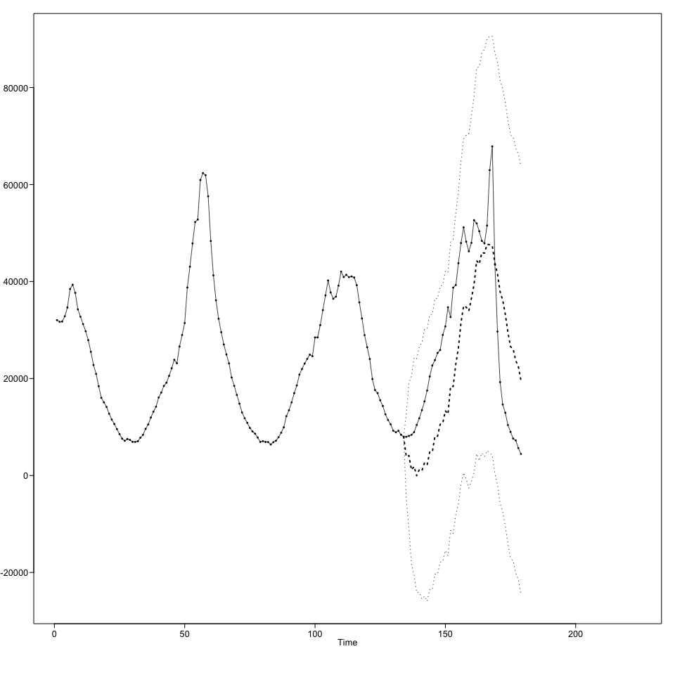

### Abstract

As the world adjusts to a new normal of illness prevention and caution towards viral infections, the microscope for drug and treatment companies gets larger and larger to be able to produce and supply medicines and equipment to meet the resource needs of the population. In our study, we looked into weekly cases of positive and negative test results for influenza, or most commonly known as the flu. Our dataset traced back to 2017 through June of 2020 and saw a cyclic behavior of spikes around the Q4 - Q1 season each year, or when weather is cold in the northern hemisphere. We ran a series of models using Maximum Likelihood Estimation, Burg, Yule Walker, Extreme Learning Machine, and Multi-layer Perceptron to forecast the next 45 days of flu cases. After checking through 26 and 52 week horizons, we were able to accurately predict historical forecasts and provide a roadmap to meet the demand for flu treatments in Q4 - Q1 of 2020/2021.

# Introduction

With infectious diseases taking the forefront of our news, culture and daily life, it’s more important than ever for drug and treatment companies to stay on top of the trends with the spread of disease to ensure they are meeting the resource needs. For cases like the flu, which has a direct seasonal spike around winter in the United States, it is critical to be able to predict these spikes accurately so you can best plan and serve your customers. In this study, we will look at data from the CDC spanning from 2017 through to 2020 that outlines the positive and negative cases of flu screenings in the U.S. We will explore some of the trends that occurred with historical data and use that to predict future flu cases more than 45 weeks out. 


```r
library(ggplot2)
library(tswge)
library(ggplot2)
library(ggthemes)
library(forecast)
```

```
## Warning: package 'forecast' was built under R version 3.6.2
```

```
## Registered S3 method overwritten by 'quantmod':
##   method            from
##   as.zoo.data.frame zoo
```

```r
library(tseries)
library(lubridate)
```

```
## 
## Attaching package: 'lubridate'
```

```
## The following object is masked from 'package:base':
## 
##     date
```

```r
library(datetime)
library(caret)
```

```
## Loading required package: lattice
```

```r
library(corrplot)
```

```
## corrplot 0.84 loaded
```

```r
library(DMwR)
```

```
## Loading required package: grid
```

```r
library(Hmisc)
```

```
## Loading required package: survival
```

```
## 
## Attaching package: 'survival'
```

```
## The following object is masked from 'package:caret':
## 
##     cluster
```

```
## Loading required package: Formula
```

```
## 
## Attaching package: 'Hmisc'
```

```
## The following objects are masked from 'package:base':
## 
##     format.pval, units
```

```r
library(ROCR)
```

```
## Loading required package: gplots
```

```
## 
## Attaching package: 'gplots'
```

```
## The following object is masked from 'package:stats':
## 
##     lowess
```

```r
library(stringr)
library(RVAideMemoire)
```

```
## *** Package RVAideMemoire v 0.9-75 ***
```

```
## 
## Attaching package: 'RVAideMemoire'
```

```
## The following object is masked from 'package:DMwR':
## 
##     bootstrap
```

```r
#install.packages("plotly")
library(plotly)
```

```
## Warning: package 'plotly' was built under R version 3.6.2
```

```
## 
## Attaching package: 'plotly'
```

```
## The following object is masked from 'package:Hmisc':
## 
##     subplot
```

```
## The following object is masked from 'package:ggplot2':
## 
##     last_plot
```

```
## The following object is masked from 'package:stats':
## 
##     filter
```

```
## The following object is masked from 'package:graphics':
## 
##     layout
```

```r
#install.packages('TSstudio')
library(TSstudio)
library(doParallel)
```

```
## Loading required package: foreach
```

```
## Loading required package: iterators
```

```
## Loading required package: parallel
```

```r
registerDoParallel(cores=16)
library(nnfor)
```

```
## Registered S3 method overwritten by 'greybox':
##   method     from
##   print.pcor lava
```

```r
library(vars)
```

```
## Loading required package: MASS
```

```
## 
## Attaching package: 'MASS'
```

```
## The following object is masked from 'package:plotly':
## 
##     select
```

```
## Loading required package: strucchange
```

```
## Loading required package: zoo
```

```
## 
## Attaching package: 'zoo'
```

```
## The following objects are masked from 'package:base':
## 
##     as.Date, as.Date.numeric
```

```
## Loading required package: sandwich
```

```
## 
## Attaching package: 'strucchange'
```

```
## The following object is masked from 'package:stringr':
## 
##     boundary
```

```
## Loading required package: urca
```

```
## Loading required package: lmtest
```

```r
ase <- function(x, xhat){
  s <- length(x) - length(xhat$f) + 1
  n <- length(x)
  mean((xhat$f-x[s:n])^2)
}
```


```r
getwd()
```

```
## [1] "/Users/chandlervaughn/Dropbox/4. Chandler/Development/git_repositories/MS7333_QTW/Case8"
```

```r
#fluDf = read.csv(file.choose(),header = TRUE)
#fluDf = read.csv("/Volumes/Dhyan-MacPC/Education/SMU /MSDS/DS 7333 Quantifying the World/Unit 8 - Case Study/flu_tidy.csv")
fluDf = read.csv("https://raw.githubusercontent.com/dhyanshah/MS7333_QTW/master/Case8/flu_tidy.csv")


head(fluDf)
```

<div data-pagedtable="false">
  <script data-pagedtable-source type="application/json">
{"columns":[{"label":[""],"name":["_rn_"],"type":[""],"align":["left"]},{"label":["year"],"name":[1],"type":["int"],"align":["right"]},{"label":["week"],"name":[2],"type":["int"],"align":["right"]},{"label":["week.year"],"name":[3],"type":["dbl"],"align":["right"]},{"label":["Positive"],"name":[4],"type":["int"],"align":["right"]},{"label":["Negative"],"name":[5],"type":["int"],"align":["right"]}],"data":[{"1":"2017","2":"1","3":"1.2017","4":"9770","5":"32027","_rn_":"1"},{"1":"2017","2":"2","3":"2.2017","4":"11527","5":"31696","_rn_":"2"},{"1":"2017","2":"3","3":"3.2017","4":"12064","5":"31760","_rn_":"3"},{"1":"2017","2":"4","3":"4.2017","4":"12385","5":"32838","_rn_":"4"},{"1":"2017","2":"5","3":"5.2017","4":"14466","5":"34640","_rn_":"5"},{"1":"2017","2":"6","3":"6.2017","4":"17591","5":"38442","_rn_":"6"}],"options":{"columns":{"min":{},"max":[10]},"rows":{"min":[10],"max":[10]},"pages":{}}}
  </script>
</div>

```r
dim(fluDf)
```

```
## [1] 179   5
```

```r
summary(fluDf)
```

```
##       year           week         week.year         Positive      
##  Min.   :2017   Min.   : 1.00   Min.   : 1.202   Min.   :   24.0  
##  1st Qu.:2017   1st Qu.:12.00   1st Qu.:12.202   1st Qu.:  358.5  
##  Median :2018   Median :23.00   Median :23.202   Median : 1601.0  
##  Mean   :2018   Mean   :24.64   Mean   :24.839   Mean   : 6568.2  
##  3rd Qu.:2019   3rd Qu.:37.50   3rd Qu.:37.702   3rd Qu.:11047.0  
##  Max.   :2020   Max.   :52.00   Max.   :52.202   Max.   :30771.0  
##     Negative    
##  Min.   : 4440  
##  1st Qu.:10738  
##  Median :22117  
##  Mean   :24692  
##  3rd Qu.:35908  
##  Max.   :67857
```

Running a quick summary of our data frame, we can see that our model is running from the first week of 2017 through June of 2020. The dataset includes 5 columns that denote the time frame that we are specifically targeting in our study. Additionally, we have columns that call out the number of positive and negative tests that were administered during the week of study. From a positive standpoint, we are maxing out at 30k total positives with a min of 24, so we have a pretty large range that we are working with. Among positive tests, the median is at 1,601 while the mean is at 6,500, which suggests our positive tests are right skeweed. 

Among our negative tests, we can see that our median and mean values per week are much closer, which shows that the negative data set is more normal than our positive tests dataset. 

### Methods

Considering we are going to be looking for the most accurate forecast of the upcoming data, we will need to be judicious to ensure that our historical data will be relevant to future data. Considering the recent changes to the supply chain and the strain of urbanization has left on companies’ ability to meet resource needs of consumers, we are choosing to use the most recent 3 years of data in our forecast. This will allow us to gather a sense of seasonality in our data across 4 quarters and to be able to see how that seasonality tends to change year over year in a broader linear trend. 

From here, we will want to account for the weekly seasonality in our dataset and forecast based on a 52 week and a 26 week landscape. In doing so, we will be looking forward 45 weeks to completely cover the time frame from June through the start of 2021, which will account for us to include the peak season in our final forecast. 


### Exploratory Data Analysis

## Week Year Review


```r
fig1 <- plot_ly(fluDf, x = ~Positive, y = ~week.year, name = "Positive", type = 'scatter',
               mode = "markers", marker = list(color = "pink"))
fig1 <- fig1 %>% add_trace(x = ~Negative, y = ~week.year, name = "Negative",type = 'scatter',
                         mode = "markers", marker = list(color = "blue"))
fig1 <- fig1 %>% layout(
  title = "Flu Cases",
  xaxis = list(title = "Number of Cases"),
  margin = list(l = 100)
)

fig1
```

```
## Warning: `arrange_()` is deprecated as of dplyr 0.7.0.
## Please use `arrange()` instead.
## See vignette('programming') for more help
## This warning is displayed once every 8 hours.
## Call `lifecycle::last_warnings()` to see where this warning was generated.
```

<!--html_preserve--><div id="htmlwidget-966d433e8888f1d425eb" style="width:960px;height:960px;" class="plotly html-widget"></div>
<script type="application/json" data-for="htmlwidget-966d433e8888f1d425eb">{"x":{"visdat":{"1003b3e2eb972":["function () ","plotlyVisDat"]},"cur_data":"1003b3e2eb972","attrs":{"1003b3e2eb972":{"x":{},"y":{},"mode":"markers","marker":{"color":"pink"},"name":"Positive","alpha_stroke":1,"sizes":[10,100],"spans":[1,20],"type":"scatter"},"1003b3e2eb972.1":{"x":{},"y":{},"mode":"markers","marker":{"color":"blue"},"name":"Negative","alpha_stroke":1,"sizes":[10,100],"spans":[1,20],"type":"scatter","inherit":true}},"layout":{"margin":{"b":40,"l":100,"t":25,"r":10},"title":"Flu Cases","xaxis":{"domain":[0,1],"automargin":true,"title":"Number of Cases"},"yaxis":{"domain":[0,1],"automargin":true,"title":"week.year"},"hovermode":"closest","showlegend":true},"source":"A","config":{"showSendToCloud":false},"data":[{"x":[9770,11527,12064,12385,14466,17591,17896,17171,12240,11117,9850,9714,8529,6302,4557,3266,2164,1652,1434,1213,927,777,600,467,359,301,268,245,209,214,223,226,180,217,306,370,408,404,455,573,627,705,915,1265,1601,2207,2851,3882,5791,8961,16447,20855,24240,27507,27154,30485,30771,30721,27573,20553,14671,10999,9522,7920,7067,5579,4468,3192,2424,1694,968,589,426,251,200,156,114,112,97,96,109,95,91,96,86,156,161,222,261,284,277,410,447,620,809,1011,1391,1747,2241,2872,3981,6557,9528,11095,10437,10274,11193,12928,15595,18461,18483,18870,18914,18699,18624,14882,11688,8496,6350,4095,2806,1861,1508,1250,965,767,629,511,399,359,358,289,302,278,279,246,285,335,477,504,504,596,664,473,583,675,936,1236,2383,3131,4919,5623,7173,10413,16793,23142,21991,20449,22377,25704,30419,29965,27572,24773,21919,19897,15808,7509,1662,506,192,130,77,67,68,65,29,24,25],"y":[1.2017,2.2017,3.2017,4.2017,5.2017,6.2017,7.2017,8.2017,9.2017,10.2017,11.2017,12.2017,13.2017,14.2017,15.2017,16.2017,17.2017,18.2017,19.2017,20.2017,21.2017,22.2017,23.2017,24.2017,25.2017,26.2017,27.2017,28.2017,29.2017,30.2017,31.2017,32.2017,33.2017,34.2017,35.2017,36.2017,37.2017,38.2017,39.2017,40.2017,41.2017,42.2017,43.2017,44.2017,45.2017,46.2017,47.2017,48.2017,49.2017,50.2017,51.2017,52.2017,1.2018,2.2018,3.2018,4.2018,5.2018,6.2018,7.2018,8.2018,9.2018,10.2018,11.2018,12.2018,13.2018,14.2018,15.2018,16.2018,17.2018,18.2018,19.2018,20.2018,21.2018,22.2018,23.2018,24.2018,25.2018,26.2018,27.2018,28.2018,29.2018,30.2018,31.2018,32.2018,33.2018,34.2018,35.2018,36.2018,37.2018,38.2018,39.2018,40.2018,41.2018,42.2018,43.2018,44.2018,45.2018,46.2018,47.2018,48.2018,49.2018,50.2018,51.2018,52.2018,1.2019,2.2019,3.2019,4.2019,5.2019,6.2019,7.2019,8.2019,9.2019,10.2019,11.2019,12.2019,13.2019,14.2019,15.2019,16.2019,17.2019,18.2019,19.2019,20.2019,21.2019,22.2019,23.2019,24.2019,25.2019,26.2019,27.2019,28.2019,29.2019,30.2019,31.2019,32.2019,33.2019,34.2019,35.2019,36.2019,37.2019,38.2019,39.2019,40.2019,41.2019,42.2019,43.2019,44.2019,45.2019,46.2019,47.2019,48.2019,49.2019,50.2019,51.2019,52.2019,1.202,2.202,3.202,4.202,5.202,6.202,7.202,8.202,9.202,10.202,11.202,12.202,13.202,14.202,15.202,16.202,17.202,18.202,19.202,20.202,21.202,22.202,23.202],"mode":"markers","marker":{"color":"pink","line":{"color":"rgba(31,119,180,1)"}},"name":"Positive","type":"scatter","error_y":{"color":"rgba(31,119,180,1)"},"error_x":{"color":"rgba(31,119,180,1)"},"line":{"color":"rgba(31,119,180,1)"},"xaxis":"x","yaxis":"y","frame":null},{"x":[32027,31696,31760,32838,34640,38442,39335,37663,34264,32740,31217,29746,27905,25497,22778,20956,18404,16014,15082,14136,12727,11541,10616,9556,8524,7592,7155,7519,7341,6933,6914,7058,7797,8371,9618,10519,11951,13165,14184,16070,17102,18472,19124,20540,22117,23851,23144,26598,28965,31436,38764,43049,47846,52262,52775,60927,62357,61920,57573,48353,41268,36118,32314,29552,27014,24955,23119,20202,18481,16609,14801,12996,11805,10861,9811,9074,8614,7825,6920,7075,6908,6891,6396,6867,7169,7893,8821,9930,12224,13447,15067,16975,18564,20797,21957,23086,24036,24924,24598,28467,28467,31004,34092,37141,40210,37747,36444,36881,39146,42040,40913,41377,40904,41051,40822,39246,35698,32384,28950,26442,24025,19889,17621,16990,15513,14333,12616,11442,10549,9234,8907,9226,8395,7992,7965,8151,8380,8942,10421,11792,13479,15276,17515,20411,22688,23793,25268,25875,28981,30741,34688,32662,38739,39268,43767,47931,51163,48218,46218,47967,52647,51990,50369,48379,47880,51533,62955,67857,43546,29692,19256,14638,12926,10395,8983,7621,7231,5650,4440],"y":[1.2017,2.2017,3.2017,4.2017,5.2017,6.2017,7.2017,8.2017,9.2017,10.2017,11.2017,12.2017,13.2017,14.2017,15.2017,16.2017,17.2017,18.2017,19.2017,20.2017,21.2017,22.2017,23.2017,24.2017,25.2017,26.2017,27.2017,28.2017,29.2017,30.2017,31.2017,32.2017,33.2017,34.2017,35.2017,36.2017,37.2017,38.2017,39.2017,40.2017,41.2017,42.2017,43.2017,44.2017,45.2017,46.2017,47.2017,48.2017,49.2017,50.2017,51.2017,52.2017,1.2018,2.2018,3.2018,4.2018,5.2018,6.2018,7.2018,8.2018,9.2018,10.2018,11.2018,12.2018,13.2018,14.2018,15.2018,16.2018,17.2018,18.2018,19.2018,20.2018,21.2018,22.2018,23.2018,24.2018,25.2018,26.2018,27.2018,28.2018,29.2018,30.2018,31.2018,32.2018,33.2018,34.2018,35.2018,36.2018,37.2018,38.2018,39.2018,40.2018,41.2018,42.2018,43.2018,44.2018,45.2018,46.2018,47.2018,48.2018,49.2018,50.2018,51.2018,52.2018,1.2019,2.2019,3.2019,4.2019,5.2019,6.2019,7.2019,8.2019,9.2019,10.2019,11.2019,12.2019,13.2019,14.2019,15.2019,16.2019,17.2019,18.2019,19.2019,20.2019,21.2019,22.2019,23.2019,24.2019,25.2019,26.2019,27.2019,28.2019,29.2019,30.2019,31.2019,32.2019,33.2019,34.2019,35.2019,36.2019,37.2019,38.2019,39.2019,40.2019,41.2019,42.2019,43.2019,44.2019,45.2019,46.2019,47.2019,48.2019,49.2019,50.2019,51.2019,52.2019,1.202,2.202,3.202,4.202,5.202,6.202,7.202,8.202,9.202,10.202,11.202,12.202,13.202,14.202,15.202,16.202,17.202,18.202,19.202,20.202,21.202,22.202,23.202],"mode":"markers","marker":{"color":"blue","line":{"color":"rgba(255,127,14,1)"}},"name":"Negative","type":"scatter","error_y":{"color":"rgba(255,127,14,1)"},"error_x":{"color":"rgba(255,127,14,1)"},"line":{"color":"rgba(255,127,14,1)"},"xaxis":"x","yaxis":"y","frame":null}],"highlight":{"on":"plotly_click","persistent":false,"dynamic":false,"selectize":false,"opacityDim":0.2,"selected":{"opacity":1},"debounce":0},"shinyEvents":["plotly_hover","plotly_click","plotly_selected","plotly_relayout","plotly_brushed","plotly_brushing","plotly_clickannotation","plotly_doubleclick","plotly_deselect","plotly_afterplot","plotly_sunburstclick"],"base_url":"https://plot.ly"},"evals":[],"jsHooks":[]}</script><!--/html_preserve-->

Reviewing the number of flu cases among our years' data assigned to the week number throughout the year, we can see that the number of cases spike more heavily during the early months and later months of the year, which would coincide during the winter months throughout the year. This makes sense as we would expect the colder weather to have a higher correlation with instances of the flu.

During the middle months out of the year, the number of flu instances drop almost to zero particularly from week 20 through week 40. This also, makes sense as the warmer weather summer months, are better correlated to lower instances of the flu. 

## Year Review


```r
fig2 <- plot_ly(fluDf, x = ~Positive, y = ~year, name = "Positive", type = 'scatter',
                mode = "markers", marker = list(color = "pink"))
fig2 <- fig2 %>% add_trace(x = ~Negative, y = ~year, name = "Negative",type = 'scatter',
                           mode = "markers", marker = list(color = "blue"))
fig2 <- fig2 %>% layout(
  title = "Flu Cases",
  xaxis = list(title = "Number of Cases"),
  margin = list(l = 100)
)

fig2
```

<!--html_preserve--><div id="htmlwidget-882004b93ef32b469051" style="width:960px;height:960px;" class="plotly html-widget"></div>
<script type="application/json" data-for="htmlwidget-882004b93ef32b469051">{"x":{"visdat":{"1003b4d7a5240":["function () ","plotlyVisDat"]},"cur_data":"1003b4d7a5240","attrs":{"1003b4d7a5240":{"x":{},"y":{},"mode":"markers","marker":{"color":"pink"},"name":"Positive","alpha_stroke":1,"sizes":[10,100],"spans":[1,20],"type":"scatter"},"1003b4d7a5240.1":{"x":{},"y":{},"mode":"markers","marker":{"color":"blue"},"name":"Negative","alpha_stroke":1,"sizes":[10,100],"spans":[1,20],"type":"scatter","inherit":true}},"layout":{"margin":{"b":40,"l":100,"t":25,"r":10},"title":"Flu Cases","xaxis":{"domain":[0,1],"automargin":true,"title":"Number of Cases"},"yaxis":{"domain":[0,1],"automargin":true,"title":"year"},"hovermode":"closest","showlegend":true},"source":"A","config":{"showSendToCloud":false},"data":[{"x":[9770,11527,12064,12385,14466,17591,17896,17171,12240,11117,9850,9714,8529,6302,4557,3266,2164,1652,1434,1213,927,777,600,467,359,301,268,245,209,214,223,226,180,217,306,370,408,404,455,573,627,705,915,1265,1601,2207,2851,3882,5791,8961,16447,20855,24240,27507,27154,30485,30771,30721,27573,20553,14671,10999,9522,7920,7067,5579,4468,3192,2424,1694,968,589,426,251,200,156,114,112,97,96,109,95,91,96,86,156,161,222,261,284,277,410,447,620,809,1011,1391,1747,2241,2872,3981,6557,9528,11095,10437,10274,11193,12928,15595,18461,18483,18870,18914,18699,18624,14882,11688,8496,6350,4095,2806,1861,1508,1250,965,767,629,511,399,359,358,289,302,278,279,246,285,335,477,504,504,596,664,473,583,675,936,1236,2383,3131,4919,5623,7173,10413,16793,23142,21991,20449,22377,25704,30419,29965,27572,24773,21919,19897,15808,7509,1662,506,192,130,77,67,68,65,29,24,25],"y":[2017,2017,2017,2017,2017,2017,2017,2017,2017,2017,2017,2017,2017,2017,2017,2017,2017,2017,2017,2017,2017,2017,2017,2017,2017,2017,2017,2017,2017,2017,2017,2017,2017,2017,2017,2017,2017,2017,2017,2017,2017,2017,2017,2017,2017,2017,2017,2017,2017,2017,2017,2017,2018,2018,2018,2018,2018,2018,2018,2018,2018,2018,2018,2018,2018,2018,2018,2018,2018,2018,2018,2018,2018,2018,2018,2018,2018,2018,2018,2018,2018,2018,2018,2018,2018,2018,2018,2018,2018,2018,2018,2018,2018,2018,2018,2018,2018,2018,2018,2018,2018,2018,2018,2018,2019,2019,2019,2019,2019,2019,2019,2019,2019,2019,2019,2019,2019,2019,2019,2019,2019,2019,2019,2019,2019,2019,2019,2019,2019,2019,2019,2019,2019,2019,2019,2019,2019,2019,2019,2019,2019,2019,2019,2019,2019,2019,2019,2019,2019,2019,2019,2019,2019,2019,2019,2019,2020,2020,2020,2020,2020,2020,2020,2020,2020,2020,2020,2020,2020,2020,2020,2020,2020,2020,2020,2020,2020,2020,2020],"mode":"markers","marker":{"color":"pink","line":{"color":"rgba(31,119,180,1)"}},"name":"Positive","type":"scatter","error_y":{"color":"rgba(31,119,180,1)"},"error_x":{"color":"rgba(31,119,180,1)"},"line":{"color":"rgba(31,119,180,1)"},"xaxis":"x","yaxis":"y","frame":null},{"x":[32027,31696,31760,32838,34640,38442,39335,37663,34264,32740,31217,29746,27905,25497,22778,20956,18404,16014,15082,14136,12727,11541,10616,9556,8524,7592,7155,7519,7341,6933,6914,7058,7797,8371,9618,10519,11951,13165,14184,16070,17102,18472,19124,20540,22117,23851,23144,26598,28965,31436,38764,43049,47846,52262,52775,60927,62357,61920,57573,48353,41268,36118,32314,29552,27014,24955,23119,20202,18481,16609,14801,12996,11805,10861,9811,9074,8614,7825,6920,7075,6908,6891,6396,6867,7169,7893,8821,9930,12224,13447,15067,16975,18564,20797,21957,23086,24036,24924,24598,28467,28467,31004,34092,37141,40210,37747,36444,36881,39146,42040,40913,41377,40904,41051,40822,39246,35698,32384,28950,26442,24025,19889,17621,16990,15513,14333,12616,11442,10549,9234,8907,9226,8395,7992,7965,8151,8380,8942,10421,11792,13479,15276,17515,20411,22688,23793,25268,25875,28981,30741,34688,32662,38739,39268,43767,47931,51163,48218,46218,47967,52647,51990,50369,48379,47880,51533,62955,67857,43546,29692,19256,14638,12926,10395,8983,7621,7231,5650,4440],"y":[2017,2017,2017,2017,2017,2017,2017,2017,2017,2017,2017,2017,2017,2017,2017,2017,2017,2017,2017,2017,2017,2017,2017,2017,2017,2017,2017,2017,2017,2017,2017,2017,2017,2017,2017,2017,2017,2017,2017,2017,2017,2017,2017,2017,2017,2017,2017,2017,2017,2017,2017,2017,2018,2018,2018,2018,2018,2018,2018,2018,2018,2018,2018,2018,2018,2018,2018,2018,2018,2018,2018,2018,2018,2018,2018,2018,2018,2018,2018,2018,2018,2018,2018,2018,2018,2018,2018,2018,2018,2018,2018,2018,2018,2018,2018,2018,2018,2018,2018,2018,2018,2018,2018,2018,2019,2019,2019,2019,2019,2019,2019,2019,2019,2019,2019,2019,2019,2019,2019,2019,2019,2019,2019,2019,2019,2019,2019,2019,2019,2019,2019,2019,2019,2019,2019,2019,2019,2019,2019,2019,2019,2019,2019,2019,2019,2019,2019,2019,2019,2019,2019,2019,2019,2019,2019,2019,2020,2020,2020,2020,2020,2020,2020,2020,2020,2020,2020,2020,2020,2020,2020,2020,2020,2020,2020,2020,2020,2020,2020],"mode":"markers","marker":{"color":"blue","line":{"color":"rgba(255,127,14,1)"}},"name":"Negative","type":"scatter","error_y":{"color":"rgba(255,127,14,1)"},"error_x":{"color":"rgba(255,127,14,1)"},"line":{"color":"rgba(255,127,14,1)"},"xaxis":"x","yaxis":"y","frame":null}],"highlight":{"on":"plotly_click","persistent":false,"dynamic":false,"selectize":false,"opacityDim":0.2,"selected":{"opacity":1},"debounce":0},"shinyEvents":["plotly_hover","plotly_click","plotly_selected","plotly_relayout","plotly_brushed","plotly_brushing","plotly_clickannotation","plotly_doubleclick","plotly_deselect","plotly_afterplot","plotly_sunburstclick"],"base_url":"https://plot.ly"},"evals":[],"jsHooks":[]}</script><!--/html_preserve-->

The plot above provides a visual of 2d scatter plots of our year in review, as well as the number of instances of positive and negative tests per week. From 2017 to 2019, the dots for the positive tests leaned more on the lower end of the spectrum, while the negative tests are on the higher end of the spectrum. This would indicate that during those 3 years, the proportion of positive tests is much lower than the instances of negative tests. 

For the 2020 data specifically, we see much more overlap between the positive and negative weeks for weeks the number of results were lower than 40k. This is likely due to the fact that our time frame of the research study ran between Jan through the end of May, and we have equal numbers of months where we have cold weather and warm weather during that time of the year. 


```r
fig3 <- plot_ly(data = fluDf, x = ~Positive, y = ~Negative,
               marker = list(size = 10,
                             color = ~year,
                             line = list(color = ~year,
                                         width = 2)))
fig3 <- fig3 %>% layout(title = 'Flu Cases',
                      yaxis = list(zeroline = FALSE),
                      xaxis = list(zeroline = FALSE))

fig3
```

```
## No trace type specified:
##   Based on info supplied, a 'scatter' trace seems appropriate.
##   Read more about this trace type -> https://plot.ly/r/reference/#scatter
```

```
## No scatter mode specifed:
##   Setting the mode to markers
##   Read more about this attribute -> https://plot.ly/r/reference/#scatter-mode
```

<!--html_preserve--><div id="htmlwidget-896fe936664b1b808708" style="width:960px;height:960px;" class="plotly html-widget"></div>
<script type="application/json" data-for="htmlwidget-896fe936664b1b808708">{"x":{"visdat":{"1003b727ae4b6":["function () ","plotlyVisDat"]},"cur_data":"1003b727ae4b6","attrs":{"1003b727ae4b6":{"x":{},"y":{},"marker":{"size":10,"color":{},"line":{"color":{},"width":2}},"alpha_stroke":1,"sizes":[10,100],"spans":[1,20]}},"layout":{"margin":{"b":40,"l":60,"t":25,"r":10},"title":"Flu Cases","yaxis":{"domain":[0,1],"automargin":true,"zeroline":false,"title":"Negative"},"xaxis":{"domain":[0,1],"automargin":true,"zeroline":false,"title":"Positive"},"hovermode":"closest","showlegend":false},"source":"A","config":{"showSendToCloud":false},"data":[{"x":[9770,11527,12064,12385,14466,17591,17896,17171,12240,11117,9850,9714,8529,6302,4557,3266,2164,1652,1434,1213,927,777,600,467,359,301,268,245,209,214,223,226,180,217,306,370,408,404,455,573,627,705,915,1265,1601,2207,2851,3882,5791,8961,16447,20855,24240,27507,27154,30485,30771,30721,27573,20553,14671,10999,9522,7920,7067,5579,4468,3192,2424,1694,968,589,426,251,200,156,114,112,97,96,109,95,91,96,86,156,161,222,261,284,277,410,447,620,809,1011,1391,1747,2241,2872,3981,6557,9528,11095,10437,10274,11193,12928,15595,18461,18483,18870,18914,18699,18624,14882,11688,8496,6350,4095,2806,1861,1508,1250,965,767,629,511,399,359,358,289,302,278,279,246,285,335,477,504,504,596,664,473,583,675,936,1236,2383,3131,4919,5623,7173,10413,16793,23142,21991,20449,22377,25704,30419,29965,27572,24773,21919,19897,15808,7509,1662,506,192,130,77,67,68,65,29,24,25],"y":[32027,31696,31760,32838,34640,38442,39335,37663,34264,32740,31217,29746,27905,25497,22778,20956,18404,16014,15082,14136,12727,11541,10616,9556,8524,7592,7155,7519,7341,6933,6914,7058,7797,8371,9618,10519,11951,13165,14184,16070,17102,18472,19124,20540,22117,23851,23144,26598,28965,31436,38764,43049,47846,52262,52775,60927,62357,61920,57573,48353,41268,36118,32314,29552,27014,24955,23119,20202,18481,16609,14801,12996,11805,10861,9811,9074,8614,7825,6920,7075,6908,6891,6396,6867,7169,7893,8821,9930,12224,13447,15067,16975,18564,20797,21957,23086,24036,24924,24598,28467,28467,31004,34092,37141,40210,37747,36444,36881,39146,42040,40913,41377,40904,41051,40822,39246,35698,32384,28950,26442,24025,19889,17621,16990,15513,14333,12616,11442,10549,9234,8907,9226,8395,7992,7965,8151,8380,8942,10421,11792,13479,15276,17515,20411,22688,23793,25268,25875,28981,30741,34688,32662,38739,39268,43767,47931,51163,48218,46218,47967,52647,51990,50369,48379,47880,51533,62955,67857,43546,29692,19256,14638,12926,10395,8983,7621,7231,5650,4440],"marker":{"color":[2017,2017,2017,2017,2017,2017,2017,2017,2017,2017,2017,2017,2017,2017,2017,2017,2017,2017,2017,2017,2017,2017,2017,2017,2017,2017,2017,2017,2017,2017,2017,2017,2017,2017,2017,2017,2017,2017,2017,2017,2017,2017,2017,2017,2017,2017,2017,2017,2017,2017,2017,2017,2018,2018,2018,2018,2018,2018,2018,2018,2018,2018,2018,2018,2018,2018,2018,2018,2018,2018,2018,2018,2018,2018,2018,2018,2018,2018,2018,2018,2018,2018,2018,2018,2018,2018,2018,2018,2018,2018,2018,2018,2018,2018,2018,2018,2018,2018,2018,2018,2018,2018,2018,2018,2019,2019,2019,2019,2019,2019,2019,2019,2019,2019,2019,2019,2019,2019,2019,2019,2019,2019,2019,2019,2019,2019,2019,2019,2019,2019,2019,2019,2019,2019,2019,2019,2019,2019,2019,2019,2019,2019,2019,2019,2019,2019,2019,2019,2019,2019,2019,2019,2019,2019,2019,2019,2020,2020,2020,2020,2020,2020,2020,2020,2020,2020,2020,2020,2020,2020,2020,2020,2020,2020,2020,2020,2020,2020,2020],"size":10,"line":{"color":[2017,2017,2017,2017,2017,2017,2017,2017,2017,2017,2017,2017,2017,2017,2017,2017,2017,2017,2017,2017,2017,2017,2017,2017,2017,2017,2017,2017,2017,2017,2017,2017,2017,2017,2017,2017,2017,2017,2017,2017,2017,2017,2017,2017,2017,2017,2017,2017,2017,2017,2017,2017,2018,2018,2018,2018,2018,2018,2018,2018,2018,2018,2018,2018,2018,2018,2018,2018,2018,2018,2018,2018,2018,2018,2018,2018,2018,2018,2018,2018,2018,2018,2018,2018,2018,2018,2018,2018,2018,2018,2018,2018,2018,2018,2018,2018,2018,2018,2018,2018,2018,2018,2018,2018,2019,2019,2019,2019,2019,2019,2019,2019,2019,2019,2019,2019,2019,2019,2019,2019,2019,2019,2019,2019,2019,2019,2019,2019,2019,2019,2019,2019,2019,2019,2019,2019,2019,2019,2019,2019,2019,2019,2019,2019,2019,2019,2019,2019,2019,2019,2019,2019,2019,2019,2019,2019,2020,2020,2020,2020,2020,2020,2020,2020,2020,2020,2020,2020,2020,2020,2020,2020,2020,2020,2020,2020,2020,2020,2020],"width":2}},"type":"scatter","mode":"markers","error_y":{"color":"rgba(31,119,180,1)"},"error_x":{"color":"rgba(31,119,180,1)"},"line":{"color":"rgba(31,119,180,1)"},"xaxis":"x","yaxis":"y","frame":null}],"highlight":{"on":"plotly_click","persistent":false,"dynamic":false,"selectize":false,"opacityDim":0.2,"selected":{"opacity":1},"debounce":0},"shinyEvents":["plotly_hover","plotly_click","plotly_selected","plotly_relayout","plotly_brushed","plotly_brushing","plotly_clickannotation","plotly_doubleclick","plotly_deselect","plotly_afterplot","plotly_sunburstclick"],"base_url":"https://plot.ly"},"evals":[],"jsHooks":[]}</script><!--/html_preserve-->

Combining the years and number of cases, we provided a scatter chart that shows the relationship of the number of positive cases and negative cases denoted by year. The first thing we can see is that we never have a week where the number of positive cases exceed the number of negative cases. Additionally, we can see there are a couple of interesting outliers that appear in the upper left corner. However, these cases would reflect instances where we likely saw a higher number of tests took place. 


```r
fig4 <- plot_ly(fluDf, x = ~year, y = ~Positive, type = 'bar', name = 'Positive')
fig4 <- fig4 %>% add_trace(y = ~Negative, name = 'Negative')
fig4 <- fig4 %>% layout(yaxis = list(title = 'Count'), barmode = 'stack')

fig4
```

<!--html_preserve--><div id="htmlwidget-6573e194be3add2afbd1" style="width:960px;height:960px;" class="plotly html-widget"></div>
<script type="application/json" data-for="htmlwidget-6573e194be3add2afbd1">{"x":{"visdat":{"1003b3cb5821a":["function () ","plotlyVisDat"]},"cur_data":"1003b3cb5821a","attrs":{"1003b3cb5821a":{"x":{},"y":{},"name":"Positive","alpha_stroke":1,"sizes":[10,100],"spans":[1,20],"type":"bar"},"1003b3cb5821a.1":{"x":{},"y":{},"name":"Negative","alpha_stroke":1,"sizes":[10,100],"spans":[1,20],"type":"bar","inherit":true}},"layout":{"margin":{"b":40,"l":60,"t":25,"r":10},"yaxis":{"domain":[0,1],"automargin":true,"title":"Count"},"barmode":"stack","xaxis":{"domain":[0,1],"automargin":true,"title":"year"},"hovermode":"closest","showlegend":true},"source":"A","config":{"showSendToCloud":false},"data":[{"x":[2017,2017,2017,2017,2017,2017,2017,2017,2017,2017,2017,2017,2017,2017,2017,2017,2017,2017,2017,2017,2017,2017,2017,2017,2017,2017,2017,2017,2017,2017,2017,2017,2017,2017,2017,2017,2017,2017,2017,2017,2017,2017,2017,2017,2017,2017,2017,2017,2017,2017,2017,2017,2018,2018,2018,2018,2018,2018,2018,2018,2018,2018,2018,2018,2018,2018,2018,2018,2018,2018,2018,2018,2018,2018,2018,2018,2018,2018,2018,2018,2018,2018,2018,2018,2018,2018,2018,2018,2018,2018,2018,2018,2018,2018,2018,2018,2018,2018,2018,2018,2018,2018,2018,2018,2019,2019,2019,2019,2019,2019,2019,2019,2019,2019,2019,2019,2019,2019,2019,2019,2019,2019,2019,2019,2019,2019,2019,2019,2019,2019,2019,2019,2019,2019,2019,2019,2019,2019,2019,2019,2019,2019,2019,2019,2019,2019,2019,2019,2019,2019,2019,2019,2019,2019,2019,2019,2020,2020,2020,2020,2020,2020,2020,2020,2020,2020,2020,2020,2020,2020,2020,2020,2020,2020,2020,2020,2020,2020,2020],"y":[9770,11527,12064,12385,14466,17591,17896,17171,12240,11117,9850,9714,8529,6302,4557,3266,2164,1652,1434,1213,927,777,600,467,359,301,268,245,209,214,223,226,180,217,306,370,408,404,455,573,627,705,915,1265,1601,2207,2851,3882,5791,8961,16447,20855,24240,27507,27154,30485,30771,30721,27573,20553,14671,10999,9522,7920,7067,5579,4468,3192,2424,1694,968,589,426,251,200,156,114,112,97,96,109,95,91,96,86,156,161,222,261,284,277,410,447,620,809,1011,1391,1747,2241,2872,3981,6557,9528,11095,10437,10274,11193,12928,15595,18461,18483,18870,18914,18699,18624,14882,11688,8496,6350,4095,2806,1861,1508,1250,965,767,629,511,399,359,358,289,302,278,279,246,285,335,477,504,504,596,664,473,583,675,936,1236,2383,3131,4919,5623,7173,10413,16793,23142,21991,20449,22377,25704,30419,29965,27572,24773,21919,19897,15808,7509,1662,506,192,130,77,67,68,65,29,24,25],"name":"Positive","type":"bar","marker":{"color":"rgba(31,119,180,1)","line":{"color":"rgba(31,119,180,1)"}},"error_y":{"color":"rgba(31,119,180,1)"},"error_x":{"color":"rgba(31,119,180,1)"},"xaxis":"x","yaxis":"y","frame":null},{"x":[2017,2017,2017,2017,2017,2017,2017,2017,2017,2017,2017,2017,2017,2017,2017,2017,2017,2017,2017,2017,2017,2017,2017,2017,2017,2017,2017,2017,2017,2017,2017,2017,2017,2017,2017,2017,2017,2017,2017,2017,2017,2017,2017,2017,2017,2017,2017,2017,2017,2017,2017,2017,2018,2018,2018,2018,2018,2018,2018,2018,2018,2018,2018,2018,2018,2018,2018,2018,2018,2018,2018,2018,2018,2018,2018,2018,2018,2018,2018,2018,2018,2018,2018,2018,2018,2018,2018,2018,2018,2018,2018,2018,2018,2018,2018,2018,2018,2018,2018,2018,2018,2018,2018,2018,2019,2019,2019,2019,2019,2019,2019,2019,2019,2019,2019,2019,2019,2019,2019,2019,2019,2019,2019,2019,2019,2019,2019,2019,2019,2019,2019,2019,2019,2019,2019,2019,2019,2019,2019,2019,2019,2019,2019,2019,2019,2019,2019,2019,2019,2019,2019,2019,2019,2019,2019,2019,2020,2020,2020,2020,2020,2020,2020,2020,2020,2020,2020,2020,2020,2020,2020,2020,2020,2020,2020,2020,2020,2020,2020],"y":[32027,31696,31760,32838,34640,38442,39335,37663,34264,32740,31217,29746,27905,25497,22778,20956,18404,16014,15082,14136,12727,11541,10616,9556,8524,7592,7155,7519,7341,6933,6914,7058,7797,8371,9618,10519,11951,13165,14184,16070,17102,18472,19124,20540,22117,23851,23144,26598,28965,31436,38764,43049,47846,52262,52775,60927,62357,61920,57573,48353,41268,36118,32314,29552,27014,24955,23119,20202,18481,16609,14801,12996,11805,10861,9811,9074,8614,7825,6920,7075,6908,6891,6396,6867,7169,7893,8821,9930,12224,13447,15067,16975,18564,20797,21957,23086,24036,24924,24598,28467,28467,31004,34092,37141,40210,37747,36444,36881,39146,42040,40913,41377,40904,41051,40822,39246,35698,32384,28950,26442,24025,19889,17621,16990,15513,14333,12616,11442,10549,9234,8907,9226,8395,7992,7965,8151,8380,8942,10421,11792,13479,15276,17515,20411,22688,23793,25268,25875,28981,30741,34688,32662,38739,39268,43767,47931,51163,48218,46218,47967,52647,51990,50369,48379,47880,51533,62955,67857,43546,29692,19256,14638,12926,10395,8983,7621,7231,5650,4440],"name":"Negative","type":"bar","marker":{"color":"rgba(255,127,14,1)","line":{"color":"rgba(255,127,14,1)"}},"error_y":{"color":"rgba(255,127,14,1)"},"error_x":{"color":"rgba(255,127,14,1)"},"xaxis":"x","yaxis":"y","frame":null}],"highlight":{"on":"plotly_click","persistent":false,"dynamic":false,"selectize":false,"opacityDim":0.2,"selected":{"opacity":1},"debounce":0},"shinyEvents":["plotly_hover","plotly_click","plotly_selected","plotly_relayout","plotly_brushed","plotly_brushing","plotly_clickannotation","plotly_doubleclick","plotly_deselect","plotly_afterplot","plotly_sunburstclick"],"base_url":"https://plot.ly"},"evals":[],"jsHooks":[]}</script><!--/html_preserve-->

```r
fig5 <- plot_ly(fluDf, x = ~week, y = ~Positive, type = 'bar', name = 'Positive')
fig5 <- fig5 %>% add_trace(y = ~Negative, name = 'Negative')
fig5 <- fig5 %>% layout(yaxis = list(title = 'Count'), barmode = 'stack')

fig5
```

<!--html_preserve--><div id="htmlwidget-145d84b61ac2165d1023" style="width:960px;height:960px;" class="plotly html-widget"></div>
<script type="application/json" data-for="htmlwidget-145d84b61ac2165d1023">{"x":{"visdat":{"1003b30709819":["function () ","plotlyVisDat"]},"cur_data":"1003b30709819","attrs":{"1003b30709819":{"x":{},"y":{},"name":"Positive","alpha_stroke":1,"sizes":[10,100],"spans":[1,20],"type":"bar"},"1003b30709819.1":{"x":{},"y":{},"name":"Negative","alpha_stroke":1,"sizes":[10,100],"spans":[1,20],"type":"bar","inherit":true}},"layout":{"margin":{"b":40,"l":60,"t":25,"r":10},"yaxis":{"domain":[0,1],"automargin":true,"title":"Count"},"barmode":"stack","xaxis":{"domain":[0,1],"automargin":true,"title":"week"},"hovermode":"closest","showlegend":true},"source":"A","config":{"showSendToCloud":false},"data":[{"x":[1,2,3,4,5,6,7,8,9,10,11,12,13,14,15,16,17,18,19,20,21,22,23,24,25,26,27,28,29,30,31,32,33,34,35,36,37,38,39,40,41,42,43,44,45,46,47,48,49,50,51,52,1,2,3,4,5,6,7,8,9,10,11,12,13,14,15,16,17,18,19,20,21,22,23,24,25,26,27,28,29,30,31,32,33,34,35,36,37,38,39,40,41,42,43,44,45,46,47,48,49,50,51,52,1,2,3,4,5,6,7,8,9,10,11,12,13,14,15,16,17,18,19,20,21,22,23,24,25,26,27,28,29,30,31,32,33,34,35,36,37,38,39,40,41,42,43,44,45,46,47,48,49,50,51,52,1,2,3,4,5,6,7,8,9,10,11,12,13,14,15,16,17,18,19,20,21,22,23],"y":[9770,11527,12064,12385,14466,17591,17896,17171,12240,11117,9850,9714,8529,6302,4557,3266,2164,1652,1434,1213,927,777,600,467,359,301,268,245,209,214,223,226,180,217,306,370,408,404,455,573,627,705,915,1265,1601,2207,2851,3882,5791,8961,16447,20855,24240,27507,27154,30485,30771,30721,27573,20553,14671,10999,9522,7920,7067,5579,4468,3192,2424,1694,968,589,426,251,200,156,114,112,97,96,109,95,91,96,86,156,161,222,261,284,277,410,447,620,809,1011,1391,1747,2241,2872,3981,6557,9528,11095,10437,10274,11193,12928,15595,18461,18483,18870,18914,18699,18624,14882,11688,8496,6350,4095,2806,1861,1508,1250,965,767,629,511,399,359,358,289,302,278,279,246,285,335,477,504,504,596,664,473,583,675,936,1236,2383,3131,4919,5623,7173,10413,16793,23142,21991,20449,22377,25704,30419,29965,27572,24773,21919,19897,15808,7509,1662,506,192,130,77,67,68,65,29,24,25],"name":"Positive","type":"bar","marker":{"color":"rgba(31,119,180,1)","line":{"color":"rgba(31,119,180,1)"}},"error_y":{"color":"rgba(31,119,180,1)"},"error_x":{"color":"rgba(31,119,180,1)"},"xaxis":"x","yaxis":"y","frame":null},{"x":[1,2,3,4,5,6,7,8,9,10,11,12,13,14,15,16,17,18,19,20,21,22,23,24,25,26,27,28,29,30,31,32,33,34,35,36,37,38,39,40,41,42,43,44,45,46,47,48,49,50,51,52,1,2,3,4,5,6,7,8,9,10,11,12,13,14,15,16,17,18,19,20,21,22,23,24,25,26,27,28,29,30,31,32,33,34,35,36,37,38,39,40,41,42,43,44,45,46,47,48,49,50,51,52,1,2,3,4,5,6,7,8,9,10,11,12,13,14,15,16,17,18,19,20,21,22,23,24,25,26,27,28,29,30,31,32,33,34,35,36,37,38,39,40,41,42,43,44,45,46,47,48,49,50,51,52,1,2,3,4,5,6,7,8,9,10,11,12,13,14,15,16,17,18,19,20,21,22,23],"y":[32027,31696,31760,32838,34640,38442,39335,37663,34264,32740,31217,29746,27905,25497,22778,20956,18404,16014,15082,14136,12727,11541,10616,9556,8524,7592,7155,7519,7341,6933,6914,7058,7797,8371,9618,10519,11951,13165,14184,16070,17102,18472,19124,20540,22117,23851,23144,26598,28965,31436,38764,43049,47846,52262,52775,60927,62357,61920,57573,48353,41268,36118,32314,29552,27014,24955,23119,20202,18481,16609,14801,12996,11805,10861,9811,9074,8614,7825,6920,7075,6908,6891,6396,6867,7169,7893,8821,9930,12224,13447,15067,16975,18564,20797,21957,23086,24036,24924,24598,28467,28467,31004,34092,37141,40210,37747,36444,36881,39146,42040,40913,41377,40904,41051,40822,39246,35698,32384,28950,26442,24025,19889,17621,16990,15513,14333,12616,11442,10549,9234,8907,9226,8395,7992,7965,8151,8380,8942,10421,11792,13479,15276,17515,20411,22688,23793,25268,25875,28981,30741,34688,32662,38739,39268,43767,47931,51163,48218,46218,47967,52647,51990,50369,48379,47880,51533,62955,67857,43546,29692,19256,14638,12926,10395,8983,7621,7231,5650,4440],"name":"Negative","type":"bar","marker":{"color":"rgba(255,127,14,1)","line":{"color":"rgba(255,127,14,1)"}},"error_y":{"color":"rgba(255,127,14,1)"},"error_x":{"color":"rgba(255,127,14,1)"},"xaxis":"x","yaxis":"y","frame":null}],"highlight":{"on":"plotly_click","persistent":false,"dynamic":false,"selectize":false,"opacityDim":0.2,"selected":{"opacity":1},"debounce":0},"shinyEvents":["plotly_hover","plotly_click","plotly_selected","plotly_relayout","plotly_brushed","plotly_brushing","plotly_clickannotation","plotly_doubleclick","plotly_deselect","plotly_afterplot","plotly_sunburstclick"],"base_url":"https://plot.ly"},"evals":[],"jsHooks":[]}</script><!--/html_preserve-->

Looking further into the ratio of negative tests with positive tests, we can see that among the three yearsof data we have available, we can see that roughly 20% of our tests are coming out positive in the first 3 full years of our research study. This can prove handy in our forecast for Q3 and Q4 of 2020 when we are going to want to ensure our forecast normalizes for the continued warm months and ramps up in the cold months of Q4. 

Reviewing our monthly data in the plot above, we can see that our 20% ratio is not consistent in each month and that we see ranges from nearly 0% to nearly 40-50%, so our forecasting model will need to account for this if we want to accurately predict Q3 and Q4. 


```r
fig6 <- plot_ly(
  type = "scatter",
  x = fluDf$year, 
  y = fluDf$Positive,
  name = 'Positive FLu Cases',
  mode = "markers",
)
fig6 <- fig6 %>%
  layout(
    title = "Flu Cases",
    xaxis = list(
      type = "Year"
    )
  )
fig6
```

<!--html_preserve--><div id="htmlwidget-c0a75d28566e3c0f7696" style="width:960px;height:960px;" class="plotly html-widget"></div>
<script type="application/json" data-for="htmlwidget-c0a75d28566e3c0f7696">{"x":{"visdat":{"1003b57b9ff18":["function () ","plotlyVisDat"]},"cur_data":"1003b57b9ff18","attrs":{"1003b57b9ff18":{"x":[2017,2017,2017,2017,2017,2017,2017,2017,2017,2017,2017,2017,2017,2017,2017,2017,2017,2017,2017,2017,2017,2017,2017,2017,2017,2017,2017,2017,2017,2017,2017,2017,2017,2017,2017,2017,2017,2017,2017,2017,2017,2017,2017,2017,2017,2017,2017,2017,2017,2017,2017,2017,2018,2018,2018,2018,2018,2018,2018,2018,2018,2018,2018,2018,2018,2018,2018,2018,2018,2018,2018,2018,2018,2018,2018,2018,2018,2018,2018,2018,2018,2018,2018,2018,2018,2018,2018,2018,2018,2018,2018,2018,2018,2018,2018,2018,2018,2018,2018,2018,2018,2018,2018,2018,2019,2019,2019,2019,2019,2019,2019,2019,2019,2019,2019,2019,2019,2019,2019,2019,2019,2019,2019,2019,2019,2019,2019,2019,2019,2019,2019,2019,2019,2019,2019,2019,2019,2019,2019,2019,2019,2019,2019,2019,2019,2019,2019,2019,2019,2019,2019,2019,2019,2019,2019,2019,2020,2020,2020,2020,2020,2020,2020,2020,2020,2020,2020,2020,2020,2020,2020,2020,2020,2020,2020,2020,2020,2020,2020],"y":[9770,11527,12064,12385,14466,17591,17896,17171,12240,11117,9850,9714,8529,6302,4557,3266,2164,1652,1434,1213,927,777,600,467,359,301,268,245,209,214,223,226,180,217,306,370,408,404,455,573,627,705,915,1265,1601,2207,2851,3882,5791,8961,16447,20855,24240,27507,27154,30485,30771,30721,27573,20553,14671,10999,9522,7920,7067,5579,4468,3192,2424,1694,968,589,426,251,200,156,114,112,97,96,109,95,91,96,86,156,161,222,261,284,277,410,447,620,809,1011,1391,1747,2241,2872,3981,6557,9528,11095,10437,10274,11193,12928,15595,18461,18483,18870,18914,18699,18624,14882,11688,8496,6350,4095,2806,1861,1508,1250,965,767,629,511,399,359,358,289,302,278,279,246,285,335,477,504,504,596,664,473,583,675,936,1236,2383,3131,4919,5623,7173,10413,16793,23142,21991,20449,22377,25704,30419,29965,27572,24773,21919,19897,15808,7509,1662,506,192,130,77,67,68,65,29,24,25],"mode":"markers","name":"Positive FLu Cases","alpha_stroke":1,"sizes":[10,100],"spans":[1,20],"type":"scatter"}},"layout":{"margin":{"b":40,"l":60,"t":25,"r":10},"title":"Flu Cases","xaxis":{"domain":[0,1],"automargin":true,"type":"Year","title":[]},"yaxis":{"domain":[0,1],"automargin":true,"title":[]},"hovermode":"closest","showlegend":false},"source":"A","config":{"showSendToCloud":false},"data":[{"x":[2017,2017,2017,2017,2017,2017,2017,2017,2017,2017,2017,2017,2017,2017,2017,2017,2017,2017,2017,2017,2017,2017,2017,2017,2017,2017,2017,2017,2017,2017,2017,2017,2017,2017,2017,2017,2017,2017,2017,2017,2017,2017,2017,2017,2017,2017,2017,2017,2017,2017,2017,2017,2018,2018,2018,2018,2018,2018,2018,2018,2018,2018,2018,2018,2018,2018,2018,2018,2018,2018,2018,2018,2018,2018,2018,2018,2018,2018,2018,2018,2018,2018,2018,2018,2018,2018,2018,2018,2018,2018,2018,2018,2018,2018,2018,2018,2018,2018,2018,2018,2018,2018,2018,2018,2019,2019,2019,2019,2019,2019,2019,2019,2019,2019,2019,2019,2019,2019,2019,2019,2019,2019,2019,2019,2019,2019,2019,2019,2019,2019,2019,2019,2019,2019,2019,2019,2019,2019,2019,2019,2019,2019,2019,2019,2019,2019,2019,2019,2019,2019,2019,2019,2019,2019,2019,2019,2020,2020,2020,2020,2020,2020,2020,2020,2020,2020,2020,2020,2020,2020,2020,2020,2020,2020,2020,2020,2020,2020,2020],"y":[9770,11527,12064,12385,14466,17591,17896,17171,12240,11117,9850,9714,8529,6302,4557,3266,2164,1652,1434,1213,927,777,600,467,359,301,268,245,209,214,223,226,180,217,306,370,408,404,455,573,627,705,915,1265,1601,2207,2851,3882,5791,8961,16447,20855,24240,27507,27154,30485,30771,30721,27573,20553,14671,10999,9522,7920,7067,5579,4468,3192,2424,1694,968,589,426,251,200,156,114,112,97,96,109,95,91,96,86,156,161,222,261,284,277,410,447,620,809,1011,1391,1747,2241,2872,3981,6557,9528,11095,10437,10274,11193,12928,15595,18461,18483,18870,18914,18699,18624,14882,11688,8496,6350,4095,2806,1861,1508,1250,965,767,629,511,399,359,358,289,302,278,279,246,285,335,477,504,504,596,664,473,583,675,936,1236,2383,3131,4919,5623,7173,10413,16793,23142,21991,20449,22377,25704,30419,29965,27572,24773,21919,19897,15808,7509,1662,506,192,130,77,67,68,65,29,24,25],"mode":"markers","name":"Positive FLu Cases","type":"scatter","marker":{"color":"rgba(31,119,180,1)","line":{"color":"rgba(31,119,180,1)"}},"error_y":{"color":"rgba(31,119,180,1)"},"error_x":{"color":"rgba(31,119,180,1)"},"line":{"color":"rgba(31,119,180,1)"},"xaxis":"x","yaxis":"y","frame":null}],"highlight":{"on":"plotly_click","persistent":false,"dynamic":false,"selectize":false,"opacityDim":0.2,"selected":{"opacity":1},"debounce":0},"shinyEvents":["plotly_hover","plotly_click","plotly_selected","plotly_relayout","plotly_brushed","plotly_brushing","plotly_clickannotation","plotly_doubleclick","plotly_deselect","plotly_afterplot","plotly_sunburstclick"],"base_url":"https://plot.ly"},"evals":[],"jsHooks":[]}</script><!--/html_preserve-->

Going back to our 2d scatter plot of just positive cases, broken out by year, we can see that we have some inconsistentyc with the number of positive outcomes that appear int he given years. For 2017 and 2018, we can see the peak is generally under 20k with a single outlier above. For the positive cases in 2018 and 2020, we can see there are much more weeks where we had more than 20k positive flu cases. 

### Flu Cases Forecasting


```r
#all data
plotts.wge(fluDf$Positive)
```

<!-- -->

```r
plotts.wge(fluDf$Negative)
```

<!-- -->

```r
plotts.sample.wge(fluDf$Positive)
```

<!-- -->

```
## $autplt
##  [1]  1.000000000  0.972441770  0.907231719  0.818963941  0.717286643
##  [6]  0.603686636  0.476159140  0.342530360  0.212965494  0.095616484
## [11] -0.008450992 -0.101563204 -0.183031484 -0.248521198 -0.297941347
## [16] -0.334317848 -0.359944739 -0.376893446 -0.386217865 -0.389930784
## [21] -0.391639674 -0.391655011 -0.390301664 -0.386428238 -0.380553095
## [26] -0.376647924
## 
## $freq
##  [1] 0.005586592 0.011173184 0.016759777 0.022346369 0.027932961 0.033519553
##  [7] 0.039106145 0.044692737 0.050279330 0.055865922 0.061452514 0.067039106
## [13] 0.072625698 0.078212291 0.083798883 0.089385475 0.094972067 0.100558659
## [19] 0.106145251 0.111731844 0.117318436 0.122905028 0.128491620 0.134078212
## [25] 0.139664804 0.145251397 0.150837989 0.156424581 0.162011173 0.167597765
## [31] 0.173184358 0.178770950 0.184357542 0.189944134 0.195530726 0.201117318
## [37] 0.206703911 0.212290503 0.217877095 0.223463687 0.229050279 0.234636872
## [43] 0.240223464 0.245810056 0.251396648 0.256983240 0.262569832 0.268156425
## [49] 0.273743017 0.279329609 0.284916201 0.290502793 0.296089385 0.301675978
## [55] 0.307262570 0.312849162 0.318435754 0.324022346 0.329608939 0.335195531
## [61] 0.340782123 0.346368715 0.351955307 0.357541899 0.363128492 0.368715084
## [67] 0.374301676 0.379888268 0.385474860 0.391061453 0.396648045 0.402234637
## [73] 0.407821229 0.413407821 0.418994413 0.424581006 0.430167598 0.435754190
## [79] 0.441340782 0.446927374 0.452513966 0.458100559 0.463687151 0.469273743
## [85] 0.474860335 0.480446927 0.486033520 0.491620112 0.497206704
## 
## $db
##  [1]  -0.01518981   5.84783089  14.33374978  12.48958630   9.09067644
##  [6] -17.51603895  13.31811286   4.98606130  -3.26538002   4.76691328
## [11] -10.69640964  -0.45870603  -8.29133900 -12.94698870  -2.82905990
## [16] -17.74166390 -11.16230195  -5.63678016 -15.92476754  -8.23226884
## [21] -13.82070819 -13.19527395 -20.00966221 -10.62446277 -14.70155853
## [26] -21.77912150 -25.93177843  -6.33760011 -12.95076761 -14.19384672
## [31]  -8.16896008 -20.08476810 -16.90770666 -14.49386115  -7.81048915
## [36] -11.00070178 -11.82866227 -12.44874034 -20.94107342 -32.07273947
## [41] -25.93211857 -27.86293746 -21.59045316 -20.78794780 -30.28875453
## [46] -28.01376539 -35.59293004 -22.03289099 -26.90207610 -20.65578568
## [51] -19.23042071 -22.57041569 -21.70922478 -25.09045652 -26.93842194
## [56] -26.64877179 -27.22649504 -21.19040536 -28.65026139 -35.99004035
## [61] -24.89073780 -28.22929193 -25.83419809 -31.42661446 -20.37688374
## [66] -22.96533851 -24.70662912 -21.31400846 -28.96774370 -23.94459197
## [71] -25.19492243 -27.39499606 -31.19146514 -21.12692923 -19.70433513
## [76] -26.13428530 -23.16422046 -23.70231873 -21.92799441 -30.30495711
## [81] -24.47755683 -20.65073462 -32.23520305 -27.27912711 -23.82444488
## [86] -33.51002541 -30.17022865 -33.25060453 -43.69046035
## 
## $dbz
##  [1]   9.6480393   9.6611229   9.6445856   9.5548132   9.3493965   8.9933871
##  [7]   8.4612502   7.7365812   6.8114277   5.6862639   4.3709832   2.8866795
## [13]   1.2672221  -0.4412214  -2.1843714  -3.9062212  -5.5507912  -7.0533635
## [19]  -8.3317039  -9.3066146  -9.9578629 -10.3552324 -10.6147340 -10.8284505
## [25] -11.0321563 -11.2158951 -11.3554275 -11.4424103 -11.4954585 -11.5491927
## [31] -11.6357530 -11.7741584 -11.9715735 -12.2318401 -12.5642718 -12.9873474
## [37] -13.5258708 -14.2039415 -15.0371510 -16.0260300 -17.1512215 -18.3705979
## [43] -19.6190775 -20.8118684 -21.8517343 -22.6445732 -23.1315669 -23.3281692
## [49] -23.3294978 -23.2654881 -23.2463855 -23.3358353 -23.5500832 -23.8689699
## [55] -24.2511680 -24.6502125 -25.0252032 -25.3396042 -25.5518113 -25.6148453
## [61] -25.4989802 -25.2220412 -24.8520119 -24.4754305 -24.1621041 -23.9490400
## [67] -23.8419144 -23.8246647 -23.8711680 -23.9556767 -24.0591848 -24.1702556
## [73] -24.2820795 -24.3899398 -24.4920580 -24.5928366 -24.7045138 -24.8441550
## [79] -25.0268222 -25.2588302 -25.5350733 -25.8422664 -26.1666839 -26.5013440
## [85] -26.8462046 -27.1987088 -27.5392964 -27.8227006 -27.9875805
```

```r
plotts.sample.wge(fluDf$Negative)
```

<!-- -->

```
## $autplt
##  [1]  1.00000000  0.96956192  0.91213289  0.84217716  0.76694393  0.68651530
##  [7]  0.59654899  0.49816704  0.39482616  0.29403181  0.20086480  0.11290537
## [13]  0.03365269 -0.04830513 -0.13283032 -0.21403858 -0.28979144 -0.35759788
## [19] -0.41987435 -0.47468177 -0.52423058 -0.56565385 -0.59815015 -0.62096431
## [25] -0.63741212 -0.64722732
## 
## $freq
##  [1] 0.005586592 0.011173184 0.016759777 0.022346369 0.027932961 0.033519553
##  [7] 0.039106145 0.044692737 0.050279330 0.055865922 0.061452514 0.067039106
## [13] 0.072625698 0.078212291 0.083798883 0.089385475 0.094972067 0.100558659
## [19] 0.106145251 0.111731844 0.117318436 0.122905028 0.128491620 0.134078212
## [25] 0.139664804 0.145251397 0.150837989 0.156424581 0.162011173 0.167597765
## [31] 0.173184358 0.178770950 0.184357542 0.189944134 0.195530726 0.201117318
## [37] 0.206703911 0.212290503 0.217877095 0.223463687 0.229050279 0.234636872
## [43] 0.240223464 0.245810056 0.251396648 0.256983240 0.262569832 0.268156425
## [49] 0.273743017 0.279329609 0.284916201 0.290502793 0.296089385 0.301675978
## [55] 0.307262570 0.312849162 0.318435754 0.324022346 0.329608939 0.335195531
## [61] 0.340782123 0.346368715 0.351955307 0.357541899 0.363128492 0.368715084
## [67] 0.374301676 0.379888268 0.385474860 0.391061453 0.396648045 0.402234637
## [73] 0.407821229 0.413407821 0.418994413 0.424581006 0.430167598 0.435754190
## [79] 0.441340782 0.446927374 0.452513966 0.458100559 0.463687151 0.469273743
## [85] 0.474860335 0.480446927 0.486033520 0.491620112 0.497206704
## 
## $db
##  [1]   2.9079323   7.1191196  15.5016310  13.6439763   8.1563127  -6.4150994
##  [7]   7.8955254   4.5018539 -10.2812387   4.0965116   0.1394168 -16.7176096
## [13]  -1.5300283  -2.6884105  -9.8814007  -5.1829553 -13.7499896  -9.5881868
## [19] -17.0555650 -10.1019636 -11.6741316 -13.9281370  -8.0385423 -15.3642552
## [25]  -8.9502537  -7.3214275 -10.8237919  -6.0567063  -6.9369024  -9.7756209
## [31]  -6.6748446 -14.5425166 -21.7265500 -15.3752505 -15.6855072 -17.4481634
## [37] -15.2748496 -12.2386998 -13.6079547 -13.2756139 -13.5638782 -14.4339339
## [43] -16.6815016 -17.8499195 -13.6425576 -17.4948473 -20.1254348 -19.7428014
## [49] -25.2289914 -26.2750475 -22.8012177 -20.4676804 -17.2252532 -17.0934519
## [55] -16.9846490 -16.8429729 -17.7869457 -16.8118419 -18.2582552 -18.2173162
## [61] -17.2604627 -26.2414270 -30.8630645 -26.9125657 -23.2328335 -20.8292565
## [67] -23.7774381 -21.8306151 -16.9745759 -33.1166552 -17.6940729 -16.4101647
## [73] -19.1384855 -15.5490514 -18.0490075 -21.7608315 -21.5166364 -23.0123528
## [79] -20.8242547 -30.2252276 -23.1324601 -40.3644125 -32.4082039 -22.1613632
## [85] -17.9049840 -20.2021036 -17.7040061 -21.1880215 -27.7485731
## 
## $dbz
##  [1]  10.378723  10.288684  10.114488   9.826551   9.393262   8.785687
##  [7]   7.980686   6.963488   5.731380   4.300221   2.714406   1.056269
## [13]  -0.559702  -2.027763  -3.313511  -4.471134  -5.582182  -6.672182
## [19]  -7.667023  -8.422667  -8.838539  -8.957418  -8.922599  -8.863707
## [25]  -8.845330  -8.882367  -8.973842  -9.126953  -9.362682  -9.706697
## [31] -10.175231 -10.763771 -11.442026 -12.157508 -12.849905 -13.472846
## [37] -14.009577 -14.469810 -14.872810 -15.234559 -15.568689 -15.894894
## [43] -16.242167 -16.640785 -17.107118 -17.629445 -18.162052 -18.634709
## [49] -18.980773 -19.170653 -19.223115 -19.185876 -19.108826 -19.032125
## [55] -18.988568 -19.008565 -19.120076 -19.343196 -19.682659 -20.121222
## [61] -20.616276 -21.102768 -21.505690 -21.760705 -21.833105 -21.724477
## [67] -21.467248 -21.114723 -20.730490 -20.377544 -20.108965 -19.962551
## [73] -19.959633 -20.106459 -20.396198 -20.810001 -21.315932 -21.865352
## [79] -22.389160 -22.802021 -23.025652 -23.027514 -22.842933 -22.554497
## [85] -22.248695 -21.985858 -21.793551 -21.674406 -21.619131
```

Starting with the initial step of our time series analysis, we decided to compare the realization plots, auto correlation plots, periodogram plots and spectral density plots for both the positve and negative cases. See below for a quick overview of what each plot and what they tell us. 

* Realization plot - Provides a raw view of a response variable chonologically over a period of time. 
* Autocorrelation Function Plot (ACF) - Provides a view of the correlation a point in the time series has with the points adjacent to it. 
* Frequency periodogram - Provides a view of the values that appear in a cyclic manner and plots where you can expect to see high frequency points and low frequency points with respect to the time frame your analyzing. 
* Parzen Window (Spectral Density) - The parzen window provides a similar view as the periodogram, but also provides some more insight to the specific frequency peaks which we can accurately measure. Additionally, a Parzen window provides some detail on the wandering nature of the data, as well as the change in variance over time. 

On the instance of positive tests, we can see that there are 4 major cyclic peaks within our realization, which is reflected in the spike at 0.2. Additionally, we can see evidence of spikes at 0.05 and 0.3 and 0.4 which we can unpack further. 

Looking at the negative data, we can see that the valleys between our peaks on the positive instances is less pronounced with a smoother regression. This was reflected in our parzen witndown with a little smoother view of the density peaks. 


```r
#truncated to last year
plotts.sample.wge(fluDf$Positive[0:100])
```

<!-- -->

```
## $autplt
##  [1]  1.00000000  0.97548311  0.91622746  0.83135879  0.73164732  0.62184594
##  [7]  0.50173200  0.37897443  0.25991181  0.15330723  0.06116274 -0.01658386
## [13] -0.08313047 -0.14008496 -0.18826220 -0.22892196 -0.26254795 -0.29017131
## [19] -0.31267119 -0.33097648 -0.34580059 -0.35758955 -0.36709872 -0.37484966
## [25] -0.38109960 -0.38604129
## 
## $freq
##  [1] 0.01 0.02 0.03 0.04 0.05 0.06 0.07 0.08 0.09 0.10 0.11 0.12 0.13 0.14 0.15
## [16] 0.16 0.17 0.18 0.19 0.20 0.21 0.22 0.23 0.24 0.25 0.26 0.27 0.28 0.29 0.30
## [31] 0.31 0.32 0.33 0.34 0.35 0.36 0.37 0.38 0.39 0.40 0.41 0.42 0.43 0.44 0.45
## [46] 0.46 0.47 0.48 0.49 0.50
## 
## $db
##  [1]   5.219694  14.760987   2.241532  10.172096  -2.416058   4.161394
##  [7]  -6.849382  -2.521004 -12.400777 -11.893330 -16.460969 -20.811947
## [13] -14.183965 -11.202582 -14.284735  -9.368501 -15.069770 -10.615643
## [19] -16.249506 -14.456717 -17.739381 -20.039786 -21.363150 -24.591954
## [25] -27.886755 -22.621252 -40.812248 -22.200920 -31.838753 -26.567388
## [31] -27.888125 -26.088031 -27.089684 -24.137702 -27.170447 -24.082440
## [37] -26.717122 -23.792806 -27.519557 -22.027594 -26.955364 -19.828742
## [43] -26.028846 -19.947958 -24.970795 -23.056242 -26.208468 -30.500461
## [49] -34.175602 -49.665272
## 
## $dbz
##  [1]   9.665026   9.348471   8.789134   7.947990   6.783485   5.259352
##  [7]   3.353649   1.073633  -1.518120  -4.269199  -6.925237  -9.183381
## [13] -10.777314 -11.585215 -11.807360 -11.882160 -12.161496 -12.785305
## [19] -13.731631 -14.897039 -16.185830 -17.575060 -19.076531 -20.606763
## [25] -21.932088 -22.889660 -23.641292 -24.459392 -25.365726 -26.076617
## [31] -26.336547 -26.251859 -26.050519 -25.780990 -25.400102 -24.953886
## [37] -24.557413 -24.265591 -24.036993 -23.810991 -23.598335 -23.482280
## [43] -23.547093 -23.826705 -24.308359 -24.966650 -25.782729 -26.701508
## [49] -27.522829 -27.872502
```

```r
plotts.sample.wge(fluDf$Positive[100:175])
```

<!-- -->

```
## $autplt
##  [1]  1.000000000  0.961959741  0.880948473  0.780321217  0.669855920
##  [6]  0.546173175  0.403334403  0.251747970  0.113721725  0.002041615
## [11] -0.088615372 -0.166448883 -0.233210246 -0.280060004 -0.302180595
## [16] -0.305475299 -0.302091344 -0.297126934 -0.289573395 -0.276352985
## [21] -0.258728492 -0.248305784 -0.245665525 -0.246949155 -0.249693712
## [26] -0.252976118
## 
## $freq
##  [1] 0.01315789 0.02631579 0.03947368 0.05263158 0.06578947 0.07894737
##  [7] 0.09210526 0.10526316 0.11842105 0.13157895 0.14473684 0.15789474
## [13] 0.17105263 0.18421053 0.19736842 0.21052632 0.22368421 0.23684211
## [19] 0.25000000 0.26315789 0.27631579 0.28947368 0.30263158 0.31578947
## [25] 0.32894737 0.34210526 0.35526316 0.36842105 0.38157895 0.39473684
## [31] 0.40789474 0.42105263 0.43421053 0.44736842 0.46052632 0.47368421
## [37] 0.48684211 0.50000000
## 
## $db
##  [1]  10.2207487  10.6298243  11.1662572  -0.5504897  -1.3070528  -4.0347598
##  [7] -10.0418450 -15.6356317 -10.5420021 -11.5758214 -20.6686830 -11.5311095
## [13]  -8.0498151 -11.8519664  -9.5850324 -11.9384701 -21.8521685 -29.0102497
## [19] -21.7698553 -21.9714420 -26.1794159 -22.4015317 -25.5389105 -29.4115102
## [25] -22.3635958 -23.0403913 -29.6110051 -24.1404970 -29.5636168 -25.5408275
## [31] -24.1247118 -54.1828809 -27.3330474 -38.6464698 -28.7492265 -27.3530759
## [37] -31.3456822 -38.5663876
## 
## $dbz
##  [1]   8.9658234   8.5627049   7.8343073   6.7123117   5.1237160   3.0030367
##  [7]   0.3159832  -2.8648491  -6.1505214  -8.6370232  -9.6811657  -9.7789207
## [13]  -9.6173976  -9.5892193  -9.9356382 -10.7907510 -12.1786960 -14.0053076
## [19] -16.0358044 -17.8988638 -19.2093269 -19.8170710 -19.9347953 -19.9276501
## [25] -20.0308851 -20.2805731 -20.6081239 -20.9648152 -21.3527401 -21.7493300
## [31] -22.0694853 -22.2582411 -22.3818771 -22.5548459 -22.8086995 -23.0698787
## [37] -23.2464895 -23.3048753
```

```r
#truncated to 6 months 
plotts.sample.wge(fluDf$Negative[0:100])
```

<!-- -->

```
## $autplt
##  [1]  1.00000000  0.98102935  0.94090464  0.88100975  0.80586462  0.72082348
##  [7]  0.62479673  0.52313439  0.42040339  0.31839504  0.21994292  0.12482439
## [13]  0.03281813 -0.05474150 -0.13867012 -0.21804320 -0.29245500 -0.36162417
## [19] -0.42440821 -0.48152306 -0.53171750 -0.57397260 -0.60819140 -0.63418938
## [25] -0.65177430 -0.66025399
## 
## $freq
##  [1] 0.01 0.02 0.03 0.04 0.05 0.06 0.07 0.08 0.09 0.10 0.11 0.12 0.13 0.14 0.15
## [16] 0.16 0.17 0.18 0.19 0.20 0.21 0.22 0.23 0.24 0.25 0.26 0.27 0.28 0.29 0.30
## [31] 0.31 0.32 0.33 0.34 0.35 0.36 0.37 0.38 0.39 0.40 0.41 0.42 0.43 0.44 0.45
## [46] 0.46 0.47 0.48 0.49 0.50
## 
## $db
##  [1]   4.69691053  16.10965414  -0.07541341   4.24146233  -1.43572303
##  [6]   0.04877594  -7.04304932  -5.63662916 -12.05173605 -12.96328491
## [11] -16.40496246 -15.45613471 -18.78831932 -13.23492508 -22.58705628
## [16] -13.73640522 -18.76129025 -16.22944016 -21.77235391 -21.26965852
## [21] -22.62789172 -25.84555556 -24.91658984 -30.62964705 -27.03874155
## [26] -33.71273359 -27.92588294 -32.83395232 -27.47510461 -34.51045122
## [31] -29.51892053 -27.43206854 -33.06629928 -25.68160379 -30.54366269
## [36] -22.97710282 -24.05516979 -21.89176564 -23.65323859 -23.79384933
## [41] -30.01088847 -25.94691106 -27.72467909 -30.65470150 -32.99537054
## [46] -33.57166169 -34.31863380 -28.93358367 -41.63258642 -27.20222103
## 
## $dbz
##  [1]  10.1204838   9.6975345   8.9659298   7.8897100   6.4256013   4.5298897
##  [7]   2.1726139  -0.6264901  -3.7164575  -6.7189323  -9.1826999 -11.0472131
## [13] -12.5003971 -13.4501203 -13.8111656 -13.9664079 -14.3837780 -15.2278040
## [19] -16.3515406 -17.4311752 -18.2736750 -19.0164306 -19.8602173 -20.7637184
## [25] -21.4959842 -21.9859123 -22.4527958 -23.0774138 -23.7223139 -24.0197277
## [31] -23.8271572 -23.3888338 -22.9355232 -22.4992184 -22.0593749 -21.6749971
## [37] -21.4520875 -21.4487782 -21.6375922 -21.9362643 -22.2725045 -22.6248137
## [43] -22.9966655 -23.3647109 -23.6791148 -23.9220891 -24.1361515 -24.3642442
## [49] -24.5727766 -24.6615671
```

```r
plotts.sample.wge(fluDf$Negative[100:175])
```

<!-- -->

```
## $autplt
##  [1]  1.00000000  0.94787587  0.85857109  0.76413492  0.67722191  0.59464552
##  [7]  0.51461279  0.43621626  0.37838511  0.31886266  0.25250309  0.17766636
## [13]  0.09237947  0.00508330 -0.07560636 -0.14658132 -0.21491666 -0.27377297
## [19] -0.32655154 -0.36623667 -0.40054418 -0.42817988 -0.45272471 -0.47086038
## [25] -0.48984558 -0.49870269
## 
## $freq
##  [1] 0.01315789 0.02631579 0.03947368 0.05263158 0.06578947 0.07894737
##  [7] 0.09210526 0.10526316 0.11842105 0.13157895 0.14473684 0.15789474
## [13] 0.17105263 0.18421053 0.19736842 0.21052632 0.22368421 0.23684211
## [19] 0.25000000 0.26315789 0.27631579 0.28947368 0.30263158 0.31578947
## [25] 0.32894737 0.34210526 0.35526316 0.36842105 0.38157895 0.39473684
## [31] 0.40789474 0.42105263 0.43421053 0.44736842 0.46052632 0.47368421
## [37] 0.48684211 0.50000000
## 
## $db
##  [1]  12.47948015  10.30196798   5.52530642   0.55285665  -1.58570630
##  [6]   1.18554610  -0.02080284  -4.33003801  -6.40387545  -9.85189697
## [11] -10.26212748  -9.00771638  -7.65519132 -10.92080538  -9.44054517
## [16]  -9.04125197 -10.80389410 -13.07795563 -12.52043867 -16.34259215
## [21] -17.35994582 -23.82264732 -20.09714370 -18.95299118 -18.51833946
## [26] -14.81981289 -16.10032857 -17.48104122 -16.82414625 -17.49547951
## [31] -19.91042215 -36.16424581 -21.80470073 -28.07998012 -20.88223880
## [36] -15.79213610 -16.59333396 -25.22318435
## 
## $dbz
##  [1]   9.25728027   8.61267619   7.53824959   6.04644514   4.18664983
##  [6]   2.08713273  -0.01562294  -1.86386395  -3.39379814  -4.75847085
## [11]  -6.06560938  -7.21676096  -8.05423397  -8.62757599  -9.16820905
## [16]  -9.85364808 -10.71831435 -11.71639205 -12.80707014 -13.96964456
## [21] -15.13088501 -16.10084487 -16.66684650 -16.80933056 -16.72151289
## [26] -16.62869243 -16.69399254 -17.02331718 -17.66637824 -18.58310708
## [31] -19.58182931 -20.29595493 -20.38803622 -19.89385160 -19.14883866
## [36] -18.45813158 -17.99266709 -17.83012583
```

```r
length(fluDf$Positive[1:100]) 
```

```
## [1] 100
```

```r
length(fluDf$Negative[1:100]) 
```

```
## [1] 100
```

```r
acf(fluDf$Positive[1:100])
acf(fluDf$Negative[1:100])
```

<!-- -->

Looking specifically at the first half of our datset along with the second half, we can see that our ACF functions look to be relatively consistent no matter where you are in the plot. This is importnant when you are looking for our time series to apply to the concept of stationarity, which requires the following criteria.

* Consistent mean throughout the time frame
* Consistent variance throughout the tiem frame
* Autocorrelations are independent of where you are in time. 

In the plots above (particularly the view of the second half acfs compared to the first), we can see that we have very similar looking plots, this would mean that our positive instances variable is meeting the third criteria of our stationary requirement. 

#### Time Series Modeling


```r
aic5.wge(fluDf$Positive,p=0:15,q=0:12,type = 'bic')
```

```
## ---------WORKING... PLEASE WAIT... 
## 
## 
## Error in aic calculation at 10 9 
## Error in aic calculation at 11 10 
## Error in aic calculation at 12 3 
## Error in aic calculation at 13 4 
## Error in aic calculation at 13 8 
## Error in aic calculation at 14 5 
## Error in aic calculation at 14 6 
## Error in aic calculation at 14 9 
## Error in aic calculation at 15 6 
## Error in aic calculation at 15 9 
## Five Smallest Values of  bic
```

<div data-pagedtable="false">
  <script data-pagedtable-source type="application/json">
{"columns":[{"label":[""],"name":["_rn_"],"type":[""],"align":["left"]},{"label":["   p"],"name":[1],"type":["dbl"],"align":["right"]},{"label":["   q"],"name":[2],"type":["dbl"],"align":["right"]},{"label":["       bic"],"name":[3],"type":["dbl"],"align":["right"]}],"data":[{"1":"7","2":"0","3":"14.30477","_rn_":"92"},{"1":"2","2":"5","3":"14.31919","_rn_":"32"},{"1":"8","2":"0","3":"14.33046","_rn_":"105"},{"1":"6","2":"1","3":"14.33107","_rn_":"80"},{"1":"7","2":"1","3":"14.33112","_rn_":"93"}],"options":{"columns":{"min":{},"max":[10]},"rows":{"min":[10],"max":[10]},"pages":{}}}
  </script>
</div>

```r
#Five Smallest Values of  bic 
#p    q        bic
#92     7    0   14.30477
#32     2    5   14.31919
#105    8    0   14.33046
#80     6    1   14.33107
#93     7    1   14.33112

aic5.wge(fluDf$Positive,p=0:15,q=0:12,type = 'aic')
```

```
## ---------WORKING... PLEASE WAIT... 
## 
## 
## Error in aic calculation at 10 9 
## Error in aic calculation at 11 10 
## Error in aic calculation at 12 3 
## Error in aic calculation at 13 4 
## Error in aic calculation at 13 8 
## Error in aic calculation at 14 5 
## Error in aic calculation at 14 6 
## Error in aic calculation at 14 9 
## Error in aic calculation at 15 6 
## Error in aic calculation at 15 9 
## Five Smallest Values of  aic
```

<div data-pagedtable="false">
  <script data-pagedtable-source type="application/json">
{"columns":[{"label":[""],"name":["_rn_"],"type":[""],"align":["left"]},{"label":["   p"],"name":[1],"type":["dbl"],"align":["right"]},{"label":["   q"],"name":[2],"type":["dbl"],"align":["right"]},{"label":["       aic"],"name":[3],"type":["dbl"],"align":["right"]}],"data":[{"1":"7","2":"0","3":"14.16232","_rn_":"92"},{"1":"2","2":"7","3":"14.16889","_rn_":"34"},{"1":"8","2":"0","3":"14.17020","_rn_":"105"},{"1":"7","2":"1","3":"14.17086","_rn_":"93"},{"1":"2","2":"5","3":"14.17674","_rn_":"32"}],"options":{"columns":{"min":{},"max":[10]},"rows":{"min":[10],"max":[10]},"pages":{}}}
  </script>
</div>

```r
#Five Smallest Values of  aic 
#p    q        aic
#92     7    0   14.16232
#34     2    7   14.16889
#105    8    0   14.17020
#93     7    1   14.17086
#32     2    5   14.17674

aic5.wge(fluDf$Negative,p=0:12,q=0:12,type = 'bic')
```

```
## ---------WORKING... PLEASE WAIT... 
## 
## 
## Error in aic calculation at 3 8 
## Error in aic calculation at 3 9 
## Error in aic calculation at 3 10 
## Error in aic calculation at 12 6 
## Five Smallest Values of  bic
```

<div data-pagedtable="false">
  <script data-pagedtable-source type="application/json">
{"columns":[{"label":[""],"name":["_rn_"],"type":[""],"align":["left"]},{"label":["   p"],"name":[1],"type":["dbl"],"align":["right"]},{"label":["   q"],"name":[2],"type":["dbl"],"align":["right"]},{"label":["       bic"],"name":[3],"type":["dbl"],"align":["right"]}],"data":[{"1":"2","2":"0","3":"15.92028","_rn_":"27"},{"1":"2","2":"1","3":"15.94886","_rn_":"28"},{"1":"3","2":"0","3":"15.94888","_rn_":"40"},{"1":"1","2":"2","3":"15.96290","_rn_":"16"},{"1":"6","2":"0","3":"15.96787","_rn_":"79"}],"options":{"columns":{"min":{},"max":[10]},"rows":{"min":[10],"max":[10]},"pages":{}}}
  </script>
</div>

```r
#Five Smallest Values of  bic 
#p    q        bic
#27    2    0   15.92028
#28    2    1   15.94886
#40    3    0   15.94888
#16    1    2   15.96290
#79    6    0   15.96787

aic5.wge(fluDf$Negative,p=0:12,q=0:12,type = 'aic')
```

```
## ---------WORKING... PLEASE WAIT... 
## 
## 
## Error in aic calculation at 3 8 
## Error in aic calculation at 3 9 
## Error in aic calculation at 3 10 
## Error in aic calculation at 12 6 
## Five Smallest Values of  aic
```

<div data-pagedtable="false">
  <script data-pagedtable-source type="application/json">
{"columns":[{"label":[""],"name":["_rn_"],"type":[""],"align":["left"]},{"label":["   p"],"name":[1],"type":["dbl"],"align":["right"]},{"label":["   q"],"name":[2],"type":["dbl"],"align":["right"]},{"label":["       aic"],"name":[3],"type":["dbl"],"align":["right"]}],"data":[{"1":"6","2":"5","3":"15.78323","_rn_":"84"},{"1":"12","2":"0","3":"15.81752","_rn_":"157"},{"1":"6","2":"7","3":"15.81909","_rn_":"86"},{"1":"12","2":"1","3":"15.82814","_rn_":"158"},{"1":"11","2":"0","3":"15.83928","_rn_":"144"}],"options":{"columns":{"min":{},"max":[10]},"rows":{"min":[10],"max":[10]},"pages":{}}}
  </script>
</div>

```r
#Five Smallest Values of  aic 
#p    q        aic
#84     6    5   15.78323
#157   12    0   15.81752
#86     6    7   15.81909
#158   12    1   15.82814
#144   11    0   15.83928
```

As we move forward into the fitting of our model to forecast future demand for flu treatment products, we first need to look into possible model frameworks that would be preferred for us to use in our final forecast model. Here we will use the Akaike information criterion as our key performance indicator for the best model (we will be looking for the lowest AIC score). The AIC is an estimator of out-of-sample prediction error, and thus the relative quality of our statistical models for a given set of parameters. 

Our output of the AIC score will be a preferred combination of Ps and Qs to use as the framework of our final model fit. The Ps represent the Autoregression score, which indicates which observations from previous models can be input into a regression equation. The Qs represent the moving average model, which specifies how the output variable depends linearly on the current and previous values. The combination of Ps and Qs in our final model fit is known as an "ARMA" model. 

Here, to help keep our models from being too computationally intense, we will start with a test of an AIC score using Ps and Qs of less than 15 for the P and 12 for the Qs.

After testing various combinations of ARMA models, we can see that our AIC prefers an AR(7) model most of all with the low AIC score of 14.16 for the positive data, and an ARMA (6,5) model for the negative data. 

### Estimate Model Parameters


```r
e1 = est.arma.wge(fluDf$Positive, p=7, q=0)
```

```
## 
## Coefficients of Original polynomial:  
## 1.7641 -0.8814 -0.0677 0.1764 0.3703 -0.6535 0.2381 
## 
## Factor                 Roots                Abs Recip    System Freq 
## 1-1.8341B+0.8734B^2    1.0500+-0.2060i      0.9346       0.0308
## 1-0.6787B+0.7435B^2    0.4565+-1.0661i      0.8623       0.1856
## 1+1.3156B+0.6470B^2   -1.0166+-0.7155i      0.8044       0.4024
## 1-0.5668B              1.7643               0.5668       0.0000
##   
## 
```

```r
e1
```

```
## $phi
## [1]  1.76405274 -0.88142813 -0.06765031  0.17643910  0.37028688 -0.65347541
## [7]  0.23814701
## 
## $theta
## [1] 0
## 
## $res
##   [1]   877.199385  -127.802266  -237.230049   224.577977  1555.647645
##   [6]  1222.959014 -1559.256409   286.678781 -3438.680040  2278.403461
##  [11] -1330.457166  1006.677803  -537.571983   597.864559  -682.532945
##  [16]    -4.767767  -819.199909   401.392136   418.451534  -242.978869
##  [21]  -303.396465   -88.098035  -452.160800  -376.911501  -304.684201
##  [26]  -261.504657  -343.872054  -307.991468  -348.068620  -296.603788
##  [31]  -341.314085  -348.122960  -384.027770  -257.351158  -295.450973
##  [36]  -350.971970  -333.225299  -331.504972  -295.802877  -277.838850
##  [41]  -368.370013  -270.907979  -140.850827  -140.265324  -250.248881
##  [46]   116.942667   -46.984096   303.439102   932.106953  1634.216508
##  [51]  5078.758742  -900.053223  1079.757804  2021.381543 -2305.619483
##  [56]  2823.896404  -948.773832   676.767127 -1890.780599 -2510.496793
##  [61] -1079.555100  1387.726900   696.434072   368.898527  2383.625169
##  [66]  -123.404033   -21.383957  -876.003995   179.991754  -511.805921
##  [71]  -142.198320   -68.601005   -15.983712  -442.690935  -153.883286
##  [76]  -231.634975  -384.285827  -337.967466  -331.896134  -359.931796
##  [81]  -326.472921  -366.004283  -347.496968  -332.475331  -367.017670
##  [86]  -274.665456  -387.002077  -285.444490  -344.275932  -340.396524
##  [91]  -383.995138  -180.225030  -425.329622  -180.671207  -251.564951
##  [96]  -243.112981  -106.986327  -186.137297   -76.433604    21.234762
## [101]   417.089101  1509.825928   938.049126  -542.481923 -1363.047871
## [106]   646.428868   475.371697   443.665789  1712.905879  2054.495211
## [111] -1416.091795  1042.464187   143.404031  -384.920116   248.824735
## [116] -2386.107517   121.108703  -470.587139   -24.725039  -986.630590
## [121]  1546.174736    60.686655   450.543854  -237.642524   -22.356663
## [126]  -287.379491  -237.862047  -440.556093  -339.238453  -239.072869
## [131]  -303.346613  -403.013351  -251.452621  -354.987615  -334.959640
## [136]  -376.920481  -248.320428  -341.568811  -221.990441  -412.103280
## [141]  -319.480048  -239.141124  -341.831721  -605.654475   -21.671049
## [146]  -319.874837  -189.626024  -192.870771   735.033274  -456.221805
## [151]  1080.811277  -748.064919  1021.823724  1846.216884  4010.169927
## [156]  1494.557478 -4557.597407   847.255935  3430.233747   184.602744
## [161]  1875.382758  -505.377957   250.170422  -443.126412  -936.245051
## [166]  -503.477071  -851.361029 -3952.062462  1184.204931  2905.393887
## [171]  -812.767116   601.378578  2216.900170   144.125873 -1249.178830
## [176]  -502.105352  -430.192550  -318.611005  -357.067758
## 
## $avar
## [1] 1293595
## 
## $aic
## [1] 14.16232
## 
## $aicc
## [1] 15.17944
## 
## $bic
## [1] 14.30477
## 
## $se.phi
## [1] 0.005205212 0.020085343 0.023812880 0.023555472 0.023484395 0.020247706
## [7] 0.005274554
## 
## $se.theta
## [1] 0
```

```r
mean(fluDf$Positive)
```

```
## [1] 6568.207
```

```r
e2 = est.arma.wge(fluDf$Negative, p=6, q=5)
```

```
## 
## Coefficients of Original polynomial:  
## 1.8429 -0.8968 -0.6407 1.5967 -1.0526 0.1229 
## 
## Factor                 Roots                Abs Recip    System Freq 
## 1-1.9607B+0.9747B^2    1.0058+-0.1196i      0.9873       0.0188
## 1+0.9720B             -1.0288               0.9720       0.5000
## 1-0.7066B+0.8792B^2    0.4019+-0.9879i      0.9376       0.1885
## 1-0.1476B              6.7754               0.1476       0.0000
##   
## 
```

```r
e2
```

```
## $phi
## [1]  1.8428774 -0.8968270 -0.6407014  1.5967127 -1.0525593  0.1229353
## 
## $theta
## [1]  0.45129414  0.24224825 -0.53596162  0.75762713  0.08476119
## 
## $res
##   [1]    944.507433   1783.682585   1466.107466   1179.045205   3038.523835
##   [6]   4936.610985   2223.020950   -149.421558   -341.676589   1552.951684
##  [11]   1258.359757    593.422891    944.921822    270.492770    715.726192
##  [16]    818.906860    -52.354187   -115.456699   1919.497948    741.853196
##  [21]    544.380143    276.746651    952.858444     80.854301    445.758544
##  [26]   -229.172215    589.281845    533.214089     78.421627   -560.784827
##  [31]    283.619036   -447.038833    337.298515   -712.694050    547.603138
##  [36]   -648.937975    443.041382   -732.886215   -326.414266      4.869801
##  [41]   -634.436990   -588.377882   -955.877326   -466.267991   -173.272284
##  [46]   -562.449590  -2510.980322   2277.439449   -190.662218    100.489187
##  [51]   5428.501500    729.637317   3278.122736   2680.715461   -360.275039
##  [56]   8456.258479   -802.669355    586.440777  -1906.453218  -5014.698637
##  [61]  -2071.421066  -1838.711993  -1395.052640      8.081422    573.905938
##  [66]    960.273538    312.467487  -1055.731914    812.243538    474.690675
##  [71]    355.980628   -148.370277    293.309505    346.575430    222.499990
##  [76]    348.028918    213.745445   -471.531577   -476.448576    520.009135
##  [81]   -437.255270   -439.637811  -1111.508492     10.207080   -765.602747
##  [86]   -461.813460   -663.701275   -501.896011    487.476201  -1065.682578
##  [91]   -363.670785   -241.754143   -721.376238      1.807224  -1342.175881
##  [96]   -844.367986  -1073.578758  -1063.359106  -2422.322578   2371.536611
## [101]  -3255.826134   1323.760522    659.142551   1004.884728    645.678418
## [106]  -4016.202966   -826.203837    547.958211    838.999254   1096.241402
## [111]  -2470.190229   1959.190549   -187.743915    469.575958   -867.733235
## [116]   -715.902939  -1947.412887   -558.842782  -2209.232276  -1123.484504
## [121]  -1661.269801  -2189.173765   -261.558323    539.683046  -2020.728490
## [126]   -569.582676  -1254.918071     44.473341  -1237.166403  -1666.276900
## [131]  -1038.613789    136.476702  -1965.464800   -890.460158  -1682.558413
## [136]  -1059.532594  -1732.653859   -805.604722   -904.273880   -938.320411
## [141]  -1251.272581   -516.537251   -718.150390    263.235019  -1309.542331
## [146]  -1465.062271  -1087.521153  -1535.117536    484.714050  -1363.940606
## [151]   1209.810361  -4750.092952   5643.137332  -3292.930217   3024.062824
## [156]   1256.418874   1758.466780  -4201.568718   -173.979548   2013.048089
## [161]   3846.088671  -2830.661361    578.098516    385.762822   2185.157219
## [166]   3729.876716  11271.483003   2589.058516 -20842.570560    309.551120
## [171]  -3220.916260  -2710.781727  -2024.901996     65.292627   3847.439631
## [176]   1745.934958   -455.756678  -2525.227716    458.613852
## 
## $avar
## [1] 6256618
## 
## $aic
## [1] 15.78323
## 
## $aicc
## [1] 16.80673
## 
## $bic
## [1] 15.99691
## 
## $se.phi
## [1] 0.4783432 1.8311687 0.2568318 0.6886451 1.1536891 0.2076721
## 
## $se.theta
## [1] 0.48003574 0.17431655 0.25747933 0.17245118 0.08399616
```

```r
mean(fluDf$Positive)
```

```
## [1] 6568.207
```

So that we can actually build a model using our AR(7) and ARMA(6,5) framework, we will use the maximum likelihood estimate to provide us the phis and thetas to help us build a model. A maximum likelihood estimation method is a probability distribution that maximizes a likelihood function to help us detirmine the best probability parameters for our fit. 

For our Positive Dataset, we can see that the respective phis for our AR(7) model is 1.76405274 -0.88142813 -0.06765031  0.17643910  0.37028688 -0.65347541  0.23814701. This gives us the model below:

1-1.76B^2 + 0.88B^3 + 0.067B^4 - 0.18B^5 - 0.37B^6 + 0.65B^7 - 0.24B^8 = a_t

For our Negative Dataset, we can see the respective phis for our ARMA(6,5) model are 1.8428774 -0.8968270 -0.6407014  1.5967127 -1.0525593  0.1229353, and our respective thetas are 0.45129414  0.24224825 -0.53596162  0.75762713  0.08476119. This gives us the model below: 

(1-1.84B^2 + 0.89B^3 + 0.64B^4 - 1.6B^5 + 1.05B^6 - 0.122B^7)X_t = -0.45a_t^2 - 0.24a_t^3 + 0.54a_t^4 - 0.76a_t^5 - 0.08a_t^6

Now lets look into the Seasonality of these models. 

#### Differences


```r
## Positive ## 

s1 = artrans.wge(fluDf$Positive, c(rep(0,11),1))
```

<!-- -->

```r
parzen.wge(s1)
```

```
## $freq
##  [1] 0.005988024 0.011976048 0.017964072 0.023952096 0.029940120 0.035928144
##  [7] 0.041916168 0.047904192 0.053892216 0.059880240 0.065868263 0.071856287
## [13] 0.077844311 0.083832335 0.089820359 0.095808383 0.101796407 0.107784431
## [19] 0.113772455 0.119760479 0.125748503 0.131736527 0.137724551 0.143712575
## [25] 0.149700599 0.155688623 0.161676647 0.167664671 0.173652695 0.179640719
## [31] 0.185628743 0.191616766 0.197604790 0.203592814 0.209580838 0.215568862
## [37] 0.221556886 0.227544910 0.233532934 0.239520958 0.245508982 0.251497006
## [43] 0.257485030 0.263473054 0.269461078 0.275449102 0.281437126 0.287425150
## [49] 0.293413174 0.299401198 0.305389222 0.311377246 0.317365269 0.323353293
## [55] 0.329341317 0.335329341 0.341317365 0.347305389 0.353293413 0.359281437
## [61] 0.365269461 0.371257485 0.377245509 0.383233533 0.389221557 0.395209581
## [67] 0.401197605 0.407185629 0.413173653 0.419161677 0.425149701 0.431137725
## [73] 0.437125749 0.443113772 0.449101796 0.455089820 0.461077844 0.467065868
## [79] 0.473053892 0.479041916 0.485029940 0.491017964 0.497005988
## 
## $pzgram
##  [1]   9.1071767   9.1903002   9.2706514   9.2859566   9.1796985   8.9081371
##  [7]   8.4402101   7.7546124   6.8367576   5.6767129   4.2684871   2.6110616
## [13]   0.7121696  -1.4028004  -3.6722238  -5.9656025  -8.0515337  -9.6423829
## [19] -10.5885909 -11.0224490 -11.2183519 -11.3981705 -11.6812150 -12.1067748
## [25] -12.6544676 -13.2515933 -13.7836269 -14.1311869 -14.2334311 -14.1265062
## [31] -13.9144424 -13.7101038 -13.6009572 -13.6452704 -13.8800905 -14.3287661
## [37] -15.0046271 -15.9106508 -17.0347980 -18.3395597 -19.7443516 -21.1065444
## [43] -22.2299364 -22.9454136 -23.2290122 -23.2139033 -23.0820542 -22.9762654
## [49] -22.9823198 -23.1401274 -23.4530097 -23.8883646 -24.3729914 -24.7935720
## [55] -25.0212325 -24.9690098 -24.6444859 -24.1412109 -23.5814869 -23.0699532
## [61] -22.6796764 -22.4562002 -22.4247424 -22.5949752 -22.9625278 -23.5073674
## [67] -24.1893106 -24.9420014 -25.6705317 -26.2640006 -26.6323636 -26.7514250
## [73] -26.6742939 -26.4962620 -26.3091720 -26.1766896 -26.1300261 -26.1724162
## [79] -26.2857009 -26.4378505 -26.5917125 -26.7138372 -26.7806867
```

```r
aic5.wge(s1)
```

```
## ---------WORKING... PLEASE WAIT... 
## 
## 
## Five Smallest Values of  aic
```

<div data-pagedtable="false">
  <script data-pagedtable-source type="application/json">
{"columns":[{"label":[""],"name":["_rn_"],"type":[""],"align":["left"]},{"label":["   p"],"name":[1],"type":["dbl"],"align":["right"]},{"label":["   q"],"name":[2],"type":["dbl"],"align":["right"]},{"label":["       aic"],"name":[3],"type":["dbl"],"align":["right"]}],"data":[{"1":"5","2":"1","3":"14.92477","_rn_":"17"},{"1":"5","2":"0","3":"14.93207","_rn_":"16"},{"1":"2","2":"2","3":"14.95951","_rn_":"9"},{"1":"3","2":"1","3":"14.95963","_rn_":"11"},{"1":"4","2":"1","3":"14.96717","_rn_":"14"}],"options":{"columns":{"min":{},"max":[10]},"rows":{"min":[10],"max":[10]},"pages":{}}}
  </script>
</div>

```r
plotts.sample.wge(s1)
```

<!-- --><!-- -->

```
## $autplt
##  [1]  1.00000000  0.97129546  0.90186287  0.80385861  0.68448510  0.54749855
##  [7]  0.39533667  0.23913945  0.09158564 -0.04287549 -0.16150945 -0.26317175
## [13] -0.34140214 -0.38701081 -0.40653692 -0.40830372 -0.39744158 -0.37665373
## [19] -0.34572892 -0.30947236 -0.27354346 -0.24099803 -0.21345319 -0.19021621
## [25] -0.17220252 -0.16295473
## 
## $freq
##  [1] 0.005988024 0.011976048 0.017964072 0.023952096 0.029940120 0.035928144
##  [7] 0.041916168 0.047904192 0.053892216 0.059880240 0.065868263 0.071856287
## [13] 0.077844311 0.083832335 0.089820359 0.095808383 0.101796407 0.107784431
## [19] 0.113772455 0.119760479 0.125748503 0.131736527 0.137724551 0.143712575
## [25] 0.149700599 0.155688623 0.161676647 0.167664671 0.173652695 0.179640719
## [31] 0.185628743 0.191616766 0.197604790 0.203592814 0.209580838 0.215568862
## [37] 0.221556886 0.227544910 0.233532934 0.239520958 0.245508982 0.251497006
## [43] 0.257485030 0.263473054 0.269461078 0.275449102 0.281437126 0.287425150
## [49] 0.293413174 0.299401198 0.305389222 0.311377246 0.317365269 0.323353293
## [55] 0.329341317 0.335329341 0.341317365 0.347305389 0.353293413 0.359281437
## [61] 0.365269461 0.371257485 0.377245509 0.383233533 0.389221557 0.395209581
## [67] 0.401197605 0.407185629 0.413173653 0.419161677 0.425149701 0.431137725
## [73] 0.437125749 0.443113772 0.449101796 0.455089820 0.461077844 0.467065868
## [79] 0.473053892 0.479041916 0.485029940 0.491017964 0.497005988
## 
## $db
##  [1]  -1.0800451   4.9018013  15.7507004   1.6555494   8.4311807  11.8349470
##  [7]   7.3851751   8.6802618   0.2680791   1.0940149   1.9313850 -10.0311059
## [13] -13.6361426 -15.4236455 -17.9465928 -21.0752328  -8.3885543 -21.5786536
## [19]  -6.7072459 -10.6670812 -11.5688147  -6.9648280 -15.2089671 -20.8847870
## [25] -26.6963707 -12.7185256 -30.8412221 -44.3736045 -16.5678030 -28.5139338
## [31] -15.9994085 -10.7547070 -13.5307429 -12.6148155 -12.0947209 -12.3005301
## [37] -15.5828830 -19.8592335 -21.4414855 -25.9543149 -24.5081855 -25.3476016
## [43] -27.9725525 -32.0355814 -21.5197064 -26.7724935 -23.1483411 -17.7414834
## [49] -22.0421027 -21.5984907 -25.3716283 -24.8418026 -24.9591765 -27.1734830
## [55] -26.0937131 -27.7524376 -29.2237076 -26.8975577 -22.8229026 -33.6192889
## [61] -20.3205147 -16.0727691 -24.9656051 -21.8833934 -18.9137152 -26.0460467
## [67] -38.4686930 -32.9330525 -27.9611244 -30.7413137 -27.9763015 -38.6754873
## [73] -34.2914832 -22.9091771 -30.6543994 -41.7781794 -21.2917411 -29.2317009
## [79] -29.3134795 -23.8227409 -25.5731520 -24.6047503 -25.0765065
## 
## $dbz
##  [1]   9.1071767   9.1903002   9.2706514   9.2859566   9.1796985   8.9081371
##  [7]   8.4402101   7.7546124   6.8367576   5.6767129   4.2684871   2.6110616
## [13]   0.7121696  -1.4028004  -3.6722238  -5.9656025  -8.0515337  -9.6423829
## [19] -10.5885909 -11.0224490 -11.2183519 -11.3981705 -11.6812150 -12.1067748
## [25] -12.6544676 -13.2515933 -13.7836269 -14.1311869 -14.2334311 -14.1265062
## [31] -13.9144424 -13.7101038 -13.6009572 -13.6452704 -13.8800905 -14.3287661
## [37] -15.0046271 -15.9106508 -17.0347980 -18.3395597 -19.7443516 -21.1065444
## [43] -22.2299364 -22.9454136 -23.2290122 -23.2139033 -23.0820542 -22.9762654
## [49] -22.9823198 -23.1401274 -23.4530097 -23.8883646 -24.3729914 -24.7935720
## [55] -25.0212325 -24.9690098 -24.6444859 -24.1412109 -23.5814869 -23.0699532
## [61] -22.6796764 -22.4562002 -22.4247424 -22.5949752 -22.9625278 -23.5073674
## [67] -24.1893106 -24.9420014 -25.6705317 -26.2640006 -26.6323636 -26.7514250
## [73] -26.6742939 -26.4962620 -26.3091720 -26.1766896 -26.1300261 -26.1724162
## [79] -26.2857009 -26.4378505 -26.5917125 -26.7138372 -26.7806867
```

```r
s2 = artrans.wge(fluDf$Positive, c(rep(0,51),1))
```

<!-- -->

```r
parzen.wge(s2)
```

```
## $freq
##  [1] 0.007874016 0.015748031 0.023622047 0.031496063 0.039370079 0.047244094
##  [7] 0.055118110 0.062992126 0.070866142 0.078740157 0.086614173 0.094488189
## [13] 0.102362205 0.110236220 0.118110236 0.125984252 0.133858268 0.141732283
## [19] 0.149606299 0.157480315 0.165354331 0.173228346 0.181102362 0.188976378
## [25] 0.196850394 0.204724409 0.212598425 0.220472441 0.228346457 0.236220472
## [31] 0.244094488 0.251968504 0.259842520 0.267716535 0.275590551 0.283464567
## [37] 0.291338583 0.299212598 0.307086614 0.314960630 0.322834646 0.330708661
## [43] 0.338582677 0.346456693 0.354330709 0.362204724 0.370078740 0.377952756
## [49] 0.385826772 0.393700787 0.401574803 0.409448819 0.417322835 0.425196850
## [55] 0.433070866 0.440944882 0.448818898 0.456692913 0.464566929 0.472440945
## [61] 0.480314961 0.488188976 0.496062992
## 
## $pzgram
##  [1]   8.08296278   8.09967324   8.08708118   8.00046615   7.79819851
##  [6]   7.44822611   6.92953620   6.23092879   5.34894732   4.28584790
## [11]   3.04791671   1.64438557   0.08757476  -1.60438590  -3.40007929
## [16]  -5.24043807  -7.01980473  -8.58046996  -9.75868217 -10.48443382
## [21] -10.83340144 -10.96117781 -11.01171034 -11.08286847 -11.23243775
## [26] -11.49052024 -11.86676867 -12.35336383 -12.92680985 -13.55086341
## [31] -14.18182535 -14.77602745 -15.29775726 -15.72509312 -16.05183128
## [36] -16.28506884 -16.43918486 -16.52820563 -16.55975411 -16.53377094
## [41] -16.44715203 -16.30196177 -16.11211801 -15.90422759 -15.71258071
## [46] -15.57208470 -15.51292619 -15.55832695 -15.72474810 -16.02323882
## [51] -16.46068315 -17.03972147 -17.75578374 -18.58903853 -19.48913404
## [56] -20.35551368 -21.03415679 -21.37310072 -21.33168719 -21.02253771
## [61] -20.62532340 -20.28889349 -20.10160838
```

```r
aic5.wge(s2)
```

```
## ---------WORKING... PLEASE WAIT... 
## 
## 
## Five Smallest Values of  aic
```

<div data-pagedtable="false">
  <script data-pagedtable-source type="application/json">
{"columns":[{"label":[""],"name":["_rn_"],"type":[""],"align":["left"]},{"label":["   p"],"name":[1],"type":["dbl"],"align":["right"]},{"label":["   q"],"name":[2],"type":["dbl"],"align":["right"]},{"label":["       aic"],"name":[3],"type":["dbl"],"align":["right"]}],"data":[{"1":"5","2":"2","3":"14.38587","_rn_":"18"},{"1":"4","2":"2","3":"14.38907","_rn_":"15"},{"1":"5","2":"1","3":"14.40323","_rn_":"17"},{"1":"3","2":"0","3":"14.42681","_rn_":"10"},{"1":"2","2":"1","3":"14.43218","_rn_":"8"}],"options":{"columns":{"min":{},"max":[10]},"rows":{"min":[10],"max":[10]},"pages":{}}}
  </script>
</div>

```r
plotts.sample.wge(s2)
```

<!-- --><!-- -->

```
## $autplt
##  [1]  1.0000000000  0.9366389042  0.8130904527  0.6529228449  0.4679147369
##  [6]  0.2893072131  0.1224774504 -0.0111172254 -0.0966608440 -0.1465116973
## [11] -0.1628215313 -0.1647348533 -0.1540478412 -0.1361421787 -0.1155652046
## [16] -0.0971574194 -0.0810011468 -0.0681467344 -0.0562757896 -0.0431682163
## [21] -0.0314056695 -0.0210406611 -0.0124515796 -0.0051894187  0.0008657811
## [26]  0.0045912848
## 
## $freq
##  [1] 0.007874016 0.015748031 0.023622047 0.031496063 0.039370079 0.047244094
##  [7] 0.055118110 0.062992126 0.070866142 0.078740157 0.086614173 0.094488189
## [13] 0.102362205 0.110236220 0.118110236 0.125984252 0.133858268 0.141732283
## [19] 0.149606299 0.157480315 0.165354331 0.173228346 0.181102362 0.188976378
## [25] 0.196850394 0.204724409 0.212598425 0.220472441 0.228346457 0.236220472
## [31] 0.244094488 0.251968504 0.259842520 0.267716535 0.275590551 0.283464567
## [37] 0.291338583 0.299212598 0.307086614 0.314960630 0.322834646 0.330708661
## [43] 0.338582677 0.346456693 0.354330709 0.362204724 0.370078740 0.377952756
## [49] 0.385826772 0.393700787 0.401574803 0.409448819 0.417322835 0.425196850
## [55] 0.433070866 0.440944882 0.448818898 0.456692913 0.464566929 0.472440945
## [61] 0.480314961 0.488188976 0.496062992
## 
## $db
##  [1]  10.3926703  -0.8221982  -3.6957709  12.5791406   3.6078292  12.5098348
##  [7]  -5.0222501   5.3554983   4.4680973 -13.6944219   4.6383593  -6.5625318
## [13]   0.4579325  -7.3866326  -4.1244834 -12.2063378  -9.3366135 -26.6812243
## [19]  -9.8503743 -33.2036969 -10.1488431 -15.5272101 -21.3667723 -11.0484391
## [25] -10.4119389  -8.1068368  -8.7578698 -13.4952103 -19.1589536 -16.3424172
## [31] -12.5246977 -14.3825445 -19.0533440 -22.7233785 -18.2233544 -15.3988212
## [37] -13.8068372 -14.2023084 -16.4400977 -15.8339304 -16.9741752 -16.8666384
## [43] -16.5045558 -20.9787087 -13.3646326 -19.3060383 -10.8908429 -17.7074531
## [49] -15.5468499 -14.9700362 -22.2075439 -12.3256766 -20.6527459 -17.8056696
## [55] -28.6087337 -38.9262705 -27.2738093 -37.1723462 -23.8172089 -22.8110620
## [61] -17.9307134 -17.0837338 -18.7122501
## 
## $dbz
##  [1]   8.08296278   8.09967324   8.08708118   8.00046615   7.79819851
##  [6]   7.44822611   6.92953620   6.23092879   5.34894732   4.28584790
## [11]   3.04791671   1.64438557   0.08757476  -1.60438590  -3.40007929
## [16]  -5.24043807  -7.01980473  -8.58046996  -9.75868217 -10.48443382
## [21] -10.83340144 -10.96117781 -11.01171034 -11.08286847 -11.23243775
## [26] -11.49052024 -11.86676867 -12.35336383 -12.92680985 -13.55086341
## [31] -14.18182535 -14.77602745 -15.29775726 -15.72509312 -16.05183128
## [36] -16.28506884 -16.43918486 -16.52820563 -16.55975411 -16.53377094
## [41] -16.44715203 -16.30196177 -16.11211801 -15.90422759 -15.71258071
## [46] -15.57208470 -15.51292619 -15.55832695 -15.72474810 -16.02323882
## [51] -16.46068315 -17.03972147 -17.75578374 -18.58903853 -19.48913404
## [56] -20.35551368 -21.03415679 -21.37310072 -21.33168719 -21.02253771
## [61] -20.62532340 -20.28889349 -20.10160838
```

```r
## Negative ## 

s3 = artrans.wge(fluDf$Negative, c(rep(0,11),1))
```

<!-- -->

```r
parzen.wge(s3)
```

```
## $freq
##  [1] 0.005988024 0.011976048 0.017964072 0.023952096 0.029940120 0.035928144
##  [7] 0.041916168 0.047904192 0.053892216 0.059880240 0.065868263 0.071856287
## [13] 0.077844311 0.083832335 0.089820359 0.095808383 0.101796407 0.107784431
## [19] 0.113772455 0.119760479 0.125748503 0.131736527 0.137724551 0.143712575
## [25] 0.149700599 0.155688623 0.161676647 0.167664671 0.173652695 0.179640719
## [31] 0.185628743 0.191616766 0.197604790 0.203592814 0.209580838 0.215568862
## [37] 0.221556886 0.227544910 0.233532934 0.239520958 0.245508982 0.251497006
## [43] 0.257485030 0.263473054 0.269461078 0.275449102 0.281437126 0.287425150
## [49] 0.293413174 0.299401198 0.305389222 0.311377246 0.317365269 0.323353293
## [55] 0.329341317 0.335329341 0.341317365 0.347305389 0.353293413 0.359281437
## [61] 0.365269461 0.371257485 0.377245509 0.383233533 0.389221557 0.395209581
## [67] 0.401197605 0.407185629 0.413173653 0.419161677 0.425149701 0.431137725
## [73] 0.437125749 0.443113772 0.449101796 0.455089820 0.461077844 0.467065868
## [79] 0.473053892 0.479041916 0.485029940 0.491017964 0.497005988
## 
## $pzgram
##  [1]  10.106680  10.019718   9.848346   9.560624   9.123061   8.505667
##  [7]   7.684959   6.645966   5.384730   3.912435   2.261261   0.489119
## [13]  -1.324395  -3.099094  -4.782955  -6.350959  -7.748655  -8.830359
## [19]  -9.419114  -9.508150  -9.317533  -9.106011  -9.029884  -9.141170
## [25]  -9.429182  -9.854862 -10.372787 -10.941376 -11.519472 -12.053383
## [31] -12.471134 -12.704978 -12.737553 -12.625459 -12.469330 -12.363539
## [37] -12.368207 -12.507667 -12.780732 -13.171972 -13.658917 -14.212308
## [43] -14.788749 -15.321047 -15.720899 -15.910480 -15.871950 -15.665947
## [49] -15.395445 -15.155233 -15.006939 -14.979112 -15.076371 -15.287593
## [55] -15.589949 -15.949143 -16.318633 -16.643021 -16.870624 -16.973020
## [61] -16.958230 -16.864972 -16.742457 -16.631648 -16.557589 -16.531554
## [67] -16.557386 -16.637128 -16.773111 -16.966047 -17.210432 -17.489543
## [73] -17.772419 -18.015404 -18.170404 -18.199467 -18.089832 -17.860352
## [79] -17.555058 -17.229001 -16.934897 -16.715027 -16.597975
```

```r
aic5.wge(s3)
```

```
## ---------WORKING... PLEASE WAIT... 
## 
## 
## Error in aic calculation at 1 0 
## Error in aic calculation at 5 1 
## Error in aic calculation at 5 2 
## Five Smallest Values of  aic
```

<div data-pagedtable="false">
  <script data-pagedtable-source type="application/json">
{"columns":[{"label":[""],"name":["_rn_"],"type":[""],"align":["left"]},{"label":["   p"],"name":[1],"type":["dbl"],"align":["right"]},{"label":["   q"],"name":[2],"type":["dbl"],"align":["right"]},{"label":["       aic"],"name":[3],"type":["dbl"],"align":["right"]}],"data":[{"1":"2","2":"1","3":"16.30406","_rn_":"8"},{"1":"5","2":"0","3":"16.31235","_rn_":"16"},{"1":"3","2":"0","3":"16.31669","_rn_":"10"},{"1":"4","2":"0","3":"16.32089","_rn_":"13"},{"1":"2","2":"0","3":"16.32286","_rn_":"7"}],"options":{"columns":{"min":{},"max":[10]},"rows":{"min":[10],"max":[10]},"pages":{}}}
  </script>
</div>

```r
plotts.sample.wge(s3)
```

<!-- --><!-- -->

```
## $autplt
##  [1]  1.00000000  0.95704103  0.90068903  0.83229439  0.75153933  0.65899156
##  [7]  0.55665213  0.44730043  0.33775020  0.22937810  0.12621362  0.02811215
## [13] -0.04690407 -0.11420370 -0.18246008 -0.24937961 -0.30809557 -0.36381746
## [19] -0.41163024 -0.45287813 -0.49135524 -0.52614200 -0.55513475 -0.57532450
## [25] -0.58972940 -0.59775979
## 
## $freq
##  [1] 0.005988024 0.011976048 0.017964072 0.023952096 0.029940120 0.035928144
##  [7] 0.041916168 0.047904192 0.053892216 0.059880240 0.065868263 0.071856287
## [13] 0.077844311 0.083832335 0.089820359 0.095808383 0.101796407 0.107784431
## [19] 0.113772455 0.119760479 0.125748503 0.131736527 0.137724551 0.143712575
## [25] 0.149700599 0.155688623 0.161676647 0.167664671 0.173652695 0.179640719
## [31] 0.185628743 0.191616766 0.197604790 0.203592814 0.209580838 0.215568862
## [37] 0.221556886 0.227544910 0.233532934 0.239520958 0.245508982 0.251497006
## [43] 0.257485030 0.263473054 0.269461078 0.275449102 0.281437126 0.287425150
## [49] 0.293413174 0.299401198 0.305389222 0.311377246 0.317365269 0.323353293
## [55] 0.329341317 0.335329341 0.341317365 0.347305389 0.353293413 0.359281437
## [61] 0.365269461 0.371257485 0.377245509 0.383233533 0.389221557 0.395209581
## [67] 0.401197605 0.407185629 0.413173653 0.419161677 0.425149701 0.431137725
## [73] 0.437125749 0.443113772 0.449101796 0.455089820 0.461077844 0.467065868
## [79] 0.473053892 0.479041916 0.485029940 0.491017964 0.497005988
## 
## $db
##  [1]  -0.4624327   5.1367369  17.6117109   3.3504725   6.7077740   5.9986402
##  [7]  -1.8088077   5.1059370   2.7298796  -7.4781817   0.2963323  -2.9910540
## [13]  -6.3849474  -7.1151062  -9.8935282 -14.6243654 -12.7425941 -17.4957209
## [19] -12.6944227  -9.5059391 -10.4459145  -7.8794053  -6.0479298  -8.1863151
## [25]  -9.9173469  -7.7452611 -10.7762545 -12.6535039 -21.3094304 -24.6921238
## [31] -26.3952604 -12.1888743 -14.1451678 -17.3057526  -9.7499507 -14.3392773
## [37] -12.7407189 -11.4391705 -13.7750294 -12.8937435 -13.5232725 -14.2509837
## [43] -16.0920854 -16.2179977 -22.7202052 -30.5742908 -19.8839567 -14.9766739
## [49] -15.7488251 -13.2947872 -13.2047406 -13.3263390 -14.4244816 -15.3395506
## [55] -15.9298489 -16.5768850 -18.5548074 -17.6950898 -19.0478017 -23.4113339
## [61] -21.6872334 -12.4598479 -19.7526175 -24.8893423 -14.4724459 -16.1735453
## [67] -17.5271689 -17.3906113 -16.0012942 -17.1216772 -16.8800492 -21.4327959
## [73] -17.8011567 -17.9711763 -17.8287428 -22.4439191 -23.8593897 -22.7027145
## [79] -19.9252633 -16.0717026 -14.7335992 -15.7042285 -16.9324153
## 
## $dbz
##  [1]  10.106680  10.019718   9.848346   9.560624   9.123061   8.505667
##  [7]   7.684959   6.645966   5.384730   3.912435   2.261261   0.489119
## [13]  -1.324395  -3.099094  -4.782955  -6.350959  -7.748655  -8.830359
## [19]  -9.419114  -9.508150  -9.317533  -9.106011  -9.029884  -9.141170
## [25]  -9.429182  -9.854862 -10.372787 -10.941376 -11.519472 -12.053383
## [31] -12.471134 -12.704978 -12.737553 -12.625459 -12.469330 -12.363539
## [37] -12.368207 -12.507667 -12.780732 -13.171972 -13.658917 -14.212308
## [43] -14.788749 -15.321047 -15.720899 -15.910480 -15.871950 -15.665947
## [49] -15.395445 -15.155233 -15.006939 -14.979112 -15.076371 -15.287593
## [55] -15.589949 -15.949143 -16.318633 -16.643021 -16.870624 -16.973020
## [61] -16.958230 -16.864972 -16.742457 -16.631648 -16.557589 -16.531554
## [67] -16.557386 -16.637128 -16.773111 -16.966047 -17.210432 -17.489543
## [73] -17.772419 -18.015404 -18.170404 -18.199467 -18.089832 -17.860352
## [79] -17.555058 -17.229001 -16.934897 -16.715027 -16.597975
```

```r
s3 = artrans.wge(fluDf$Negative, c(rep(0,51),1))
```

<!-- -->

```r
parzen.wge(s3)
```

```
## $freq
##  [1] 0.007874016 0.015748031 0.023622047 0.031496063 0.039370079 0.047244094
##  [7] 0.055118110 0.062992126 0.070866142 0.078740157 0.086614173 0.094488189
## [13] 0.102362205 0.110236220 0.118110236 0.125984252 0.133858268 0.141732283
## [19] 0.149606299 0.157480315 0.165354331 0.173228346 0.181102362 0.188976378
## [25] 0.196850394 0.204724409 0.212598425 0.220472441 0.228346457 0.236220472
## [31] 0.244094488 0.251968504 0.259842520 0.267716535 0.275590551 0.283464567
## [37] 0.291338583 0.299212598 0.307086614 0.314960630 0.322834646 0.330708661
## [43] 0.338582677 0.346456693 0.354330709 0.362204724 0.370078740 0.377952756
## [49] 0.385826772 0.393700787 0.401574803 0.409448819 0.417322835 0.425196850
## [55] 0.433070866 0.440944882 0.448818898 0.456692913 0.464566929 0.472440945
## [61] 0.480314961 0.488188976 0.496062992
## 
## $pzgram
##  [1]   8.0443479   8.0135336   7.9310712   7.7624362   7.4760476   7.0495291
##  [7]   6.4721448   5.7448110   4.8789889   3.8952391   2.8220475   1.6956648
## [13]   0.5613249  -0.5260148  -1.5071203  -2.3361019  -3.0050498  -3.5553901
## [19]  -4.0623824  -4.6052749  -5.2440390  -6.0089965  -6.8974712  -7.8714776
## [25]  -8.8572508  -9.7565998 -10.4818836 -11.0030536 -11.3637246 -11.6457752
## [31] -11.9180310 -12.2075587 -12.4992576 -12.7553642 -12.9452206 -13.0692821
## [37] -13.1608084 -13.2665378 -13.4240660 -13.6493363 -13.9350484 -14.2551415
## [43] -14.5711908 -14.8389078 -15.0155201 -15.0703687 -14.9982092 -14.8278635
## [49] -14.6176842 -14.4391390 -14.3587345 -14.4258635 -14.6663132 -15.0771963
## [55] -15.6202786 -16.2162601 -16.7524761 -17.1207450 -17.2749142 -17.2545181
## [61] -17.1470256 -17.0340525 -16.9665936
```

```r
aic5.wge(s3)
```

```
## ---------WORKING... PLEASE WAIT... 
## 
## 
## Five Smallest Values of  aic
```

<div data-pagedtable="false">
  <script data-pagedtable-source type="application/json">
{"columns":[{"label":[""],"name":["_rn_"],"type":[""],"align":["left"]},{"label":["   p"],"name":[1],"type":["dbl"],"align":["right"]},{"label":["   q"],"name":[2],"type":["dbl"],"align":["right"]},{"label":["       aic"],"name":[3],"type":["dbl"],"align":["right"]}],"data":[{"1":"2","2":"0","3":"16.09553","_rn_":"7"},{"1":"3","2":"0","3":"16.09926","_rn_":"10"},{"1":"2","2":"1","3":"16.10201","_rn_":"8"},{"1":"1","2":"2","3":"16.10506","_rn_":"6"},{"1":"4","2":"0","3":"16.11097","_rn_":"13"}],"options":{"columns":{"min":{},"max":[10]},"rows":{"min":[10],"max":[10]},"pages":{}}}
  </script>
</div>

```r
plotts.sample.wge(s3)
```

<!-- --><!-- -->

```
## $autplt
##  [1]  1.00000000  0.90931555  0.75672947  0.58436631  0.41783274  0.28017290
##  [7]  0.16296752  0.06678054 -0.01820848 -0.08139758 -0.11229676 -0.12407249
## [13] -0.10985979 -0.10181831 -0.10318236 -0.10848446 -0.10885447 -0.09777905
## [19] -0.09595732 -0.08649194 -0.07813872 -0.06554156 -0.05196553 -0.03804051
## [25] -0.02878783 -0.02532603
## 
## $freq
##  [1] 0.007874016 0.015748031 0.023622047 0.031496063 0.039370079 0.047244094
##  [7] 0.055118110 0.062992126 0.070866142 0.078740157 0.086614173 0.094488189
## [13] 0.102362205 0.110236220 0.118110236 0.125984252 0.133858268 0.141732283
## [19] 0.149606299 0.157480315 0.165354331 0.173228346 0.181102362 0.188976378
## [25] 0.196850394 0.204724409 0.212598425 0.220472441 0.228346457 0.236220472
## [31] 0.244094488 0.251968504 0.259842520 0.267716535 0.275590551 0.283464567
## [37] 0.291338583 0.299212598 0.307086614 0.314960630 0.322834646 0.330708661
## [43] 0.338582677 0.346456693 0.354330709 0.362204724 0.370078740 0.377952756
## [49] 0.385826772 0.393700787 0.401574803 0.409448819 0.417322835 0.425196850
## [55] 0.433070866 0.440944882 0.448818898 0.456692913 0.464566929 0.472440945
## [61] 0.480314961 0.488188976 0.496062992
## 
## $db
##  [1]  10.11883525  -4.26586012  -7.08020688  11.75322699  -0.08677135
##  [6]  11.16035348   5.92683482   7.86120548   5.41422174   2.98468689
## [11]   0.05047618  -6.02810144  -5.64138348  -2.38572601  -3.23931066
## [16]  -1.04126644  -1.57505211  -2.31569356  -3.54513106  -5.19490960
## [21]  -3.44912224  -6.53792463  -9.86156904 -13.11957956 -15.84394676
## [26] -20.85314797 -11.39135352  -9.85439025  -8.65455066  -8.04279016
## [31]  -9.51881824  -9.66208907 -17.26843922 -15.19553193 -17.73487523
## [36] -20.07490571 -12.79174708  -9.49598336  -9.71870531 -11.47964967
## [41] -12.84652789 -12.54071165 -12.00447371 -15.26601078 -18.96298017
## [46] -23.26183001 -10.94170710 -19.83632291 -17.71931724 -10.57739717
## [51] -15.47148101  -9.25884305 -15.72152325 -14.10309166 -20.71130492
## [56] -24.97854112 -20.30419043 -20.94104388 -20.17950278 -17.12400241
## [61] -12.78886162 -14.62538382 -22.87276070
## 
## $dbz
##  [1]   8.0443479   8.0135336   7.9310712   7.7624362   7.4760476   7.0495291
##  [7]   6.4721448   5.7448110   4.8789889   3.8952391   2.8220475   1.6956648
## [13]   0.5613249  -0.5260148  -1.5071203  -2.3361019  -3.0050498  -3.5553901
## [19]  -4.0623824  -4.6052749  -5.2440390  -6.0089965  -6.8974712  -7.8714776
## [25]  -8.8572508  -9.7565998 -10.4818836 -11.0030536 -11.3637246 -11.6457752
## [31] -11.9180310 -12.2075587 -12.4992576 -12.7553642 -12.9452206 -13.0692821
## [37] -13.1608084 -13.2665378 -13.4240660 -13.6493363 -13.9350484 -14.2551415
## [43] -14.5711908 -14.8389078 -15.0155201 -15.0703687 -14.9982092 -14.8278635
## [49] -14.6176842 -14.4391390 -14.3587345 -14.4258635 -14.6663132 -15.0771963
## [55] -15.6202786 -16.2162601 -16.7524761 -17.1207450 -17.2749142 -17.2545181
## [61] -17.1470256 -17.0340525 -16.9665936
```

Considering, visually, we have a large seasonality associated with our positive tests, so let's see if we can reduce the impact of it by adjusting for the weekly and monthly cyclic behavior in the data. 

Accounting for the weekly seasonaility by running ar trans on the weekly data we have over 3 years, we can see that we have a smoothe spectral density and a realization that relies less on on the 4 seasonal factors in the winter and shows more of the change in demand year over year. Comparing the monthly with the weekly seasonality data, we can see that we have an improved aic score on the weekly data. This makes sense as our dataset is broken out in week long intervals. 

Regarding the negative instances, we can see that our weekly seasonality model has the lower AIC score  and a smoother spectral density plot. That said, it doesn't improve our AIC score, so we will will not difference the data before moving forward. 

### Forecast


```r
f1 = fore.aruma.wge(fluDf$Positive, phi = c(1.76405274, -0.88142813, -0.06765031,  0.17643910,  0.37028688, -0.65347541,  0.23814701),  s=52, n.ahead = 45, lastn = TRUE)
```

<!-- -->

```r
#ase1 = mean(((f1$f-fluDf$Positive[135:179])))
#ase1

ase1 = ase(fluDf$Positive, f1)

f1_neg = fore.aruma.wge(fluDf$Negative, phi = c(1.8428774, -0.8968270, -0.6407014,  1.5967127, -1.0525593,  0.1229353), theta = c(0.45129414,  0.24224825, -0.53596162,  0.75762713,  0.08476119), s=52, n.ahead = 45, lastn = TRUE)
```

<!-- -->

```r
#ase2 = mean(((f2$f-fluDf$Negative[135:179])))
ase2 = ase(fluDf$Negative, f1_neg)


f2 = fore.aruma.wge(fluDf$Positive, phi = c(1.76405274, -0.88142813, -0.06765031,  0.17643910,  0.37028688, -0.65347541,  0.23814701), s=26, n.ahead = 13, lastn = TRUE)
```

<!-- -->

```r
#ase1 = mean(((f1$f-fluDf$Positive[154:179])))
ase3 = ase(fluDf$Positive, f2)


f2_neg = fore.aruma.wge(fluDf$Negative, phi = c(1.8428774, -0.8968270, -0.6407014,  1.5967127, -1.0525593,  0.1229353), theta = c(0.45129414,  0.24224825, -0.53596162,  0.75762713,  0.08476119), s=26, n.ahead = 13, lastn = TRUE)
```

<!-- -->

```r
#ase1 = mean(((f2$f-fluDf$Negative[154:179])))
ase4 = ase(fluDf$Negative, f2_neg)
```

Now that we have our models and have addressed the seasonality phenomenon with regards to the spike that we see in our positive and negative instances dataset, we will want to begin to forecast the future diagonsises of the flu so that we can mobilize resources to best serve the need in the winter of Q4. In order to ensure that we are best forecasting future data without actuals to measure the accuracy against, we will need to look in the past to see if we can use our model to best predict the most recent 9 months of data. 

In order to do this, we will create a prediction based on 2017 through the first half of 2019 data, and we will overlay that with the actual data that occured from September 2019 through June 2020. From there, we will test the difference between our predicted value and the respective actuals aggregated over the 45 week window and use the Average Squared Error score to evaluate performance. 

And then we will look to use a bi-weekly seasonality model to which we are looking to predict the next 13 weeks of data. Doing so for both Positive and Negative Results. 


After running the model, we can see that our weekly seasonality forecast best performs our bi-weekly seasonality. From there, we get our ASE score baseline which we can look to improve upon. 

Now lets run a Burg Model to see if we can improve on our AIC scores. 

### Burg Model


```r
be1 = est.ar.wge(fluDf$Positive, p=7, type = 'burg')
```

```
## 
## Coefficients of Original polynomial:  
## 1.7661 -0.8820 -0.0626 0.1667 0.3807 -0.6633 0.2422 
## 
## Factor                 Roots                Abs Recip    System Freq 
## 1-1.8380B+0.8763B^2    1.0487+-0.2034i      0.9361       0.0305
## 1-0.6768B+0.7440B^2    0.4548+-1.0664i      0.8625       0.1858
## 1+1.3185B+0.6518B^2   -1.0114+-0.7150i      0.8074       0.4021
## 1-0.5698B              1.7549               0.5698       0.0000
##   
## 
```

```r
be1
```

```
## $phi
## [1]  1.76613344 -0.88202450 -0.06256226  0.16666095  0.38071794 -0.66334254
## [7]  0.24216554
## 
## $res
##   [1]   868.654260  -145.041790  -254.403708   208.754840  1540.981500
##   [6]  1207.634595 -1573.411947   265.111348 -3459.219188  2275.999103
##  [11] -1340.147929  1036.244310  -552.966175   623.376814  -698.817874
##  [16]     7.900269  -811.712578   413.615556   432.672824  -234.635814
##  [21]  -297.696389   -80.062988  -445.336332  -368.863568  -296.286717
##  [26]  -251.849223  -335.583612  -298.904408  -339.470689  -287.818387
##  [31]  -332.692394  -339.352809  -375.488573  -248.430176  -286.876615
##  [36]  -342.197221  -325.131273  -323.069628  -287.643820  -269.734267
##  [41]  -360.026716  -263.027804  -133.042958  -132.692976  -243.859957
##  [46]   122.931508   -42.538172   306.981334   932.197922  1632.703893
##  [51]  5068.427765  -925.790012  1045.015835  1962.804956 -2336.577153
##  [56]  2767.021096  -981.167662   657.608439 -1948.456399 -2508.221214
##  [61] -1112.856891  1409.308211   717.042215   382.869635  2403.582225
##  [66]  -126.279222   -19.488528  -881.197197   192.914076  -507.917715
##  [71]  -128.077940   -61.640246    -4.135443  -434.288469  -145.220103
##  [76]  -222.390428  -375.960207  -330.154307  -322.638555  -351.400482
##  [81]  -317.689992  -356.983339  -338.797467  -323.546269  -358.032587
##  [86]  -265.858319  -378.132780  -276.592736  -336.037428  -331.374039
##  [91]  -376.107669  -171.232518  -417.221951  -172.125701  -244.202725
##  [96]  -234.785362  -101.033563  -179.170248   -71.134335    25.347055
## [101]   421.150035  1510.193051   934.561886  -553.254607 -1380.710292
## [106]   633.814925   465.318943   440.244445  1703.435937  2044.627344
## [111] -1441.263430  1013.800932   117.069654  -397.596218   224.316330
## [116] -2389.695549   111.449246  -474.281939    -4.255259  -985.453739
## [121]  1574.930379    67.182034   465.544108  -234.238198   -11.247523
## [126]  -283.456446  -229.635544  -433.695585  -330.988430  -230.048426
## [131]  -294.764729  -394.406125  -242.929183  -346.359898  -326.146625
## [136]  -368.798875  -239.009717  -333.411107  -213.079933  -404.279009
## [141]  -311.049790  -231.664805  -333.299830  -598.089773   -13.217913
## [146]  -311.515102  -180.823540  -186.785331   743.551242  -453.645179
## [151]  1084.434519  -752.875206  1023.100899  1832.852314  4007.199194
## [156]  1463.362067 -4592.234427   801.612762  3395.861513   172.427734
## [161]  1837.731612  -526.728869   213.714327  -497.033254  -946.824922
## [166]  -526.153665  -842.800597 -3947.513162  1193.373544  2934.581227
## [171]  -778.239869   618.640908  2237.159345   150.287361 -1258.068005
## [176]  -495.973847  -422.327698  -309.573003  -348.185277
## 
## $avar
## [1] 1293353
## 
## $aic
## [1] 14.16213
## 
## $aicc
## [1] 15.17926
## 
## $bic
## [1] 14.30459
```

```r
mean(fluDf$Positive)
```

```
## [1] 6568.207
```

```r
#be2 = est.arma.wge(fluDf$Negative, p=6, q=5, type = 'burg')
#be2
#mean(fluDf$Positive)
```
Note that the Burg model only works on AR models, so we won't be able to use it on the ARMA (6,5) negative data. Doing so, we get a model parameter series of phi = (1.76613344 -0.88202450 -0.06256226  0.16666095  0.38071794 -0.66334254  0.24216554) which is slightly different from the MLE model we ran previously. A Burg estimation works to minimize the least squares through backwards prediction errors while constraining AR parameters. 

Next we will check it against our ASE score. 


```r
bf1 = fore.aruma.wge(fluDf$Positive, phi = c(1.76613344, -0.88202450, -0.06256226, 0.16666095, 0.38071794, -0.66334254,  0.24216554),  s=52, n.ahead = 45, lastn = TRUE)
```

<!-- -->

```r
ase_bf1 = ase(fluDf$Positive, bf1)


bf2 = fore.aruma.wge(fluDf$Positive, phi = c(1.76613344, -0.88202450, -0.06256226, 0.16666095, 0.38071794, -0.66334254,  0.24216554), s=26, n.ahead = 13, lastn = TRUE)
```

<!-- -->

```r
ase_bf2 = ase(fluDf$Positive, bf2)
```
After running a burg estimation, we did not see an improvement in our ASE score to predict our 52 week model accuratley, but we did see a positive result in predicting the bi-weekly report accurately.

Now lets try the Yule Walker estimate approach.


```r
bje1 = est.ar.wge(fluDf$Positive, p=7, type = 'yw')
```

```
## 
## Coefficients of Original polynomial:  
## 1.6394 -0.6972 -0.1047 0.1646 0.2630 -0.4775 0.1489 
## 
## Factor                 Roots                Abs Recip    System Freq 
## 1-1.8485B+0.8856B^2    1.0436+-0.2000i      0.9411       0.0301
## 1-0.6271B+0.6751B^2    0.4645+-1.1250i      0.8216       0.1877
## 1+1.2621B+0.5849B^2   -1.0790+-0.7387i      0.7648       0.4045
## 1-0.4258B              2.3484               0.4258       0.0000
##   
## 
```

```r
bje1
```

```
## $phi
## [1]  1.6393810 -0.6971789 -0.1047377  0.1645558  0.2629677 -0.4774660  0.1488986
## 
## $res
##   [1]   969.811586   138.394067  -347.158588   154.527151  1717.044131
##   [6]  1569.956881 -1407.315729    32.790042 -3601.782736  1897.330307
##  [11]  -968.522514   894.500304  -386.094886   191.965563  -485.162654
##  [16]   -38.589980  -680.951320   332.622897   377.710372  -173.832793
##  [21]  -283.889336  -124.473186  -441.532973  -405.576849  -357.323160
##  [26]  -322.701332  -384.919812  -366.171968  -402.977846  -357.654755
##  [31]  -395.439406  -406.627753  -445.895585  -327.873888  -347.846949
##  [36]  -403.886865  -394.549659  -400.804764  -356.836630  -330.673860
##  [41]  -421.081472  -336.028011  -202.619292  -177.250451  -275.426511
##  [46]    67.460586   -57.949024   291.356019   963.932864  1738.363600
##  [51]  5309.406824  -244.691280  1097.016391  2044.672735 -2150.054679
##  [56]  2927.248922  -765.336587   563.396249 -1795.510329 -3059.091441
##  [61] -1210.599086  1112.348541   990.833912   550.637037  2227.927790
##  [66]   134.688305   146.083711  -660.719074   135.894451  -416.831601
##  [71]  -209.787652   -69.304754   -40.567670  -410.354227  -193.063566
##  [76]  -273.448487  -408.657878  -379.019556  -391.613440  -412.450325
##  [81]  -388.289681  -427.910795  -410.508630  -397.942138  -429.134537
##  [86]  -339.032569  -444.541610  -352.374480  -402.053745  -405.844304
##  [91]  -441.720757  -253.566342  -467.569578  -248.894631  -299.139808
##  [96]  -297.366037  -146.464743  -226.456626  -108.722970    -5.429929
## [101]   399.644631  1559.028182  1122.696249  -389.161846 -1440.513504
## [106]   391.052513   551.906444   623.445436  1800.950486  2106.247569
## [111] -1184.981899   936.378810   229.397034  -267.009521   339.443674
## [116] -2523.051368  -182.543080  -549.746742   -49.296426  -819.828678
## [121]  1263.326248   224.253374   510.303268   -75.923321   -27.297215
## [126]  -237.596871  -249.812273  -433.461372  -382.055372  -298.262776
## [131]  -347.016274  -450.389694  -316.107026  -409.387419  -392.428738
## [136]  -433.243494  -320.476422  -389.579942  -283.187623  -458.263491
## [141]  -391.979189  -300.671406  -393.647020  -655.702633  -122.281721
## [146]  -360.043801  -232.585164  -227.326753   670.353239  -370.913185
## [151]  1035.734228  -640.308192   923.751495  1980.461588  4215.288222
## [156]  2126.565193 -4343.370402   225.317447  3277.135923   841.504268
## [161]  2368.562257  -655.791237   -75.539358  -393.530664  -875.421677
## [166]  -284.401415 -1072.447058 -4205.588841   620.802202  2939.230923
## [171]  -166.599605   768.269877  1970.162127   345.091764  -881.331122
## [176]  -487.059339  -471.263416  -386.498368  -416.322978
## 
## $avar
## [1] 1332903
## 
## $aic
## [1] 14.19226
## 
## $aicc
## [1] 15.20938
## 
## $bic
## [1] 14.33471
```

```r
mean(fluDf$Positive)
```

```
## [1] 6568.207
```

```r
bjf1 = fore.aruma.wge(fluDf$Positive, phi = bje1$phi,  s=52, n.ahead = 45, lastn = TRUE)
```

<!-- -->

```r
ase_bjf1 = ase(fluDf$Positive, bjf1)


bjf2 = fore.aruma.wge(fluDf$Positive, phi = bje1$phi, s=26, n.ahead = 13, lastn = TRUE)
```

<!-- -->

```r
ase_bjf2 = ase(fluDf$Positive, bjf2)
```
Next, we will use the Yule-Walker estimation to forecast future flu needs. A Yule-Walker esetimate chooses parameters for which the moments are equal to the empirical moments. 


```r
#ase_bjf1
#ase_bjf2
```


Now lets try a neural model to see if we can improve. We will run an MLP model as well as an ELM model to see if we can improve upon the ASE scores for the MLE, Yule Walker and Burg Method. 

#### Neural Forecast


```r
flu_train = ts(fluDf$Positive[1:153], start = c(2017,1),frequency = 52)
nonflu_train = ts(fluDf$Negative[1:153], start = c(2017,1),frequency = 52)
flu_test = ts(fluDf$Positive[154:179], start = c(2019,49),frequency = 52)
nonflu_test = ts(fluDf$Negative[154:179], start = c(2019,49),frequency = 52)
set.seed(255)
fit.mlp= mlp(flu_train, lags=1:52, hd.auto.type="cv", hd.max=20, reps=500)
```

```
## Warning: The chosen seasonal unit root test encountered an error when testing for the second difference.
## From chol.default(): the leading minor of order 51 is not positive definite
## 1 seasonal differences will be used. Consider using a different unit root test.
```

```r
fit.mlp
```

```
## MLP fit with 15 hidden nodes and 500 repetitions.
## Series modelled in differences: D1D52.
## Univariate lags: (1,7,52)
## Forecast combined using the median operator.
## MSE: 78108.9463.
```

```r
plot(fit.mlp)
```

<!-- -->


```r
h=26
frc <- forecast(fit.mlp,h=h)
plot(frc)
```

<!-- -->

```r
frc$f <- frc$mean
ase_mlp = ase(flu_train, frc)
#ase_mlp

# Plotting Forecast vs actual for MLP
plot(fluDf$Positive, type = "l",
     main='Flu Rates',
     xlab="Week"
     ,ylab="Cases")
lines(seq(153,178,1),frc$mean,col = "blue")
#axis(1, at=1:37, labels=seq(1936,1972,1),las=2)
legend(26, 3, legend=c("MLP Forecast", 'Actual'),
       col=c("green", 'black'), lty=1, cex=0.9)
```

<!-- -->
Next wee will perform a multilayer perceptron model which is a class of feed forward artificial neural networks. It utilizes 3 layers of nodes: an input layer, output layer and hidden layer, and each node is a neuron that uses backpropogation for training to use on future forecast data. Here, we use it for a 52 and 26 week landscape. 


```r
set.seed(255)
fit <- elm(flu_train, m=52, difforder=c(1,52), comb= "mean", reps=1000, type = c("lasso", "ridge", "step", "lm"))
print(fit)
```

```
## ELM fit with 46 hidden nodes and 1000 repetitions.
## Series modelled in differences: D1D52.
## Univariate lags: (1,7,52)
## Forecast combined using the mean operator.
## Output weight estimation using: lasso.
## MSE: 859599.4192.
```

```r
plot(fit)
```

<!-- -->

```r
frc<-forecast(fit,h=26)
frc$f <- frc$mean
ase_elm = ase(flu_train, frc)
#ase_elm
```

```r
# Plotting Forecast vs actual for ELM
plot(fluDf$Positive, type = "l",
     main='Flu Rates',
     xlab="Week"
     ,ylab="Cases")
lines(seq(153,178,1),frc$mean,col = "blue")
#axis(1, at=1:37, labels=seq(1936,1972,1),las=2)
legend(26, 3, legend=c("MLP Forecast", 'Actual'),
       col=c("green", 'black'), lty=1, cex=0.9)
```

<!-- -->

Next, we will perform an ELM function which is a Single Hidden Layer Feedforward Nueral Net. Standing for Extreme Learning Machine algorithm (ELM), it randomly generates weights with no gradient-based backpropagation. What this means is that it can create a much more complex neural net than our mlp forecast net, which should allow us to create a better prediction of flu cases at the end of 2020. 

Visually, we can see that it pretty closely traces our historical data with our line much better than our MLE, MLP, Yule Walker and Burg estimation. 


### Results

For our 26 week horizons, we generating the following ASE scores for our forecasts. 

* MLE - 34,336,802
* Burg - 34,348,066
* Yule Walker - 34,315,621

Here, we can see that the Yule Walker approach has the lowest Average Square Error, which means that the distance from the predicted values is the lowest from the actual values across our timeframe estimates. 

On our 52 week Horizons, we are generating the following ASE scores for our forecasts. 

* MLE - 18,610,064
* Burg - 19,395,470
* Yule Walker - 21,523,957
* MLP (neural) - 380,856,834
* ELM (neural) - 302,336,726

Here, we can see the most efficient 52 week model is the Maximum likelihood Estimation with an ASE at 18 MM. it makes sense as is distinct as it runs through each value of the probability distribution to come out with the 52 week forecast values that show to be the most probable. 

### Conclusion

After running through 5 different models in our research study, we found that the best overall forecaster (using historical data as a pressure test) was the MLE over a 52 week horizon. It was able to generate a much greater score if we are able to factor in a longer tail timeline into our forecasting mode than if we only used the previous 26 weeks. 

With that said, there is practicality of using a 26 week time frame in our modeling. Considering how quickly the markets and trends change over a span of a few months, a longer tail of time may factor outdated data into our forecast. With this in mind, we found that our Yule Walker approach gave us the best score with a 26 week approach. 

Both forecast models suggest there will be a peak of positive flu cases at about 30k at the end of the year, which the company will need to account for in the supply chain and production to meet. 

### Deployment

As COVID-19 has created a “new normal” with regards to how society practices safety to prevent the spread of illness, it’s more important than ever for drug and treatment companies to ensure they stay pliable to meet the demands. While our 52 week model gave us the greatest overall forecast, we will also need to realize that the Q4 of 2020 will be much different in the US and Globally than 2019 and the years before. So with this in mind, we would recommend looking more towards a 26 week horizon and allowing for more recent data to dictate the future. 

Per our findings, we can see that we will have a soft peak at around 25k positive cases with an even bigger peak of 30k cases at the height of December going into January. Since it takes our company 6-7 months to produce and roll out treatment materials, it’s very important to begin now to ensure we are producing and supplying resources to meet that demand of 30k individuals. 


### Resources:

https://cran.r-project.org/web/packages/ELMR/ELMR.pdf

http://scikit-learn.org/stable/modules/neural_networks_supervised.html 

https://www.stat.berkeley.edu/~bartlett/courses/153-fall2010/lectures/12.pdf

https://www.mathworks.com/help/dsp/ref/burgarestimator.html

