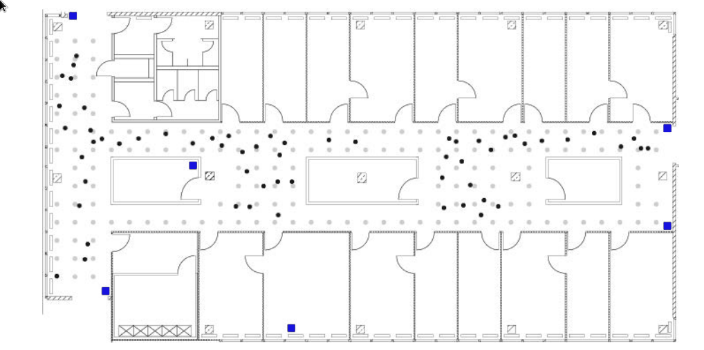

```{r setup, include=FALSE}
knitr::opts_chunk$set(warning = F, message = F, dev = "svg", fig.align = "center")
knitr::opts_chunk$set(tidy = T)
knitr::opts_chunk$set(comment = '#>')
options(digits = 2)
rm(list=ls())

library(foreach)
library(doParallel)
library(tidyverse)
library(dplyr)
library(ggplot2)
library(DT)
```

# Introduction

With the advent of Wi-Fi and local area networks, devices like Real-Time Location Systems (RTLS) can be leveraged for location positioning of an object in a specified area in real time. This is made possible by way of a continuous communication and feedback between a device held by the object being tracked and the beacons or receiver by the host. Examples of RTLS’s include Infrared, Bluetooth, Cellular, and Radio Frequency Identification (RFID). To operate RTLS, a scanning device is required to locate an object (such as a cell phone or laptop) based on the angle and coordinates of the object being tracked. You can use multiple scanning devices to triangulate the exact location of the object using the combination of angles in which the signal is triggering the respective receivers. Utilizing a series of wireless network signals in an office building, we will be able to detect the exact location of various objects in real time using different combinations of mac devices. Here, we can perform an unweighted and weighted k-nearest neighbors (k-NN) analysis to predict the location of the Online data using the offline data. To go further, we will be seeing if we can better predict the location of the online data using different combinations of the mac addresses available. 

# Data

For this project, we will be leveraging two separate datasets for our analysis. One of which is a reference set named “offline” which contains signal strength measurements from a hand-held device on a gridwork of 166 different points, all of which were spaced 1 meter apart. This gridwork is located in the hallways of a one floor building at the University of Mannheim. The other dataset is titled “online” which we will be using for testing our k-NN model to predict the location. This dataset includes 60 different locations chosen at random with 110 signals measured from them across each point. In figure 1.1 below, you can see a map of the “online” test locations (black dots) overlaid with the “offline” training locations (grey dots). Both datasets contain the same features and will require the same procedures for cleaning. 


```{r, fig.cap = "**Office layout:** *The floor plan of our experimentation environment. This makes up a 1-floor building in the University of Mannheim with the offline (grey dots) points placed about a meter apart from one another throughout the building. In addition, you can see the placement of the online points scattered throughout for testing. Wifi access points are denoted by black squares. Training data is denoted at grey dots. Test data is denoted at black dots.*"}

```

## Data Description

```{r data_desc_table, fig.cap = "Data Description"}
pander::pander(
 list(
      t = "Time stamp (Milliseconds) since 12:00am, January 1, 1970",
      Id = "router MAC address",
      Pos = "Router location",
      Degree = "Orientation of scanning device carried by the researcher, measured in Degrees",
      MAC = "MAC address of either the router, or scanning device, combined with corresponding values for signal strength (dBm), the mode in which it was operating(adhoc scanner = 1, access router = 3), and its corresponding channel frequency.",Signal = "Received Signal Strength in DbM")
 )
```
## Data Formatting

The first cleaning method we will employ will be to break up the position variable into separate variables which we can use to triangulate the location. In our raw dataset, we have position values for latitude, longitude and elevation separated by commas, which we will convert into PosX, PosY and PosZ. Upon further cleaning, we were able to determine that there was only one unique value for PosZ at 0 (which made sense considering the experiment took place in a one story building), we had the liberty to drop the variable. Additionally, running a procedure to check on the number of unique variables in the ScanMac column yielded only a single unique value, so we can drop that one as well. 

In our documentation, we found that our type of device was mixed between the values 1 and 3, which we may want to clarify more. Reviewing our documentation, we will only want to focus on fixed access points (value=3) as that is more relevant to our study of predicting device locations using a fixed set of receivers. So, moving further, we will remove the adhoc instances in our dataset. 

The Time measurement is something that we will want to make an adjustment to so that we can more easily analyze in the future. As mentioned prior, the time data is based on the number of milliseconds from a specific date (which could possibly be arbitrary), so we can change to a Year-Month-Day-Time format. But first, we can divide the number of milliseconds to seconds. This leaves us with the following features that we will use across our offline and online data.  Additionally, we will remove the channel feature since it is strictly a character code that contains redundant identifiers of Mac Address, signal strength, frequency and mode that may play an unfair role in our predictive modeling. 

```{r data_processing_utility_functions}

#processLine performs splitting and cleansing of delimiters in the lines
processLine = function(x) {
    tokens = strsplit(x, "[;=,]")[[1]]
    if (length(tokens) == 10) {
        return(NULL)
    }
    tmp = matrix(tokens[-(1:10)], , 4, byrow = TRUE)
    cbind(matrix(tokens[c(2, 4, 6:8, 10)], nrow(tmp), 6, byrow = TRUE), tmp)
}

#roundReaderOrientation adjusts angles to increments of 45 degrees
#this is done to simplify calculations overall since the resolution
#of these angles is less important than that which is provided
roundReaderOrientation = function(orientation) {
    refs = seq(0, by = 45, length = 9)
    angle = sapply(orientation, function(o) which.min(abs(o - refs)))
    c(refs[1:8], 0)[angle]
}

# read in the data for the appropriate mac addresses
readData <- function(filename, subMacs = c("00:0f:a3:39:e1:c0", "00:0f:a3:39:dd:cd",
                                           "00:14:bf:b1:97:8a", "00:14:bf:3b:c7:c6",
                                           "00:14:bf:b1:97:90", "00:14:bf:b1:97:8d",
                                           "00:14:bf:b1:97:81")) {
    txt = readLines(filename)
    lines = txt[substr(txt, 1, 1) != "#"]
    tmp = lapply(lines, processLine)
    
    # create dataframe and name columns
    data = as.data.frame(do.call(rbind, tmp), stringsAsFactors = FALSE)
    names(data) = c("time", "scanMac", "posX", "posY", "posZ", 
                    "orientation", "mac", "signal", "channel", 
                    "type")
    
    # keep only signals from access points (=3)
    data = data[data$type == "3", ]
    
    # drop scanMac, posZ, channel, and type - no info in them
    dropVars = c("scanMac", "posZ", "channel", "type")
    data = data[, !(names(data) %in% dropVars)]
    
    # drop more unwanted access points
    data = data[data$mac %in% subMacs, ]
    
    # convert numeric values
    numVars = c("time", "posX", "posY", "orientation", "signal")
    data[numVars] = lapply(data[numVars], as.numeric)
    
    # convert time to POSIX
    data$rawTime = data$time
    data$time = data$time/1000
    class(data$time) = c("POSIXt", "POSIXct")
    
    # round orientations to nearest 45 degree angle
    data$angle = roundReaderOrientation(data$orientation)
    
    return(data)
    }
```

```{r data_file_processing}

offline <- readData("offline.final.trace.txt")
online <- readData("online.final.trace.txt")
```

Reviewing our cleansed data set, we can see the following:
```{r processed_data_structure}
head(offline)
```

It should be noted that the original researchers chose to exclude data from one access point. Of the 7 access points, 2 were Alpha routers. Mac `00:0f:a3:39:e1:c0` was kept for the analysis, and mac `00:0f:a3:39:dd:cd` was removed. In this analysis we will endeavor to determine whether this action was warranty. 

According to our documentation, we should have only 8 values for orientation. We also simplify our measurement of the reader orientation and round these measurements to the nearest 45 degree angle. The resolution of the existing data is less important, thus we can safely assume that 45 degree increments is sufficient, and this will provide some relief in terms of computational effort. 

We will look at the orientation column of our dataset, we can see that we have a wide variety of angles available in clusters around the expected angles (such as 179 or 181) as shown in figure 2.1. Since we are going to focus on measure signal strength at 8 orientations in 45-degree increments, we will round each of our orientations to the nearest 45 degree increment. Additionally, we will try to map values close to 360 so that they line up back to zero. 
```{r 45_angles, fig.cap = "**Orientation for the Hand-Held Device:** *The location of the orientation values as it relates to the empirical cdf. We can see that at each major orientation (such as 45, 90, 135, 180, ect) we are scattered around these values. So our cleaning procedure is going to round these to the nearest 45 degree angle. After making the adjustment, we can see that the new values look like they are more exact to the 8 angles we are using. *"}
length(unique(offline$orientation))

plot(ecdf(offline$orientation), main = 'Orientation for the Hand-Held Device', xlab = 'CDF', ylab = 'Orientation')

with(offline, boxplot(orientation ~ angle, 
                      xlab = 'Rounded 45 Degree Angle', 
                      ylab = 'Orientation'))
```


The last cleaning procedure we will follow is to review the frequency of the mac addresses in place for our models. Since the documentation mentioned that the mac addresses ending in ‘c5’, ‘a9’, ‘fc’, ‘10’, and ‘4b’ were either not on the correct floor, or were not turned on the whole time, we have dropped these addresses so that we are only working with the remaining 7 addresses that have a frequency of over 120,000 observations.

```{r mac_addresses}
#### Exploring MAC Addresses ###


## Below we can check the counts of observations for various MAC addresses with table()
par(mar=c(10,5,1,1))   # extra large bottom margin
plotdata <- offline %>%
  group_by(mac) %>%
  summarise(counts = n())

ggplot(plotdata, aes(x = reorder(mac, -counts), y = counts)) +
  geom_bar(fill = "#0073C2FF", stat = "identity") +
  geom_text(aes(label = counts), vjust = -0.3) + 
  theme(axis.text.x = element_text(angle = 90)) +
  labs(x = "Mac", caption = "Figure: Frequency count of Mac addresses in our study. We will be dropping the addresses that have a frequency count below 120,000. ")
```

# RTLS Analysis
Approaching this problem strategically, we chose to analyze the received signal strength utilizing a K Nearest Neighbors approach. We first analyze the data excluding mac `00:0f:a3:39:dd:cd` as definde by the original researchers. Then analyze the same data set including mac `00:0f:a3:39:dd:cd` and excluding mac `00:0f:a3:39:e1:c0`. Then, finally, we analyze the full data set including all access points. 

```{r accesspoints}

ap_a <- "00:0f:a3:39:e1:c0"
ap_b <- "00:0f:a3:39:dd:cd"

```

## Exploratory Data Analysis
**Signal Strength by Angle**
Given that the orientation of the signal receiving device is an important characterstic these data, we quickly review signal versus orientation angle. From these plots it becomes clear that the signal from `00:0f:a3:39:dd:cd` is weak as compared to `00:0f:a3:39:e1:c0`, and contains numerous outliers in the data. 
```{r ss_vs_a, fig.width=12, fig.height=12}
offline %>% mutate(angle = factor(angle)) %>% 
  filter(posX == 2 & posY == 12) %>% 
  ggplot + geom_boxplot(aes(y = signal, x = angle)) + 
  facet_wrap(. ~ mac, ncol = 2) + 
  ggtitle("Boxplot of RSSI vs Angle for All MACs") +
  labs(x="Angles", y="RSSI")
```

This is further confirmed when reviewing a comparison of mean and standard deviation between the routers. This confirms our suspicion  for low signal strength values for `00:0f:a3:39:dd:cd`. In fact, access point `00:0f:a3:39:e1:c0` is the strongest signal compared to all access points.

```{r mean_stddev}

dt <- offline %>% 
  mutate(angle = factor(angle)) %>% 
  group_by(mac) %>% 
  summarise(signal_avg = mean(signal), signal_std = sd(signal))

datatable(offline %>% 
  mutate(angle = factor(angle)) %>% 
  group_by(mac) %>% 
  summarise(signal_avg = mean(signal), signal_std = sd(signal)))

ggplot(dt, aes(x = reorder(mac, -signal_avg), y = signal_avg)) +
  geom_bar(fill = "#0073C2FF", stat = "identity") +
  theme(axis.text.x = element_text(angle = 90)) +
  labs(x = "Mac", caption = "Figure: Average Signal")
```


## Modeling: K Nearest Neighbors (excluding `00:0f:a3:39:dd:cd`)
We will first do a search for an optimal model excluding `00:0f:a3:39:dd:cd`. This can serve as a baseline model to measure against since it will align with the original research methods. 

```{r gridsearch_for_baseline_B}
ap_a <- "00:0f:a3:39:e1:c0"
ap_b <- "00:0f:a3:39:dd:cd"

offline <- readData("offline.final.trace.txt")
offline$posXY <-  paste(offline$posX, offline$posY, sep = "-")
ByLocationAngle = with(offline, by(offline, list(posXY, angle, mac), function(x) x))

signalSummary = 
  lapply(ByLocationAngle,            
         function(oneLoc) {
           ans = oneLoc[1, ]
           ans$medSignal = median(oneLoc$signal)
           ans$avgSignal = mean(oneLoc$signal)
           ans$num = length(oneLoc$signal)
           ans$sdSignal = sd(oneLoc$signal)
           ans$iqrSignal = IQR(oneLoc$signal)
           ans
           })

offlineSummary_original = do.call("rbind", signalSummary)    

offlineSummary <- offlineSummary_original %>% 
  filter(mac != ap_b)

online <-  readData("online.final.trace.txt", subMacs = unique(offlineSummary$mac))

online$posXY <-  paste(online$posX, online$posY, sep = "-")

keepVars = c("posXY", "posX","posY", "orientation", "angle")

byLocation = with(online, 
             by(online, list(posXY), 
                function(x) {
                  ans = x[1, keepVars]
                  avgSS = tapply(x$signal, x$mac, mean)
                  y = matrix(avgSS, nrow = 1, ncol = 6,
                        dimnames = list(ans$posXY, names(avgSS)))
                  cbind(ans, y)
                }))

onlineSummary = do.call("rbind", byLocation)
calcError <- function(estXY, actualXY) sum( rowSums( (estXY - actualXY)^2) )
reshapeSS1 <-  function(data, varSignal = "signal", keepVars = c("posXY", "posX","posY")) {
  byLocation <- with(data, by(data, list(posXY), 
                              function(x) {
                                ans <-  x[1, keepVars]
                                avgSS <-  tapply(x[ , varSignal ], x$mac, mean)
                                y <-  matrix(avgSS, nrow = 1, ncol = 6,
                                             dimnames = list(ans$posXY,
                                                             names(avgSS)))
                                cbind(ans, y)
                              }))
  
  newDataSS <- do.call("rbind", byLocation)
  return(newDataSS)
}

selectTrain1 <-  function(angleNewObs, signals = NULL, m = 1){
  refs <-  seq(0, by = 45, length  = 8)
  nearestAngle <-  roundReaderOrientation(angleNewObs)
  if (m %% 2 == 1) 
    angles <-  seq(-45 * (m - 1) /2, 45 * (m - 1) /2, length = m)
  else {
    m = m + 1
    angles <-  seq(-45 * (m - 1) /2, 45 * (m - 1) /2, length = m)
    if (sign(angleNewObs - nearestAngle) > -1) 
      angles <-  angles[ -1 ]
    else 
      angles <-  angles[ -m ]
  }
  
  # round angles
  angles <-  angles + nearestAngle
  angles[angles < 0] <-  angles[ angles < 0 ] + 360
  angles[angles > 360] <-  angles[ angles > 360 ] - 360
  angles <-  sort(angles) 
  offlineSubset <-  signals[ signals$angle %in% angles, ]
  reshapeSS1(offlineSubset, varSignal = "avgSignal")
}

findNN1 <-  function(newSignal, trainSubset) {
  diffs <-  apply(trainSubset[ , 4:9], 1, 
                  function(x) x - newSignal)
  dists <-  apply(diffs, 2, function(x) sqrt(sum(x^2)) )
  closest <-  order(dists)
  weightDF <-  trainSubset[closest, 1:3 ]
  weightDF$weight <-  1/closest
  return(weightDF)
}

predXY1 <-  function(newSignals, newAngles, trainData, 
                    numAngles = 1, k = 3){
  closeXY <-  list(length = nrow(newSignals))
  for (i in 1:nrow(newSignals)) {
    trainSS <-  selectTrain1(newAngles[i], trainData, m = numAngles)
    closeXY[[i]] <- findNN1(newSignal = as.numeric(newSignals[i, ]), trainSS)
  }
  estXY <- lapply(closeXY, 
                 function(x) sapply(x[ , 2:3], 
                                    function(x) mean(x[1:k])))
  estXY <- do.call("rbind", estXY)
  return(estXY)
}

v = 11 
permuteLocs = sample(unique(offlineSummary$posXY))
permuteLocs = matrix(permuteLocs, ncol = v, 
                     nrow = floor(length(permuteLocs)/v))

onlinecvFold = subset(offlineSummary, posXY %in% permuteLocs[ , 1])

reshapeSS1 = function(data, varSignal = "signal", 
                     keepVars = c("posXY", "posX","posY"),
                     sampleAngle = FALSE, 
                     refs = seq(0, 315, by = 45)) {
  byLocation =
    with(data, by(data, list(posXY), 
                  function(x) {
                    if (sampleAngle) {
                      x = x[x$angle == sample(refs, size = 1), ]}
                    ans = x[1, keepVars]
                    avgSS = tapply(x[ , varSignal ], x$mac, mean)
                    y = matrix(avgSS, nrow = 1, ncol = 6,
                               dimnames = list(ans$posXY,
                                               names(avgSS)))
                    cbind(ans, y)
                  }))
  
  newDataSS = do.call("rbind", byLocation)
  return(newDataSS)
}

#exclude the right mac address
offline = offline[ offline$mac != ap_b, ]
keepVars = c("posXY", "posX","posY", "orientation", "angle")

onlineCVSummary = reshapeSS1(offline, keepVars = keepVars, 
                            sampleAngle = TRUE)

onlinecvFold = subset(onlineCVSummary, 
                    posXY %in% permuteLocs[ , 1])

offlineFold = subset(offlineSummary,
                     posXY %in% permuteLocs[ , -1])

estFold = predXY1(newSignals = onlinecvFold[ , 6:11], 
                 newAngles = onlinecvFold[ , 4], 
                 offlineFold, numAngles = 1, k = 3)

actualFold = onlinecvFold[ , c("posX", "posY")]

NNeighbors = 20
K = NNeighbors 
err = numeric(K)
for (j in 1:v) {
  onlinecvFold = subset(onlineCVSummary, 
                      posXY %in% permuteLocs[ , j])
  offlineFold = subset(offlineSummary,
                       posXY %in% permuteLocs[ , -j])
  actualFold = onlinecvFold[ , c("posX", "posY")]
  
  for (k in 1:K) {
    estFold = predXY1(newSignals = onlinecvFold[ , 6:11],
                     newAngles = onlinecvFold[ , 4], 
                     offlineFold, numAngles = 1, k = k)
    err[k] = err[k] + calcError(estFold, actualFold)
  }
}

error_df <- data.frame(ap_a = err)
plot(y = err, x = (1:K),  type = "l", lwd= 2,
     ylim = c(800, 2100),
     xlab = "Number of Neighbors",
     ylab = "Sum of Square Errors",
      main = "Error vs K, with AP A Data")
rmseMin = min(err)
kMin = which(err == rmseMin)[1]
segments(x0 = 0, x1 = kMin, y0 = rmseMin, col = gray(0.4), 
         lty = 2, lwd = 2)
segments(x0 = kMin, x1 = kMin, y0 = 1100,  y1 = rmseMin, 
         col = grey(0.4), lty = 2, lwd = 2)


text(x = kMin - 2, y = rmseMin + 40, 
     label = as.character(round(rmseMin)), col = grey(0.4))
estXYkmin1 = predXY1(newSignals = onlineSummary[ , 6:11], 
                 newAngles = onlineSummary[ , 4], 
                 offlineSummary, numAngles = 1, k = kMin)
actualXY = onlineSummary[ , c("posX", "posY")]

err_cv1 <- calcError(estXYkmin1, actualXY)
trainData = offlineSummary[ offlineSummary$angle == 0 & 
                              offlineSummary$mac == "00:0f:a3:39:e1:c0" ,
                        c("posX", "posY")]

ErrorMap = function(estXY, actualXY, trainData = NULL, AP = NULL){
  
    plot(0, 0, xlim = c(0, 35), ylim = c(-3, 15), type = "n",
         xlab = "", ylab = "", axes = FALSE,
         main = "Floor Map of Predictions",
         sub = "■ = Access Point, ● = Actual, ✷ = Predicted")
    box()
    if ( !is.null(AP) ) points(AP, pch = 15)
    if ( !is.null(trainData) )
      points(trainData, pch = 19, col="grey", cex = 0.6)
    
    points(x = actualXY[, 1], y = actualXY[, 2], 
           pch = 19, cex = 0.8 )
    points(x = estXY[, 1], y = estXY[, 2], 
           pch = 8, cex = 0.8 )
    segments(x0 = estXY[, 1], y0 = estXY[, 2],
             x1 = actualXY[, 1], y1 = actualXY[ , 2],
             lwd = 2, col = "red")
}
actualXY = onlineSummary[ , c("posX", "posY")]
```
```{r errormap_a}
ErrorMap(estXY  = estXYkmin1 , actualXY = actualXY, trainData = trainData)
```

Through the grid search we can see that the best value for K is `r kMin`, with an error of `r rmseMin`. Prediction for the online data has an RMSE of  `r err_cv1 `. 

## Modeling: K Nearest Neighbors (excluding `00:0f:a3:39:e1:c0`)
Now we will conduct the same exercise excluding the other access point. 
```{r gridsearch_for_A}
ap_a <- "00:0f:a3:39:e1:c0"
ap_b <- "00:0f:a3:39:dd:cd"

offline <- readData("offline.final.trace.txt")
offline$posXY <-  paste(offline$posX, offline$posY, sep = "-")
ByLocationAngle = with(offline, by(offline, list(posXY, angle, mac), function(x) x))

signalSummary = 
  lapply(ByLocationAngle,            
         function(oneLoc) {
           ans = oneLoc[1, ]
           ans$medSignal = median(oneLoc$signal)
           ans$avgSignal = mean(oneLoc$signal)
           ans$num = length(oneLoc$signal)
           ans$sdSignal = sd(oneLoc$signal)
           ans$iqrSignal = IQR(oneLoc$signal)
           ans
           })

offlineSummary_original = do.call("rbind", signalSummary)    

offlineSummary <- offlineSummary_original %>% 
  filter(mac != ap_a)

online <-  readData("online.final.trace.txt", subMacs = unique(offlineSummary$mac))

online$posXY <-  paste(online$posX, online$posY, sep = "-")

keepVars = c("posXY", "posX","posY", "orientation", "angle")

byLocation = with(online, 
             by(online, list(posXY), 
                function(x) {
                  ans = x[1, keepVars]
                  avgSS = tapply(x$signal, x$mac, mean)
                  y = matrix(avgSS, nrow = 1, ncol = 6,
                        dimnames = list(ans$posXY, names(avgSS)))
                  cbind(ans, y)
                }))

onlineSummary = do.call("rbind", byLocation)
calcError <- function(estXY, actualXY) sum( rowSums( (estXY - actualXY)^2) )
reshapeSS2 <-  function(data, varSignal = "signal", keepVars = c("posXY", "posX","posY")) {
  byLocation <- with(data, by(data, list(posXY), 
                              function(x) {
                                ans <-  x[1, keepVars]
                                avgSS <-  tapply(x[ , varSignal ], x$mac, mean)
                                y <-  matrix(avgSS, nrow = 1, ncol = 6,
                                             dimnames = list(ans$posXY,
                                                             names(avgSS)))
                                cbind(ans, y)
                              }))
  
  newDataSS <- do.call("rbind", byLocation)
  return(newDataSS)
}

selectTrain2 <-  function(angleNewObs, signals = NULL, m = 1){
  refs <-  seq(0, by = 45, length  = 8)
  nearestAngle <-  roundReaderOrientation(angleNewObs)
  if (m %% 2 == 1) 
    angles <-  seq(-45 * (m - 1) /2, 45 * (m - 1) /2, length = m)
  else {
    m = m + 1
    angles <-  seq(-45 * (m - 1) /2, 45 * (m - 1) /2, length = m)
    if (sign(angleNewObs - nearestAngle) > -1) 
      angles <-  angles[ -1 ]
    else 
      angles <-  angles[ -m ]
  }
  
  # round angles
  angles <-  angles + nearestAngle
  angles[angles < 0] <-  angles[ angles < 0 ] + 360
  angles[angles > 360] <-  angles[ angles > 360 ] - 360
  angles <-  sort(angles) 
  offlineSubset <-  signals[ signals$angle %in% angles, ]
  reshapeSS2(offlineSubset, varSignal = "avgSignal")
}

findNN2 <-  function(newSignal, trainSubset) {
  diffs <-  apply(trainSubset[ , 4:9], 1, 
                  function(x) x - newSignal)
  dists <-  apply(diffs, 2, function(x) sqrt(sum(x^2)) )
  closest <-  order(dists)
  weightDF <-  trainSubset[closest, 1:3 ]
  weightDF$weight <-  1/closest
  return(weightDF)
}

predXY2 <-  function(newSignals, newAngles, trainData, 
                    numAngles = 1, k = 3){
  closeXY <-  list(length = nrow(newSignals))
  for (i in 1:nrow(newSignals)) {
    trainSS <-  selectTrain1(newAngles[i], trainData, m = numAngles)
    closeXY[[i]] <- findNN1(newSignal = as.numeric(newSignals[i, ]), trainSS)
  }
  estXY <- lapply(closeXY, 
                 function(x) sapply(x[ , 2:3], 
                                    function(x) mean(x[1:k])))
  estXY <- do.call("rbind", estXY)
  return(estXY)
}

v = 11 
permuteLocs = sample(unique(offlineSummary$posXY))
permuteLocs = matrix(permuteLocs, ncol = v, 
                     nrow = floor(length(permuteLocs)/v))

onlinecvFold = subset(offlineSummary, posXY %in% permuteLocs[ , 1])

reshapeSS2 = function(data, varSignal = "signal", 
                     keepVars = c("posXY", "posX","posY"),
                     sampleAngle = FALSE, 
                     refs = seq(0, 315, by = 45)) {
  byLocation =
    with(data, by(data, list(posXY), 
                  function(x) {
                    if (sampleAngle) {
                      x = x[x$angle == sample(refs, size = 1), ]}
                    ans = x[1, keepVars]
                    avgSS = tapply(x[ , varSignal ], x$mac, mean)
                    y = matrix(avgSS, nrow = 1, ncol = 6,
                               dimnames = list(ans$posXY,
                                               names(avgSS)))
                    cbind(ans, y)
                  }))
  
  newDataSS = do.call("rbind", byLocation)
  return(newDataSS)
}

#exclude the right mac address
offline = offline[ offline$mac != ap_a, ]
keepVars = c("posXY", "posX","posY", "orientation", "angle")

onlineCVSummary = reshapeSS2(offline, keepVars = keepVars, 
                            sampleAngle = TRUE)

onlinecvFold = subset(onlineCVSummary, 
                    posXY %in% permuteLocs[ , 1])

offlineFold = subset(offlineSummary,
                     posXY %in% permuteLocs[ , -1])

estFold = predXY1(newSignals = onlinecvFold[ , 6:11], 
                 newAngles = onlinecvFold[ , 4], 
                 offlineFold, numAngles = 1, k = 3)

actualFold = onlinecvFold[ , c("posX", "posY")]

NNeighbors = 20
K = NNeighbors 
err = numeric(K)
for (j in 1:v) {
  onlinecvFold = subset(onlineCVSummary, posXY %in% permuteLocs[ , j])
  offlineFold = subset(offlineSummary,posXY %in% permuteLocs[ , -j])
  actualFold = onlinecvFold[ , c("posX", "posY")]
  
  for (k in 1:K) {
    estFold = predXY2(newSignals = onlinecvFold[ , 6:11],
                     newAngles = onlinecvFold[ , 4], 
                     offlineFold, numAngles = 1, k = k)
    
    err[k] = err[k] + calcError(estFold, actualFold)
  }
}

error_df$ap_b <- err
plot(y = err, x = (1:K),  type = "l", lwd= 2,
     ylim = c(800, 2100),
     xlab = "Number of Neighbors",
     ylab = "Sum of Square Errors",
      main = "Error vs K, with AP B Data")
rmseMin = min(err)
kMin = which(err == rmseMin)[1]
segments(x0 = 0, x1 = kMin, y0 = rmseMin, col = gray(0.4), 
         lty = 2, lwd = 2)
segments(x0 = kMin, x1 = kMin, y0 = 1100,  y1 = rmseMin, 
         col = grey(0.4), lty = 2, lwd = 2)


text(x = kMin - 2, y = rmseMin + 40, 
     label = as.character(round(rmseMin)), col = grey(0.4))
estXYkmin2 = predXY2(newSignals = onlineSummary[ , 6:11], 
                 newAngles = onlineSummary[ , 4], 
                 offlineSummary, numAngles = 1, k = kMin)
actualXY = onlineSummary[ , c("posX", "posY")]

err_cv2 <- calcError(estXYkmin2, actualXY)
trainData = offlineSummary[ offlineSummary$angle == 0 & 
                              offlineSummary$mac == "00:0f:a3:39:dd:cd" ,
                        c("posX", "posY")]

ErrorMap = function(estXY, actualXY, trainData = NULL, AP = NULL){
  
    plot(0, 0, xlim = c(0, 35), ylim = c(-3, 15), type = "n",
         xlab = "", ylab = "", axes = FALSE,
         main = "Floor Map of Predictions",
         sub = "■ = Access Point, ● = Actual, ✷ = Predicted")
    box()
    if ( !is.null(AP) ) points(AP, pch = 15)
    if ( !is.null(trainData) )
      points(trainData, pch = 19, col="grey", cex = 0.6)
    
    points(x = actualXY[, 1], y = actualXY[, 2], 
           pch = 19, cex = 0.8 )
    points(x = estXY[, 1], y = estXY[, 2], 
           pch = 8, cex = 0.8 )
    segments(x0 = estXY[, 1], y0 = estXY[, 2],
             x1 = actualXY[, 1], y1 = actualXY[ , 2],
             lwd = 2, col = "red")
}
actualXY = onlineSummary[ , c("posX", "posY")]
```

```{r errormap_b}
ErrorMap(estXY  = estXYkmin2 , actualXY = actualXY, trainData = trainData)
```

Here, the optimal value for K is  `r kMin`, with an error of  `r rmseMin`. Prediction for the online data has an RMSE of  `r err_cv2`. Lets compare the results to those of router B:

```{r, fig.cap = "*Model Data with AP B overall performed better than AP A*"}
error_df$k <- 1:nrow(error_df)
error_df %>% 
  gather_("Router","RMSE", names(error_df)[-length(error_df)]) %>%
  ggplot() + geom_line(aes(x = k, y = RMSE, color = Router)) +
  ggtitle("RMSE Over K by Router")
```

The model that includes AP B has a significantly lower RMSE than the model with just AP A. This would imply that removing AP B from the model originally was not the optimal choice. 

## Modeling: K Nearest Neighbors (all Macs)

We will now perform a final model with all the data, and compare results. 

```{r all_macs}
offline <- readData("offline.final.trace.txt")

offline$posXY <-  paste(offline$posX, offline$posY, sep = "-")
ByLocationAngle = with(offline, 
                    by(offline, list(posXY, angle, mac), 
                       function(x) x))
signalSummary = 
  lapply(ByLocationAngle,            
         function(oneLoc) {
           ans = oneLoc[1, ]
           ans$medSignal = median(oneLoc$signal)
           ans$avgSignal = mean(oneLoc$signal)
           ans$num = length(oneLoc$signal)
           ans$sdSignal = sd(oneLoc$signal)
           ans$iqrSignal = IQR(oneLoc$signal)
           ans
           })
offlineSummary = do.call("rbind", signalSummary)     
online <-  readData("online.final.trace.txt", subMacs = unique(offlineSummary$mac))
online$posXY <-  paste(online$posX, online$posY, sep = "-")
keepVars = c("posXY", "posX","posY", "orientation", "angle")
byLocation = with(online, 
             by(online, list(posXY), 
                function(x) {
                  ans = x[1, keepVars]
                  avgSS = tapply(x$signal, x$mac, mean)
                  y = matrix(avgSS, nrow = 1, ncol = 7,
                        dimnames = list(ans$posXY, names(avgSS)))
                  cbind(ans, y)
                }))
onlineSummary = do.call("rbind", byLocation)
calcError <- function(estXY, actualXY) sum( rowSums( (estXY - actualXY)^2) )
reshapeSS2 <-  function(data, varSignal = "signal", 
                        keepVars = c("posXY", "posX","posY")) {
  byLocation <- with(data, by(data, list(posXY), 
                              function(x) {
                                ans <-  x[1, keepVars]
                                avgSS <-  tapply(x[ , varSignal ], x$mac, mean)
                                y <-  matrix(avgSS, nrow = 1, ncol = 7,
                                             dimnames = list(ans$posXY,
                                                             names(avgSS)))
                                cbind(ans, y)
                              }))
  newDataSS <- do.call("rbind", byLocation)
  return(newDataSS)
}
selectTrain2 <-  function(angleNewObs, signals = NULL, m = 1){
  # m is the number of angles to keep between 1 and 5
  refs <-  seq(0, by = 45, length  = 8)
  nearestAngle <-  roundReaderOrientation(angleNewObs)
  if (m %% 2 == 1) 
    angles <-  seq(-45  * (m - 1) /2, 45 * (m - 1) /2, length = m)
  else {
    m = m + 1
    angles <-  seq(-45 * (m - 1) /2, 45 * (m - 1) /2, length = m)
    if (sign(angleNewObs - nearestAngle) > -1) 
      angles <-  angles[ -1 ]
    else 
      angles <-  angles[ -m ]
  }
  # round angles
  angles <-  angles + nearestAngle
  angles[angles < 0] <-  angles[ angles < 0 ] + 360
  angles[angles > 360] <-  angles[ angles > 360 ] - 360
  angles <-  sort(angles) 
  offlineSubset <-  signals[ signals$angle %in% angles, ]
  reshapeSS2(offlineSubset, varSignal = "avgSignal")
}
findNN2 <-  function(newSignal, trainSubset) {
  diffs <-  apply(trainSubset[ , 4:9], 1, 
                  function(x) x - newSignal)
  dists <-  apply(diffs, 2, function(x) sqrt(sum(x^2)) )
  closest <-  order(dists)
  weightDF <-  trainSubset[closest, 1:3 ]
  weightDF$weight <-  1/closest
  return(weightDF)
}
predXY2 <-  function(newSignals, newAngles, trainData, 
                    numAngles = 1, k = 3){
  closeXY <-  list(length = nrow(newSignals))
  for (i in 1:nrow(newSignals)) {
    trainSS <-  selectTrain2(newAngles[i], trainData, m = numAngles)
    closeXY[[i]] <- findNN2(newSignal = as.numeric(newSignals[i, ]), trainSS)
  }
  estXY <- lapply(closeXY, 
                 function(x) sapply(x[ , 2:3], 
                                    function(x) mean(x[1:k])))
  estXY <- do.call("rbind", estXY)
  return(estXY)
}
v = 11 
permuteLocs = sample(unique(offlineSummary$posXY))
permuteLocs = matrix(permuteLocs, ncol = v, 
                     nrow = floor(length(permuteLocs)/v))
onlinecvFold = subset(offlineSummary, posXY %in% permuteLocs[ , 1])
reshapeSS2 = function(data, varSignal = "signal", 
                     keepVars = c("posXY", "posX","posY"),
                     sampleAngle = FALSE, 
                     refs = seq(0, 315, by = 45)) {
  byLocation =
    with(data, by(data, list(posXY), 
                  function(x) {
                    if (sampleAngle) {
                      x = x[x$angle == sample(refs, size = 1), ]}
                    ans = x[1, keepVars]
                    avgSS = tapply(x[ , varSignal ], x$mac, mean)
                    y = matrix(avgSS, nrow = 1, ncol = 7,
                               dimnames = list(ans$posXY,
                                               names(avgSS)))
                    cbind(ans, y)
                  }))
  newDataSS = do.call("rbind", byLocation)
  return(newDataSS)
}
keepVars = c("posXY", "posX","posY", "orientation", "angle")
onlineCVSummary = reshapeSS2(offline, keepVars = keepVars, 
                            sampleAngle = TRUE)
onlinecvFold = subset(onlineCVSummary, 
                    posXY %in% permuteLocs[ , 1])
offlineFold = subset(offlineSummary,
                     posXY %in% permuteLocs[ , -1])
estFold = predXY2(newSignals = onlinecvFold[ , 6:12], 
                 newAngles = onlinecvFold[ , 5], 
                 offlineFold, numAngles = 1, k = 3)
actualFold = onlinecvFold[ , c("posX", "posY")]
NNeighbors = 20
K = NNeighbors 
err = numeric(K)
for (j in 1:v) {
  onlinecvFold = subset(onlineCVSummary, 
                      posXY %in% permuteLocs[ , j])
  offlineFold = subset(offlineSummary,
                       posXY %in% permuteLocs[ , -j])
  actualFold = onlinecvFold[ , c("posX", "posY")]
  
  for (k in 1:K) {
    estFold = predXY2(newSignals = onlinecvFold[ , 6:11],
                     newAngles = onlinecvFold[ , 4], 
                     offlineFold, numAngles = 1, k = k)
    err[k] = err[k] + calcError(estFold, actualFold)
  }
}
error_df$both <- err
plot(y = err, x = (1:K),  type = "l", lwd= 2,
     ylim = c(800, 2100),
     xlab = "Number of Neighbors",
     ylab = "Sum of Square Errors",
      main = "Error vs K, with all Data")
rmseMin = min(err)
kMin = which(err == rmseMin)[1]
segments(x0 = 0, x1 = kMin, y0 = rmseMin, col = gray(0.4), 
         lty = 2, lwd = 2)
segments(x0 = kMin, x1 = kMin, y0 = 1100,  y1 = rmseMin, 
         col = grey(0.4), lty = 2, lwd = 2)

text(x = kMin - 2, y = rmseMin + 40, 
     label = as.character(round(rmseMin)), col = grey(0.4))
estXYkmin3 = predXY2(newSignals = onlineSummary[ , 6:12], 
                 newAngles = onlineSummary[ , 5], 
                 offlineSummary, numAngles = 1, k = kMin)
actualXY = onlineSummary[ , c("posX", "posY")]
err_cv3 <- calcError(estXYkmin3, actualXY)
trainData = offlineSummary[ offlineSummary$angle == 0 & 
                              offlineSummary$mac == "00:0f:a3:39:e1:c0" ,
                        c("posX", "posY")]

ErrorMap = function(estXY, actualXY, trainData = NULL, AP = NULL){
  
    plot(0, 0, xlim = c(0, 35), ylim = c(-3, 15), type = "n",
         xlab = "", ylab = "", axes = FALSE,
         main = "Floor Map of Predictions",
         sub = "■ = Access Point, ● = Actual, ✷ = Predicted")
    box()
    if ( !is.null(AP) ) points(AP, pch = 15)
    if ( !is.null(trainData) )
      points(trainData, pch = 19, col="grey", cex = 0.6)
    
    points(x = actualXY[, 1], y = actualXY[, 2], 
           pch = 19, cex = 0.8 )
    points(x = estXY[, 1], y = estXY[, 2], 
           pch = 8, cex = 0.8 )
    segments(x0 = estXY[, 1], y0 = estXY[, 2],
             x1 = actualXY[, 1], y1 = actualXY[ , 2],
             lwd = 2, col = "red")
}
actualXY = onlineSummary[ , c("posX", "posY")]
```

```{r errormap_all}
ErrorMap(estXY  = estXYkmin3 , actualXY = actualXY, trainData = trainData)
```

```{r}
datatable(data.frame(router = c("With Access Point A","With Access Point B", "All Access Points"), 
                     "Sum of Squares - Online Dataset" = c(err_cv1, err_cv2, err_cv3)))
```

As shown in the above table the best results were yielded from including Access Point B, not Access Point A. And in fact, results diminished by including both. 

## Weighted KNN Analysis
Here we will attempt to improve our results by including Access Point B, excluding Access Point A, and performing a weighted KNN analysis. 

```{r weighted_knn}
offline <- readData("offline.final.trace.txt")

offline$posXY <-  paste(offline$posX, offline$posY, sep = "-")
ByLocationAngle = with(offline, 
                    by(offline, list(posXY, angle, mac), 
                       function(x) x))
signalSummary = 
  lapply(ByLocationAngle,            
         function(oneLoc) {
           ans = oneLoc[1, ]
           ans$medSignal = median(oneLoc$signal)
           ans$avgSignal = mean(oneLoc$signal)
           ans$num = length(oneLoc$signal)
           ans$sdSignal = sd(oneLoc$signal)
           ans$iqrSignal = IQR(oneLoc$signal)
           ans
           })

offlineSummary_original = do.call("rbind", signalSummary)     
offlineSummary <- offlineSummary_original %>% filter(mac != ap_a)
online <-  readData("online.final.trace.txt", subMacs = unique(offlineSummary$mac))
online$posXY <-  paste(online$posX, online$posY, sep = "-")
keepVars = c("posXY", "posX","posY", "orientation", "angle")
byLocation = with(online, 
             by(online, list(posXY), 
                function(x) {
                  ans = x[1, keepVars]
                  avgSS = tapply(x$signal, x$mac, mean)
                  y = matrix(avgSS, nrow = 1, ncol = 6,
                        dimnames = list(ans$posXY, names(avgSS)))
                  cbind(ans, y)
                }))
onlineSummary = do.call("rbind", byLocation)
calcError <- function(estXY, actualXY) sum( rowSums( (estXY - actualXY)^2) )
reshapeSS1 <-  function(data, varSignal = "signal", 
                        keepVars = c("posXY", "posX","posY")) {
  byLocation <- with(data, by(data, list(posXY), 
                              function(x) {
                                ans <-  x[1, keepVars]
                                avgSS <-  tapply(x[ , varSignal ], x$mac, mean)
                                y <-  matrix(avgSS, nrow = 1, ncol = 6,
                                             dimnames = list(ans$posXY,
                                                             names(avgSS)))
                                cbind(ans, y)
                              }))
  newDataSS <- do.call("rbind", byLocation)
  return(newDataSS)
}
selectTrain1 <-  function(angleNewObs, signals = NULL, m = 1){
  # m is the number of angles to keep between 1 and 5
  refs <-  seq(0, by = 45, length  = 8)
  nearestAngle <-  roundReaderOrientation(angleNewObs)
  if (m %% 2 == 1) 
    angles <-  seq(-45 * (m - 1) /2, 45 * (m - 1) /2, length = m)
  else {
    m = m + 1
    angles <-  seq(-45 * (m - 1) /2, 45 * (m - 1) /2, length = m)
    if (sign(angleNewObs - nearestAngle) > -1) 
      angles <-  angles[ -1 ]
    else 
      angles <-  angles[ -m ]
  }
  # round angles
  angles <-  angles + nearestAngle
  angles[angles < 0] <-  angles[ angles < 0 ] + 360
  angles[angles > 360] <-  angles[ angles > 360 ] - 360
  angles <-  sort(angles) 
  offlineSubset <-  signals[ signals$angle %in% angles, ]
  reshapeSS1(offlineSubset, varSignal = "avgSignal")
}
findNN_weighted = function(newSignal, trainSubset) {
  diffs = apply(trainSubset[ , 4:9], 1,
                function(x) x - newSignal)
  dists <- sqrt(colSums(diffs^2)) # why is the book using apply when R is vectorized?
  weighted_dists <- (1/dists)/(sum(1/dists))
  closest = order(dists)
  return(list(trainSubset[closest, 1:3 ], (1/dists)[order(weighted_dists, decreasing = TRUE)]))
}


cl <- makeCluster(parallel::detectCores() - 1)
registerDoParallel(cl)
predXY_weighted = function(newSignals, newAngles, trainData,
  numAngles = 1, k = 3){
  l <- nrow(newSignals)
  res <- foreach(i = 1:nrow(newSignals)) %do% {
   trainSS <- selectTrain1(newAngles[i], trainData, m = numAngles)
   nn <-  findNN_weighted(newSignal = as.numeric(newSignals[i,]), trainSS)[[1]]
   wdist <- findNN_weighted(newSignal = as.numeric(newSignals[i,]), trainSS)[[2]]
   weighted_dist <- wdist[1:k]/sum(wdist[1:k])
   lab <- as.matrix(nn[1:k,2:3] * weighted_dist)
   return(lab)
  }
  estXY = lapply(res, colSums)
  estXY = do.call("rbind", estXY)
  return(estXY)
}
v = 11 
permuteLocs = sample(unique(offlineSummary$posXY))
permuteLocs = matrix(permuteLocs, ncol = v, 
                     nrow = floor(length(permuteLocs)/v))
onlinecvFold = subset(offlineSummary, posXY %in% permuteLocs[ , 1])
reshapeSS1 = function(data, varSignal = "signal", 
                     keepVars = c("posXY", "posX","posY"),
                     sampleAngle = FALSE, 
                     refs = seq(0, 315, by = 45)) {
  byLocation =
    with(data, by(data, list(posXY), 
                  function(x) {
                    if (sampleAngle) {
                      x = x[x$angle == sample(refs, size = 1), ]}
                    ans = x[1, keepVars]
                    avgSS = tapply(x[ , varSignal ], x$mac, mean)
                    y = matrix(avgSS, nrow = 1, ncol = 6,
                               dimnames = list(ans$posXY,
                                               names(avgSS)))
                    cbind(ans, y)
                  }))
  newDataSS = do.call("rbind", byLocation)
  return(newDataSS)
}
offline = offline[ offline$mac != "00:0f:a3:39:dd:cd", ]
keepVars = c("posXY", "posX","posY", "orientation", "angle")
onlineCVSummary = reshapeSS1(offline, keepVars = keepVars, 
                            sampleAngle = TRUE)
onlinecvFold = subset(onlineCVSummary, 
                    posXY %in% permuteLocs[ , 1])
offlineFold = subset(offlineSummary,
                     posXY %in% permuteLocs[ , -1])
estFold = predXY_weighted(newSignals = onlinecvFold[ , 6:11], 
                 newAngles = onlinecvFold[ , 4], 
                 offlineFold, numAngles = 1, k = 3)
actualFold = onlinecvFold[ , c("posX", "posY")]
NNeighbors = 20
K = NNeighbors 
err = numeric(K)
for (j in 1:v) {
  onlinecvFold = subset(onlineCVSummary, 
                      posXY %in% permuteLocs[ , j])
  offlineFold = subset(offlineSummary,
                       posXY %in% permuteLocs[ , -j])
  actualFold = onlinecvFold[ , c("posX", "posY")]
  
  for (k in 1:K) {
    estFold = predXY_weighted(newSignals = onlinecvFold[ , 6:11],
                     newAngles = onlinecvFold[ , 4], 
                     offlineFold, numAngles = 1, k = k)
    err[k] = err[k] + calcError(estFold, actualFold)
  }
}
error_df$weighted <- err
plot(y = err, x = (1:K),  type = "l", lwd= 2,
     ylim = c(800, 8000),
     xlab = "Number of Neighbors",
     ylab = "Sum of Square Errors",
      main = "Error vs K, with weighted Data")
rmseMin = min(err)
kMin = which(err == rmseMin)[1]
segments(x0 = 0, x1 = kMin, y0 = rmseMin, col = gray(0.4), 
         lty = 2, lwd = 2)
segments(x0 = kMin, x1 = kMin, y0 = 1100,  y1 = rmseMin, 
         col = grey(0.4), lty = 2, lwd = 2)

text(x = kMin - 2, y = rmseMin + 40, 
     label = as.character(round(rmseMin)), col = grey(0.4))
estXYkmin4 = predXY_weighted(newSignals = onlineSummary[ , 6:11], 
                 newAngles = onlineSummary[ , 4], 
                 offlineSummary, numAngles = 1, k = kMin)
actualXY = onlineSummary[ , c("posX", "posY")]
err_cv4 <- calcError(estXYkmin4, actualXY)
trainData = offlineSummary[ offlineSummary$angle == 0 & 
                              offlineSummary$mac == "00:0f:a3:39:e1:c0" ,
                        c("posX", "posY")]

ErrorMap = function(estXY, actualXY, trainData = NULL, AP = NULL){
  
    plot(0, 0, xlim = c(0, 35), ylim = c(-3, 15), type = "n",
         xlab = "", ylab = "", axes = FALSE,
         main = "Floor Map of Predictions",
         sub = "■ = Access Point, ● = Actual, ✷ = Predicted")
    box()
    if ( !is.null(AP) ) points(AP, pch = 15)
    if ( !is.null(trainData) )
      points(trainData, pch = 19, col="grey", cex = 0.6)
    
    points(x = actualXY[, 1], y = actualXY[, 2], pch = 19, cex = 0.8 )
    points(x = estXY[, 1], y = estXY[, 2], pch = 8, cex = 0.8 )
    segments(x0 = estXY[, 1], y0 = estXY[, 2], x1 = actualXY[, 1], y1 = actualXY[ , 2],
             lwd = 2, col = "red")
}
actualXY = onlineSummary[ , c("posX", "posY")]
```

```{r errormap_weighted}
ErrorMap(estXY  = estXYkmin4 , actualXY = actualXY, trainData = trainData)
```
The best value for K o a weighted KNN was `r kMin`, with an error of  `r rmseMin`. Prediction on the online data has an RMSE of  `r err_cv4`. Comparing predictive results is show below:

```{r, fig.cap = "*The offline training errors with the weighted KNN were rather large...*"}
error_df$k <- 1:nrow(error_df)
error_df %>% 
  gather_("Router","RMSE", names(error_df)[c(1,2,4,5)]) %>%
  ggplot() + geom_line(aes(x = k, y = RMSE, color = Router)) +
  ggtitle("RMSE Over K by Access Point")

```

Reviewing our test set using the weighted knn we can see it outperformed all other models:


```{r}
datatable(data.frame(router = c("With Access Point A","With Access Point B", "All Data", "Weighted"), 
                     "Sum of Squares - Online Dataset" = c(err_cv1, err_cv2, err_cv3, err_cv4)))
```

Cross validation for the weighted KNN performs poorly. However, the Weighted model performed the best of all models in terms of prediction, with the lowest error when compared to actuals.


## Conclusion
